进度 18-11 7 分 48

事件循环 2： 9-45 秒

分类：

todo

易错

了解

复习 记忆

done

towrite

toread

**手写 EventEmitter(发布订阅模式--简单版)**

# wangzhan tosearch

-   检查是否有`Web Worker`任务，有则执行

# HTML/CSS

## 如何理解 HTML 语义化 p1

-   让人（写程序、读程序）更易读懂
-   让机器（浏览器、搜索引擎）更易读懂

HTML 符合 XML 标准，但又和 XML 不一样 —— HTML 不允许像 XML 那样自定义标签名称，HTML 有自己规定的标签名称。问题就在这里 —— HTML 为何要自己规定那么多标签名称呢，例如`p` `div` `h1` `ul`等 —— 就是为了语义化

爬虫

为了加强 HTML 语义化，HTML5 标准中又增加了`Nav header footer ` `section` `article`等标签。因此，书写 HTML 时，语义化是非常重要的，否则 W3C 也没必要辛辛苦苦制定出这些标准来。

## 块状元素和内联元素 p0

块：div p h1-h6 ul ol li table tbody tr th

行内：image a em input button

## 布局问题

### 盒模型 p0 done

-   盒子大小计算

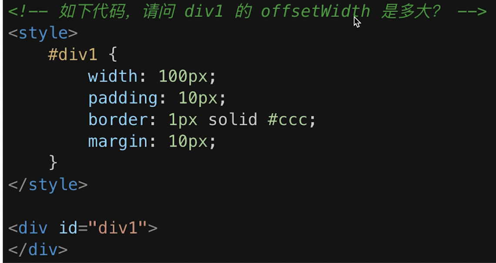

 offsetWidth/offsetHeight 返回值包含 content + padding + border，效果与 e.getBoundingClientRect()相同

 clientWidth/clientHeight 返回值只包含 content + padding，如果有滚动条，也不包含滚动条

 scrollWidth/scrollHeight 返回值包含 content + padding + 溢出内容的尺寸

### margin-top bottom left right 的分别加负值 p1

margin-top left 负值 自身上移或左移，

margin-right 负值，右侧元素左移

margin-bottom 负值，下方元素上移，自身不动

### margin 重叠问题

### BFC 理解与应用 【复习】

https://developer.mozilla.org/zh-CN/docs/Web/Guide/CSS/Block_formatting_context

BFC 是块级格式化作用域（block format context），它是一块独立渲染区域，内部元素的渲染不会影响到外部的元素。

像下方示例的代码 container 没有形成 bfc，img float 之后脱离了文档流，影响到了 container 外的布局，该

p 标签没有形成 bfc 使得其宽度为 100vw，碰到了图片，所以分别给 2 者加上 bfc

形成条件：

-   float 不为 none;
-   positon 是 absolute 或 fixed
-   overflow 不是 visible(默认)
-   display 取值为 inline-block,table-cell, table-caption,flex, inline-flex 之一的元素

BFC 特性：

1.内部的 Box 会在垂直方向上一个接一个的放置；

2.垂直方向上的距离由 margin 决定；（解决外边距重叠问题）

3.bfc 的区域不会与 float 的元素区域重叠；（防止浮动文字环绕）

4.计算 bfc 的高度时，浮动元素也参与计算；（清除浮动）

5.bfc 就是页面上的一个独立容器，容器里面的子元素不会影响外面元素；

作者：Big shark@LX
链接：https://juejin.cn/post/6844904148899463175
来源：掘金
著作权归作者所有。商业转载请联系作者获得授权，非商业转载请注明出处。

1. 内部的盒会在垂直方向一个接一个排列（可以看作 BFC 中有一个的常规流）；
2. 处于同一个 BFC 中的元素相互影响，可能会发生 margin collapse；
3. 每个元素的 margin box 的左边，与容器块 border box 的左边相接触(对于**从左往右的格式化**，否则相反)。即使存在浮动也是如此；
4. BFC 就是页面上的一个隔离的独立容器，容器里面的子元素不会影响到外面的元素，反之亦然；
5. 计算 BFC 的高度时，考虑 BFC 所包含的所有元素，连浮动元素也参与计算；
6. 浮动盒区域不叠加到 BFC 上；

作者：考拉海购前端团队
链接：https://juejin.cn/post/6844903495108132877
来源：掘金
著作权归作者所有。商业转载请联系作者获得授权，非商业转载请注明出处。

https://ithelp.ithome.com.tw/articles/10226790

https://zhuanlan.zhihu.com/p/25321647

```html
<!DOCTYPE html>
<html>
	<head>
		<meta charset="UTF-8" />
		<meta name="viewport" content="width=device-width, initial-scale=1.0" />
		<meta http-equiv="X-UA-Compatible" content="ie=edge" />
		<title>Document</title>
		<style type="text/css">
			.container {
				background-color: #f1f1f1;
			}
			.left {
				float: left;
			}
			.bfc {
				overflow: hidden; /* 触发元素 BFC */
			}
		</style>
	</head>
	<body>
		<div class="container bfc">
			
			<p class="bfc">某一段文字……</p>
		</div>
	</body>
</html>
```

### 三栏布局

#### postion

```
<div class="container">
    <div class="left">Left</div>
    <div class="main">Main</div>
    <div class="right">Right</div>
</div>


body,html,.container{
    height: 100%;
    padding: 0;
    margin: 0;
    overflow: hidden;
}
/*左右进行绝对定位*/
.left,.right{
    position: absolute;
    height:100%;
    top: 0;
    background: #333;
}
.left{
    left: 0;
    width: 200px;
}
.right{
    right: 0;
    width: 200px;
}
/*中间用margin空出左右元素所占的空间*/
.main{
    height:100%;
    margin: 0 200px;
    background: red;
}
/*或者中间也进行绝对定位*/
.main{
    position: absolute;
    height:100%;
    left: 200px;
    right:200px;
    background: red;
}
```

#### 3.flex（弹性盒子布局）

4 table 布局

```html
<div class="container">
	<div class="left">Left</div>
	<div class="main">Main</div>
	<div class="right">Right</div>
</div>

body,html{ height: 100%; padding: 0; margin: 0; overflow: hidden; } .container{
display: table; width:100%; } .container>div{ display: table-cell; } .left{
width: 200px; background: red; } .main{ background: blue; } .right{ width:
200px; background: red; }
```

优点：兼容性很好（ie8 及以上） 父元素高度会被子元素撑开（不担心高度塌陷）
缺点: seo 不友好 当其中一个单元格高度超出的时候，其他的单元格也是会跟着一起变高的

#### 5.Grid(网格布局)

```
<div class="container">
    <div class="left">Left</div>
    <div class="main">Main</div>
    <div class="right">Right</div>
</div>


 body,html{
    height: 100%;
    padding: 0;
    margin: 0;
    overflow: hidden;
}
.container{
    display: grid;
    width: 100%;
    grid-template-rows: 100px;  /*设置行高*/
    grid-template-columns: 200px auto 200px;  /*设置列数属性*/
}
.left{
    background: red;
}
.main{
    background: blue;
}
.right{
    background:red;
}
复制代码
优点：简单强大 解决二维布局问题
缺点: 不兼容 ie9 及以下
```

作者：Big shark@LX
链接：https://juejin.cn/post/6844904148899463175
来源：掘金
著作权归作者所有。商业转载请联系作者获得授权，非商业转载请注明出处。

### 圣杯布局和双飞翼布局

圣杯布局的出现是来自由 Matthew Levine 在 2006 年写的一篇文章 《In Search of the Holy Grail》，在国内最早是淘宝 UED 的工程师（玉伯大大）对圣杯布局改进并传播开来，在中国的叫法是双飞翼布局 。

        圣杯布局和双飞翼布局达到的效果基本相同，都是侧边两栏宽度固定，中间栏宽度自适应。 主要的不同之处就是在解决中间部分被挡住的问题时，采取的解决办法不一样，圣杯布局是在父元素上设置了padding-left和padding-right，在给左右两边的内容设置position为relative，通过左移和右移来使得左右两边的内容得以很好的展现，而双飞翼则是在center这个div中再加了一个div来放置内容，在给这个新的div设置margin-left和margin-right

————————————————
原文链接：https://blog.csdn.net/qq_38128179/article/details/86542447

三栏布局，中间一栏最先加载和渲染

两侧内容固定，中间内容随宽度自适应。

这三栏布局是中间盒子优先渲染，两边的盒子框子宽度固定不变，即使页面宽度变小，也不影响我们的浏览。**`注意：为了安全起见，最好还是给body加一个最小宽度!`**

#### 鲨鱼哥

```js
<div class="container">
    <div class="left">Left</div>
     <!-- 右栏部分要写在中间内容之前 -->
    <div class="right">Right</div>
    <div class="main">Main</div>
</div>

body,html,.containerl{
    height: 100%;
    padding:0;
    margin: 0;
}
/*左边栏左浮动*/
.left{
    float:left;
    height:100%;
    width:200px;
    background:#333;
}
/*中间栏自适应*/
.main{
    height:100%;
    margin:0 200px;
    background: red;
}
/*右边栏右浮动*/
.right{
    float:right;
    height:100%;
    width:200px;
    background:#333;
}
```

防止中间内容被两边覆盖，一个用 padding，一个用 margin

#### 圣杯 1：

html: main left right

css: 三者均浮动、

main 宽 100%

left: -100%(即父元素宽度) position: relative left -自身宽度

right: -自身宽度 position: relative left 自身宽度

父元素 container 必须设置 min-width 否则页面小于最小宽度时会乱掉。

父元素高度塌陷需清除浮动 1、可用伪类 content: ''; display: table; clear: both; 2、overhidden

-   第一步：为三个元素的父元素加上`padding`属性，腾开位置
-   第二步：由于腾开位置后会产生空白，所以使用`position: relative;`属性来移动左右两栏，这样就不会遮挡了。

不过这样布局有一个问题就是：有一个**最小宽度**，当页面小于最小宽度时布局就会乱掉。所以**最好给`body`设置一个`min-width`**。这个`min-width`肯定不能是试出来的，怎么计算呢？就是**left-width \* 2 + right-width**，至于为什么，简单的说就是：**“由于设置了相对定位，所以当 left 原来的位置和 right 的位置产生重叠时，由于浮动的原因一行放不下就会换行”**。所以布局就被打乱了。使用双飞翼布局就可以避免这个问题。

作者：羡鱼丶码鹿
链接：https://juejin.cn/post/6844903565278855181
来源：掘金
著作权归作者所有。商业转载请联系作者获得授权，非商业转载请注明出处。

#### 圣杯 2

与写法 1 的区别：right 部分没用 position 定位,而采用负 margin 的形式

```
/* margin-right为负值，后面的元素左移，左移150px，right就没空间浮动了，就上去了 */
 margin-right: -150px;
```

-margin 自身宽度的效果，在外界元素看来，其不占宽度了。

详解见 第 3 章 CSS 面试题【不多说了，前端面试 CSS 是必考知识，不过关直接回家】 3-6 视频 倒数 4 分钟

代码 cup1.html

过程：

```html
<!DOCTYPE html>
<html>
	<head>
		<meta charset="UTF-8" />
		<meta name="viewport" content="width=device-width, initial-scale=1.0" />
		<meta http-equiv="X-UA-Compatible" content="ie=edge" />
		<title>圣杯布局</title>
		<style type="text/css">
			body {
				min-width: 550px;
			}
			#header {
				text-align: center;
				background-color: #f1f1f1;
			}

			#container {
				padding-left: 200px;
				padding-right: 150px;
			}
			#container .column {
				float: left;
			}

			#center {
				background-color: #ccc;
				width: 100%;
			}
			#left {
				position: relative;
				background-color: yellow;
				width: 200px;
				/* 向左移动100%container */
				margin-left: -100%;
				right: 200px;
			}
			#right {
				background-color: red;
				width: 150px;
				/* margin-right为负值，后面的元素左移，左移150px，right就没空间浮动了，就上去了 */
				margin-right: -150px;
			}

			#footer {
				text-align: center;
				background-color: #f1f1f1;
			}

			/* 手写 clearfix */
			.clearfix:after {
				content: "";
				display: table;
				clear: both;
			}
		</style>
	</head>
	<body>
		<div id="header">this is header</div>
		<div id="container" class="clearfix">
			<div id="center" class="column">this is center</div>
			<div id="left" class="column">this is left</div>
			<div id="right" class="column">this is right</div>
		</div>
		<div id="footer">this is footer</div>
	</body>
</html>
```

#### 双飞翼：todo

header 和 footer 各自占领屏幕所有宽度，高度固定。中间的 container 是一个三栏布局。三栏布局两侧宽度固定不变，中间部分自动填充整个区域。中间部分的高度是三栏中最高的区域的高度。

-   left、center、right 三种都设置左浮动
-   设置 center 宽度为 100%
-   设置负边距，left 设置负边距为 100%，right 设置负边距为自身宽度
-   设置 content 的 margin 值为左右两个侧栏留出空间，margin 值大小为 left 和 right 宽度

```html
<!DOCTYPE html>
<html>
	<head>
		<meta charset="UTF-8" />
		<meta name="viewport" content="width=device-width, initial-scale=1.0" />
		<meta http-equiv="X-UA-Compatible" content="ie=edge" />
		<title>双飞翼布局</title>
		<style type="text/css">
			body {
				min-width: 550px;
			}
			.col {
				float: left;
			}

			#main {
				width: 100%;
				height: 200px;
				background-color: #ccc;
			}
			#main-wrap {
				margin: 0 190px 0 190px;
			}

			#left {
				width: 190px;
				height: 200px;
				background-color: #0000ff;
				margin-left: -100%;
			}
			#right {
				width: 190px;
				height: 200px;
				background-color: #ff0000;
				margin-left: -190px;
			}
		</style>
	</head>
	<body>
		<div id="main" class="col">
			<div id="main-wrap">this is main</div>
		</div>
		<div id="left" class="col">this is left</div>
		<div id="right" class="col">this is right</div>
	</body>
</html>
```

### 清理浮动

```
.clearfix::after {
	clear: both;
	content: '';
	display: table;
}
.clearfix {
    *zoom: 1; /* 兼容 IE 低版本 */
}
```

```
<div class="clearfix">
    
    
</div>
```

### flex 实现一个三点的色子

```html
<!DOCTYPE html>
<html>
	<head>
		<meta charset="UTF-8" />
		<meta name="viewport" content="width=device-width, initial-scale=1.0" />
		<meta http-equiv="X-UA-Compatible" content="ie=edge" />
		<title>flex 画骰子</title>
		<style type="text/css">
			.box {
				width: 200px;
				height: 200px;
				border: 2px solid #ccc;
				border-radius: 10px;
				padding: 20px;

				display: flex;
				justify-content: space-between;
			}
			.item {
				display: block;
				width: 40px;
				height: 40px;
				border-radius: 50%;
				background-color: #666;
			}
			.item:nth-child(2) {
				align-self: center;
			}
			.item:nth-child(3) {
				align-self: flex-end;
			}
		</style>
	</head>
	<body>
		<div class="box">
			<span class="item"></span>
			<span class="item"></span>
			<span class="item"></span>
		</div>
	</body>
</html>
```

## 选择器的权重和优先级 d

!important > 行内> id > 类名> 标签

## 浮动

-   浮动布局概念

float 设计的初衷就是为了实现文字环绕图片效果，使得父标签出现了坍塌现象。导致这一现象的最根本原因在于：**被设置了 float 的元素会脱离文档流**。

### 包裹性

**包裹性**也是 float 的一个非常重要的特性，大家用 float 时一定要熟知这一特性。咱们还是先从一个小例子看起：


如上图，普通的 div 如果没有设置宽度，它会撑满整个屏幕，在之前的盒子模型那一节也讲到过。而如果给 div 增加`float:left`之后，它突然变得紧凑了，宽度发生了变化，把内容中的三个字包裹了——这就是包裹性。为 div 设置了 float 之后，其宽度会自动调整为包裹住内容宽度，而不是撑满整个父容器。

注意，此时 div 虽然体现了包裹性，但是它的 display 样式是没有变化的，还是`display: block`。

float 为什么要具有包裹性？其实答案还是得从 float 的设计初衷来寻找，float 是被设计用于实现文字环绕效果的。文字环绕图片比较好理解，但是如果想要让文字环绕一个 div 呢？此时 div 不被“包裹”起来的话，就无法实现环绕效果了。

### 清空格

float 还有一个大家可能不是很熟悉的特性——清空格。按照惯例，咱还是先举例子说明。

```
<div style="border: 2px solid blue; padding:3px;">
    
    
    
    
</div>
```


加上`float:left`之后：


上面第一张图中，正常的 img 中间是会有空格的，因为多个 img 标签会有换行，而浏览器识别换行为空格，这也是很正常的。第二张图中，为 img 增加了`float:left`的样式，这就使得 img 之间没有了空格，4 个 img 紧紧挨着。

如果大家之前没注意，现在想想之前写过的程序，是不是有这个特性。为什么 float 适合用于网页排版（俗称“砌砖头”）？就是因为 float 排版出来的网页严丝合缝，中间连个苍蝇都飞不进去。

“清空格”这一特性的根本原因是 float 会导致节点脱离文档流结构。它都不属于文档流结构了，那么它身边的什么换行、空格就都和它没了关系，它就尽量往一边靠拢，能靠多近就靠多近，这就是清空格的本质。

## 定位

position 用于网页元素的定位，可设置 static/relative/absolute/fixed 这些值，其中 static 是默认值，不用介绍。

> 题目：relative 和 absolute 有何区别？

**relative 会导致自身位置的相对变化，而不会影响其他元素的位置、大小**。这是 relative 的要点之一。还有第二个要点，就是 relative 产生一个新的定位上下文。

absolute

从上面的结果中，我们能看出几点信息：

-   absolute 元素脱离了文档结构。和 relative 不同，其他三个元素的位置重新排列了。只要元素会脱离文档结构，它就会产生破坏性，导致父元素坍塌。（此时你应该能立刻想起来，float 元素也会脱离文档结构。）
-   absolute 元素具有“包裹性”。之前`<p>`的宽度是撑满整个屏幕的，而此时`<p>`的宽度刚好是内容的宽度。
-   absolute 元素具有“跟随性”。虽然 absolute 元素脱离了文档结构，但是它的位置并没有发生变化，还是老老实实地呆在它原本的位置，因为我们此时没有设置 top、left 的值。
-   absolute 元素会悬浮在页面上方，会遮挡住下方的页面内容。

fixed

其实 fixed 和 absolute 是一样的，唯一的区别在于：absolute 元素是根据最近的定位上下文确定位置，而 fixed 根据 window （或者 iframe）确定位置。

## flex

### 设计原理

设置了`display: flex`的元素，我们称为“容器”（flex container），其所有的子节点我们称为“成员”（flex item）。容器默认存在两根轴：水平的主轴（main axis）和垂直的交叉轴（cross axis）。主轴的开始位置（与边框的交叉点）叫做 main start，结束位置叫做 main end；交叉轴的开始位置叫做 cross start，结束位置叫做 cross end。项目默认沿主轴排列。单个项目占据的主轴空间叫做 main size，占据的交叉轴空间叫做 cross size。


将以上文字和图片结合起来，再详细看一遍，这样就能理解 flex 的设计原理，才能更好地实际使用。

### 设置主轴的方向

`flex-direction`可决定主轴的方向，有四个可选值：

-   row（默认值）：主轴为水平方向，起点在左端。
-   row-reverse：主轴为水平方向，起点在右端。
-   column：主轴为垂直方向，起点在上沿。
-   column-reverse：主轴为垂直方向，起点在下沿。

```
.box {
  flex-direction: column-reverse| column | row | row-reverse;
}
```

以上代码设置的主轴方向，将依次对应下图：


### 设置主轴的对齐方式

`justify-content`属性定义了项目在主轴上的对齐方式，值如下：

-   flex-start（默认值）：向主轴开始方向对齐。
-   flex-end：向主轴结束方向对齐。
-   center： 居中。
-   space-between：两端对齐，项目之间的间隔都相等。
-   space-around：每个项目两侧的间隔相等。所以，项目之间的间隔比项目与边框的间隔大一倍。

```
.box {
    justify-content: flex-start | flex-end | center | space-between | space-around;
}
```


### 交叉轴的对齐方式

`align-items`属性定义项目在交叉轴上如何对齐，值如下：

-   flex-start：交叉轴的起点对齐。
-   flex-end：交叉轴的终点对齐。
-   center：交叉轴的中点对齐。
-   baseline: 项目的第一行文字的基线对齐。
-   stretch（默认值）：如果项目未设置高度或设为 auto，将占满整个容器的高度。

```
.box {
    align-items: flex-start | flex-end | center | baseline | stretch;
}
```


弹性盒子中 flex: 0 1 auto 表示什么意思

Flex-grow flex-shrink flex-basis

https://www.shangmayuan.com/a/2901f970b11b4b5f8af54171.html

`flex` CSS 属性设置的是，`flex` 元素如何根据其在 `flex` 容器中的所剩空间来动态拉伸或收缩，它是 `flex-grow`、`flex-shrink`、`flex-basis` 这三个属性的简化版。前端

其**语法格式**有`单值、双值、三值`三种语法格式。ide

### 单值语法

值必须是以下之一：布局

- 数值 `number`，那么解释为 `flex: number 1 0`
- `none`、`auto`、`initial`

### 双值语法

第一个值必须是 `number`，它会被解释为 `flex-grow` 属性，

第二个值必须是以下之一：

- 数值 `number`，会被解释为 `flex-shrink` 属性
- 一个可以描述**宽度**的值，例如 `10em`、`30%`、`min-content`，会被解释为 `flex-basis` 属性

### 三值语法

三个值的含义：ui

- 第一个 `number` 表示 `flex-grow`
- 第二个 `number` 表示 `flex-shrink`
- 第三个描述宽度的值表示 `flex-basis` https://developer.mozilla.org/zh-CN/docs/Web/CSS/flex-basis

**Note:** 当一个元素同时被设置了 `flex-basis` (除值为 `auto` 外) 和 `width` (或者在 `flex-direction: column` 情况下设置了`height`) , `flex-basis` 具有更高的优先级.

### `flex` 属性经常使用值

##### `flex: 0 auto`

`flex: 0 auto` 等同于 `flex: initial`，也是 `flex: 0 1 auto` 的简写表达。它根据元素自身的 `width` 或 `height` 属性来调节元素大小。

当还剩余一些空闲空间时，它使 `flex` 元素呈现的是固定大小的样式；当没有足够的空间时，它容许它收缩到最小。`auto` 边距可用于根据主轴来对齐元素。

##### `flex: auto`

`flex: auto` 等同于 `flex: 1 1 auto`，它根据元素的 `width` 或 `height` 属性调整元素的大小，可是其很是灵活，以便让它们吸取沿主轴的任何额外空间。

##### `flex: none`

`flex: none` 等同于 `flex: 0 0 auto`。它根据 `width` 和 `height 来调节元素大小，可是彻底不灵活。

flex布局中width和flex-basis区别

https://blog.csdn.net/weixin_42966484/article/details/106275218


## 如何实现居中对齐？p0 差不多

```
inline 元素用text-align: center;即可，如下：
block 元素可使用margin: auto;，PC 时代的很多网站都这么搞。
绝对定位元素可结合left和margin实现，但是必须知道宽度。

垂直居中：
inline 元素可设置line-height的值等于height值，如单行文字垂直居中：
绝对定位元素，可结合left和margin实现，但是必须知道尺寸。

display: flex;
align-items: center;
justify: center;

position: absolute; left top 50% tranform: tanslate(-50%, -50%);
缺点：兼容性不好

```

```
绝对定位结合margin: auto，不需要提前知道尺寸，兼容性好。

.container {
    position: relative;
    height: 300px;
}
.item {
    width: 100px;
    height: 50px;
    position: absolute;
    left: 0;
    top: 0;
    right: 0;
    bottom: 0;
    margin: auto;
}
```

## 响应式

rem，相对单位，相对于根元素 font-size

媒体查询

```style
@media only screen and (max-width: 374px) {
    /* iphone5 或者更小的尺寸，以 iphone5 的宽度（320px）比例设置 font-size */
    html {
        font-size: 86px;
    }
}
@media only screen and (min-width: 375px) and (max-width: 413px) {
    /* iphone6/7/8 和 iphone x */
    html {
        font-size: 100px;
    }
}
@media only screen and (min-width: 414px) {
    /* iphone6p 或者更大的尺寸，以 iphone6p 的宽度（414px）比例设置 font-size */
    html {
        font-size: 110px;
    }
}
```

window.screen.height 屏幕高度

window.innerHeight 网页视口高度(不含工具栏，地址栏)

document.body.clientHeight Body 高度

vh vw 视口高度、宽度的 1/100

vmax vmin

## CSS3 动画 p1

CSS3 可以实现动画，代替原来的 Flash 和 JavaScript 方案。

首先，使用`@keyframes`定义一个动画，名称为`testAnimation`，如下代码，通过百分比来设置不同的 CSS 样式，规定动画的变化。所有的动画变化都可以这么定义出来。

```
@keyframes testAnimation
{
    0%   {background: red; left:0; top:0;}
    25%  {background: yellow; left:200px; top:0;}
    50%  {background: blue; left:200px; top:200px;}
    75%  {background: green; left:0; top:200px;}
    100% {background: red; left:0; top:0;}
}
```

然后，针对一个 CSS 选择器来设置动画，例如针对`div`元素设置动画，如下：

```
div {
    width: 100px;
    height: 50px;
    position: absolute;

    animation-name: myfirst;
    animation-duration: 5s;
}
```

`animation-name`对应到动画名称，`animation-duration`是动画时长，还有其他属性：

-   `animation-timing-function`：规定动画的速度曲线。默认是`ease`
-   `animation-delay`：规定动画何时开始。默认是 0
-   `animation-iteration-count`：规定动画被播放的次数。默认是 1
-   `animation-direction`：规定动画是否在下一周期逆向地播放。默认是`normal`
-   `animation-play-state` ：规定动画是否正在运行或暂停。默认是`running`
-   `animation-fill-mode`：规定动画执行之前和之后如何给动画的目标应用，默认是`none`，保留在最后一帧可以用`forwards`

## 题目：CSS 的`transition`和`animation`有何区别？ P1

首先`transition`和`animation`都可以做动效，从语义上来理解，`transition`是过渡，由一个状态过渡到另一个状态，比如高度`100px`过渡到`200px`；而`animation`是动画，即更专业做动效的，`animation`有帧的概念，可以设置关键帧`keyframe`，一个动画可以由多个关键帧多个状态过渡组成，另外`animation`也包含上面提到的多个属性。

## 回流&重绘 p0 todo


### 回流

回流：渲染对象在创建完成并添加到渲染树时，只是将 DOM 节点和它对应的样式结合起来，并不包含位置和大小信息。所以还需要 `layout` 这一过程计算他们的位置和大小，这一过程称为回流。

指的是处于文档流中 DOM 的尺寸、位置 变化时发生，导致浏览器重新渲染部分或全部文档的情况。一些属性的读取例如 DOM 的宽高或 getComputedStyle 也会导致回流。

相比之下回流比重绘更加消耗性能。

 document.write 只能重绘整个页面

 innerHTML 可以重绘页面的一部分

导致reflow操作：

- 浏览器窗口大小改变；
- 元素尺寸、位置改变(width padding margin left top border)；
- 元素内容变化（文字数量） 字体大小
- 添加或删除DOM
- 激活CSS伪类
- 查询某些属性或调用某些方法

clinetWidth height top left

offsetWidth 

scrollWIDTH

- `scrollIntoView()`、`scrollIntoViewIfNeeded()`
- `getComputedStyle()`
- `getBoundingClientRect()`
- `scrollTo()`

由于浏览器使用流式布局，对`Render Tree`的计算通常只需要遍历一次就可以完成，但`table`及其内部元素除外，他们可能需要多次计算，通常要花3倍于同等元素的时间，这也是为什么要避免使用`table`布局的原因之

一。

Reflow


### 重绘

那么我们就可以将渲染树的每个节点都转换为屏幕上的实际像素，这个过程就叫做重绘。

指当前页面中的元素不脱离文档流，而简单的进行样式的变化，如颜色、背景等

浏览器重新绘制样式。

`color`、`background-color`、`visibility` 、`outline`等

3.JS / CSS > 样式 > 合成


有些属性可以使渲染流水线跳过布局和绘制环节，只需要做合成层的合并即可，例如：transform 和 opacity 属性。

有些文章有写到 transform 和 opacity 属性不会引起回流和重绘，但是上述例子（只截取动画开始部分）实际效果是在动画开始和结束的时候都有一次重绘（Paint。动画过程中只会发生 **composite **合成。那这里为什么会有重绘呢？是因为对 transform 和 opacity 应用了 animation 或者 transition属性是需要这两个属性是在过程中的，如果 animation 或者 transition 未开始或者已结束，那么提升合成层也会失效。所以动画开始前创建合成层发生一次重绘，动画结束后独立的合成层被移除，移除后会引发重绘。
作者：政采云前端团队
链接：https://juejin.cn/post/7013131773756309517 todo


### 如何避免

Css 

避免使用table布局

避免使用CSS表达式 例如 calc()

尽可能在DOM树末端修改class，而不是其父级。

避免设置


js

- 避免频繁操作样式，最好一次性重写`style`属性，或者将样式列表定义为`class`并一次性更改`class`属性。

对于复杂动画的元素使用绝对定位，使它脱离文档流，否则父元素及后续元素频繁回流。

**css3硬件加速（GPU加速）**

比起考虑如何减少回流重绘，我们更期望的是，根本不要回流重绘。这个时候，css3硬件加速就闪亮登场啦！！

**划重点：**

**1. 使用css3硬件加速，可以让transform、opacity、filters这些动画不会引起回流重绘 。**

**2. 对于动画的其它属性，比如background-color这些，还是会引起回流重绘的，不过它还是可以提升这些动画的性能。**

作者：腾讯IVWEB团队
链接：https://juejin.cn/post/6844903779700047885
来源：稀土掘金
著作权归作者所有。商业转载请联系作者获得授权，非商业转载请注明出处。


> 题目：找出下面代码的优化点，并且优化它

```
var data = ['string1', 'string2', 'string3'];
for(var i = 0; i < data.length; i++){
    var dom = document.getElementById('list');
    dom.innerHTML += '<li>' + data[i] + '</li>';
}
```

上面的代码在循环中每次都获取`dom`，然后对其内部的 HTML 进行累加`li`，每次都会操作 DOM 结构，可以改成使用`documentFragment`或者先遍历组成 HTML 的字符串，最后操作一次`innerHTML`。


# JS

思考题：

https://juejin.cn/book/6844733763675488269/section/6844733763767779342

## A.变量类型

### Q1: 解释 JS 中的值和类型

### Q2: JS 中类型转换？m1p0 d

强制显示类型 parseInt parseFloat toString Number

if 逻辑运算（与或非） == +拼接字符串

100 + ‘10’ ’10010‘

100 == '100'

0 == ''

0 == false

false == ''

null == undefined

除了 null 和 undefined 比较用 == 其它地方一律用===， jquery 源码也是用的两等

truly 变量: !!a === true

falsely 变量 !!a === false

```
!!0
!!NaN not a number
!!''
!!null
!!undefined
!!false
```

if 语句判断的是 falsely 变量，和 C 语言不同

逻辑判断 与或非

### Q3: 解释 JS 中的相等判断 m1P0 d

Q3-1: 何时使用=== 何时使用== m1 d

除了 null 和 undefined，其它都用===

### Q4: 如何检查一个数字是否为整数？P0

取余 1 是否为 0

### Q5: 如果比较 JavaScript 中的两个对象？P0

### Q6: undefined 和 not defined 的区别、null undefined 区别 P0

### Q7:介绍 js 有哪些内置对象？宿主对象 和原生对象 P0

(host objects)

原生对象 (native objects)

### Q8：类型判断用到哪些方法？ m1p0 d

typeof vs instanceof

`typeof` 对于原始类型来说，除了 `null` 都可以显示正确的类型

```js
typeof 1; // 'number'
typeof "1"; // 'string'
typeof undefined; // 'undefined'
typeof true; // 'boolean'
typeof Symbol(); // 'symbol'
```

`typeof` 对于对象来说，除了函数都会显示 `object`，所以说 `typeof` 并不能准确判断变量到底是什么类型

typeof 能判断哪些类型？

```
number string boolean undefined  object(包括null,数组)  function symbol
typeof console.log function
```

如果我们想判断一个对象的正确类型，这时候可以考虑使用 `instanceof`

对于原始类型来说，你想直接通过 `instanceof` 来判断类型是不行的，当然我们还是有办法让 `instanceof` 判断原始类型的

```js
class PrimitiveString {
	static [Symbol.hasInstance](x) {
		return typeof x === "string";
	}
}
console.log("hello world" instanceof PrimitiveString); // true
```

你可能不知道 `Symbol.hasInstance` 是什么东西，其实就是一个能让我们自定义 `instanceof` 行为的东西，以上代码等同于 `typeof 'hello world' === 'string'`，所以结果自然是 `true` 了。这其实也侧面反映了一个问题， `instanceof` 也不是百分之百可信的。

### Q8-1 instanceof 原理 m1p0 d

用来测试一个对象在其原型链中是否存在一个构造函数的 prototype 属性

```js

A B
let isInstanceOf = false;
let proto;
while (a && a.__proto__) {
	proto = a.__proto__;
  if (B === proto) {
    isInstanceOf = true
  }
}
return isInstanceOf
错×!错×!错×!
```

检测后者是否出现在前者的原型链上

应该是后者的原型对象与之作比较

```js
function myInstanceof(left, right) {
	const prototype = right.prototype;
	left = left.__proto__;
	while (true) {
		if (left === null || left === undefined) return false;
		if (prototype === left) return true;
		left = left.__proto__;
	}
}
```

```js
function myInstanceof(left, right) {
	console.log("left: ", left);
	while (left) {
		left = left.__proto__;
		if (left === right.prototype) {
			return true;
		}
	}
	return false;
}
```

以下是对实现的分析：

-   首先获取类型的原型
-   然后获得对象的原型
-   然后一直循环判断对象的原型是否等于类型的原型，直到对象原型为 `null`，因为原型链最终为 `null`

### Q9: 原始类型有哪几种？null 是对象嘛？p0

Primitive

6 种 number string boolean undefined null symbol

首先原始类型存储的都是值，是没有函数可以调用的，比如 `undefined.toString()`


此时你肯定会有疑问，这不对呀，明明 `'1'.toString()` 是可以使用的。其实在这种情况下，`'1'` 已经不是原始类型了，而是被强制转换成了 `String` 类型也就是对象类型，所以可以调用 `toString` 函数。

另外对于 `null` 来说，很多人会认为他是个对象类型，其实这是错误的。虽然 `typeof null` 会输出 `object`，但是这只是 JS 存在的一个悠久 Bug。在 JS 的最初版本中使用的是 32 位系统，为了性能考虑使用低位存储变量的类型信息，`000` 开头代表是对象，然而 `null` 表示为全零，所以将它错误的判断为 `object` 。虽然现在的内部类型判断代码已经改变了，但是对于这个 Bug 却是一直流传下来。

### 10: 值类型和引用类型的区别 m1p0 d

对象类型和原始类型的不同之处？

JS 当中，值类型是存储在栈当中，

引用类型存储在堆中，

引用类型变量 a 的 value 存储的是对象的内存地址。 包含 null 对象 数组等内置对象，function

为什么引用类型复制的是内存地址，因为性能问题。

在 JS 中，除了原始类型那么其他的都是对象类型了。对象类型和原始类型不同的是，原始类型存储的是值，对象类型存储的是地址（指针）。当你创建了一个对象类型的时候，计算机会在内存中帮我们开辟一个空间来存放值，

### 11 实现 JQuery m1p1

todo

```js
class jQuery {
	constructor(selector) {
		const result = document.querySelectorAll(selector);
		const length = result.length;
		for (let i = 0; i < length; i++) {
			this[i] = result[i];
		}
		this.length = length;
		this.selector = selector;
	}
	get(index) {
		return this[index];
	}
	each(fn) {
		for (let i = 0; i < this.length; i++) {
			const elem = this[i];
			fn(elem);
		}
	}
	on(type, fn) {
		return this.each(elem => {
			elem.addEventListener(type, fn, false);
		});
	}
	// 扩展很多 DOM API
}

// 插件
jQuery.prototype.dialog = function (info) {
	alert(info);
};

// “造轮子”
class myJQuery extends jQuery {
	constructor(selector) {
		super(selector);
	}
	// 扩展自己的方法
	addClass(className) {}
	style(data) {}
}

// const $p = new jQuery('p')
// $p.get(1)
// $p.each((elem) => console.log(elem.nodeName))
// $p.on('click', () => alert('clicked'))
```

### 函数声明式和表达式的区别 m1

## B.数组、对象深拷贝

### Q1：数组方法 Map、flatMap、reduce P0

### Q2：set get 方法

### Q3：深拷贝 m1p0 d

像普通的浅拷贝，当拷贝一个对象，他的 key 对应的 value 为对象时，拷贝的只是对象地址的引用，而深拷贝则是创建一个新对象。

实现递归实现，

浅拷贝：Object.assign 展开运算符...

```

```

4-2 4min 处

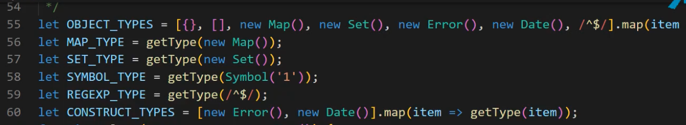

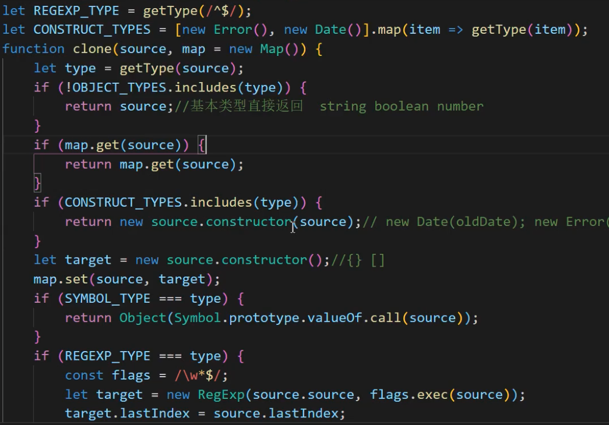

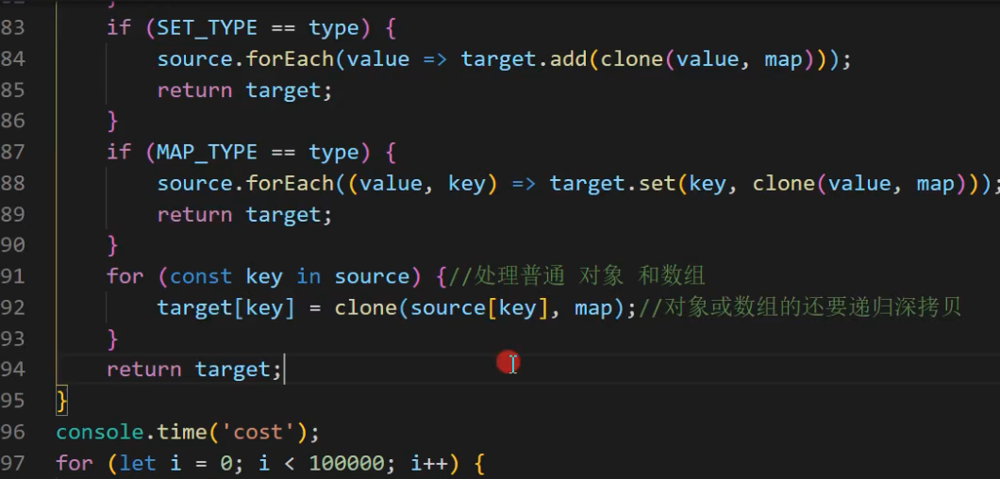

### Q4：JS 创建对象的几种方式？ P0m1

```
// 1.对象字面量
let a={name:'xxx'}

// 2.构造函数
function Person(name){
    this.name=name
}
let b=new Person('xxx')

// 3.Object.create(proto, [propertiesObject])
// Object.create()方法创建的对象时，属性是在原型下面的
let c=Object.create({name:'xxx'})
```

### Q5：new 操作符具体干了什么呢？源码如何实现的？ P0

new 的原理是什么？通过 new 的方式创建对象和通过字面量创建有什么区别？

在调用 `new` 的过程中会发生以上四件事情：

1. 新生成了一个对象
2. 链接到原型
3. 绑定 this
4. 返回新对象

```
const instance = {};
Fn.call(instance, params);
instance.constructor = Fn;
instance.__proto__ = Fn.prototype;
```

创建一个对象，并将 this 指向该对象，执行构造函数，

对象的 constructor 指向构造函数、\_\_proto\_\_指向原型对象。

**记忆**

```js
function create() {
	let obj = {};
	let Con = [].shift.call(arguments);
	obj.__proto__ = Con.prototype;
	let result = Con.apply(obj, arguments);
	return result instanceof Object ? result : obj;
}
```

以下是对实现的分析：

-   创建一个空对象
-   获取构造函数
-   设置空对象的原型
-   绑定 `this` 并执行构造函数
-   确保返回值为对象

对于对象来说，其实都是通过 `new` 产生的，无论是 `function Foo()` 还是 `let a = { b : 1 }` 。

对于创建一个对象来说，更推荐使用字面量的方式创建对象（无论性能上还是可读性）。因为你使用 `new Object()` 的方式创建对象需要通过作用域链一层层找到 `Object`，但是你使用字面量的方式就没这个问题。

```js
function Foo() {}
// function 就是个语法糖
// 内部等同于 new Function()
let a = { b: 1 };
// 这个字面量内部也是使用了 new Object()
```

更多关于 `new` 的内容可以阅读我写的文章 [聊聊 new 操作符](https://link.juejin.cn/?target=https%3A%2F%2Fgithub.com%2FKieSun%2FDream%2Fissues%2F14)。

### Q6: 对象遍历 和 数组遍历 P1

### Q7: 数组的哪些 API 是纯函数 m1

不改变原数组（没有副作用

返回一个数组

concat slice filter every forEach map

slice 能传负数

### split 和 join 区别 m1

### 数组的 pop push unshift shift m1

### slice 和 splice 的区别

### [10, 20, 30].map(parseInt)

## C.作用域、作用域链、闭包

### Q1: JS 作用域是？

作用域是一个独立的地盘、不会让变量外泄、暴露出去。

ES6 之前，JS 没有块级作用域，只有全局作用域和函数作用域。

ES6 之后，增加了块级作用域

易错：

```
console.log(b); // 这里报错
// Uncaught ReferenceError: b is not defined
b = 100;
```

非 var let const 声明的变量，不存在变量提升。

### Q1-1 JS 作用域链 m1P0

自由变量（todo）：当前作用域没有定义的变量称为自由变量。没有就得向父级作用域查找，父级再没有，再一层层向上寻找，直到找到全局作用域还是没找到，就宣告结束。这种一层层的关系就是作用域链。

### Q1-2 变量提升 m1p0

一个函数在执行前，会创建一个函数执行上下文环境，进行预解析，发现 var，会提前将该变量识别为 undined，发现函数就会提前声明，且函数优先级打印变量。

跟全局上下文类似，只不过多出 this arguments 和函数的参数，

### Q2: 什么叫 IIFEs? P1

(Immediately Invoked Function Expressions)

### Q3: 什么是闭包（closure），为什么要用它？请提供一个例子 P0 复习

函数 A 里有个函数 B，函数 B 可以访问函数 A 中的变量，那么 B 就称为闭包。

意义：能够间接访问函数内部的变量。

```js
function A() {
	var age = 18;
	function B() {
		console.log(age);
	}
}
```

全局作用域、函数作用域、块级作用域

自由变量：一个变量在当前作用域没有定义，但被使用的。

自由变量将从作用域链中去寻找，但是 **依据的是函数定义时的作用域链，而不是函数执行时**，以上这个 例子就是闭包。闭包主要有两个应用场景:

**函数作为返回值**，上面的例子就是 **函数作为参数传递**，看以下例子（见 6-2 隐藏数据，只提供 API）

```js
// 易错
// 函数作为返回值
function create() {
	let a = 100;
	return function () {
		console.log(a);
		console.log(this.a);
	};
}
// var a = 200;
let a = 200;
const fn = create();
fn();

// 函数作为参数
function print(func) {
	let b = 200;
	func();
}
let b = 100;
function func() {
	console.log("b", b);
}
print(func);
// 自由变量 去它定义的地方，上级作用域查找，而不是函数执行的地方。
```

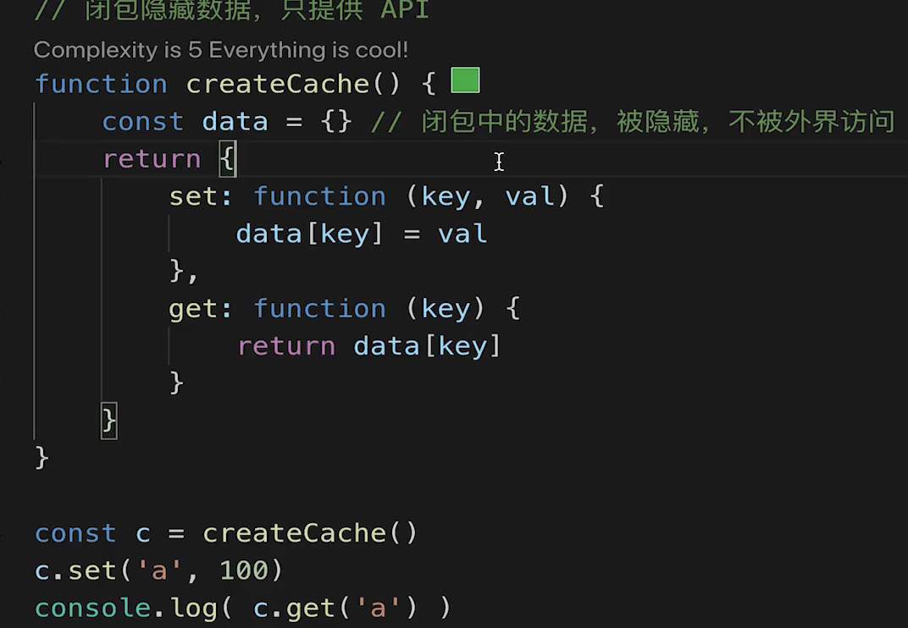

### 创建 10 个标签，点击不同标签，打印其序号值 m1p0

经典面试题，循环中使用闭包解决 `var` 定义函数的问题

```js
for (var i = 1; i <= 5; i++) {
	setTimeout(function timer() {
		console.log(i);
	}, i * 1000);
}
```

```js
for (var i = 1; i <= 5; i++) {
	(function (k) {
		setTimeout(function timer() {
			console.log(k);
		}, k * 1000);
	})(i);
}
```

第二种就是使用 `setTimeout `的第三个参数，这个参数会被当成 `timer` 函数的参数传入。

```js
for (var i = 1; i <= 5; i++) {
	setTimeout(
		function timer(j) {
			console.log(j);
		},
		i * 1000,
		i
	);
}
```

方法 3 用 let 声明

### Q4: JS 中如何创建私有变量？

### Q5 JS 垃圾回收机制 P2

Qn: JavaScript 有几种类型的值？，你能画一下他们的内存图吗？

### 自测

## D.函数（高阶、匿名）

### Q1: 请解释什么叫做回调函数并提供一个简单的例子

### Q2: 请实现如下函数 P0 d

```
var addSix = createBase(6);
addSix(10); // returns 16
addSix(21); // returns 27
```

### Qn: 匿名函数和命名函数区别？p2

## E.原型、原型链、继承

### Q1: JS 原型，原型链 ? m1P0

JS 是采用原型的方式实现继承的，每个构造函数都有一个 prototype 的属性，指向一个原型对象，上面可以挂载公共属性和方法，构造函数的实例都有一个、\_\_\_proto\_\_\_属性，同样指向该原型，

当我们想得到一个对象的属性时，如果这个对象本身没有该属性，那么就是它的\_\_proto\_\_上查找，如果原型上也没有，就去原型对象的\_\_proto\_\_查找，就这样向上一层层形成一个链条，即为原型链。

那么如何判断这个属性是不是对象本身的属性呢?使用 hasOwnProperty ，常用的地方是遍历一个对象 的时候。

// 要点四:引用类型的 **proto** 属性值指向它的构造函数的 prototype 属性值 console.log(obj.**proto** === Object.prototype)

```js
var item;
for (item in f) {
	// 高级浏览器已经在 for in 中屏蔽了来自原型的属性，但是这里建议大家还是加上这个判断，保证 程序的健壮性
	if (f.hasOwnProperty(item)) {
		console.log(item);
	}
}
```


特殊点： Function() 的\_\_proto\_\_为 Function.prototype 因为 ？？？？

Function 本身是一个函数。而所有函数都是 Function 的实例。所以 Function 是 Function 的实例

让 Function 变成一个机器了，目的是让所有的构造函数的\_\_proto\_\_ 都指向了 Function.prototype，包括 Function 本身这条逻辑走通吗？

额，至于 Function 的 \_\_proto\_\_，函数本身是对象，也有自己的原型，函数的 call bind apply 都挂在 Function.prototype 上，每个函数都可以调用到。

因为 JS 原型链设计时定义了 Object 是一等公民，Function 是二等公民， 所以你再想想为什么 `Function.prototype.__proto__ === Object.prototype` 为什么为 `true`

因为 Function 牛比啊，他不仅生了对象，他还生了函数，还生了自己。Object 就是他生的函数。所以

Object.\_\_proto\_\_ === Function.prototype

Function.\_\_proto\_\_===Function.prototype

到这里就成环形结构了，就是所谓的原型链。Object.prototype 就是没人要的野孩子了，所以为 null

### Q2: JS 如何实现继承？JS 继承的几种实现方式？P0 复习

原型继承、构造函数继承、组合继承

#### 1、原型继承

：子类的原型指向父类的实例

```
Child.prototype = new Parent();
```

```
优点：
1. 简单，易于实现
2. 父类新增原型方法、原型属性，子类都能访问到
缺点：
1. 无法实现多继承，因为原型一次只能被一个实例更改
2. 来自原型对象的所有属性被所有实例共享（上诉例子中的color属性）
3. 创建子类实例时，无法向父构造函数传参
```

java 里是没有多继承的，即一个子类不能同时继承多个父类，但可以实现多个接口，这也间接的实现了多继承

作者：Big shark@LX

链接：https://juejin.cn/post/6844904148899463175
来源：掘金

#### 2、构造函数继承

子类中调用构造函数(复制父类的实例属性给子类)

```
function Child(value) {
  Parent.call(this, value)
}
```

```
主要缺点：没有继承父类的prototype
优点：
1. 解决了原型链继承中子类实例共享父类引用属性的问题
2. 创建子类实例时，可以向父类传递参数
3. 可以实现多继承（call多个父类对象）
缺点：
1. 实例并不是父类的实例，只是子类的实例
2. 只能继承父类实例的属性和方法，不能继承其原型上的属性和方法
3. 无法实现函数复用，每个子类都有父类实例函数的副本，影响性能
```

#### 3、组合继承

原型继承和构造继承的结合。

使用原型链实现对原型属性和方法的继承，而通过构造函数来实现对实例属性的继承

缺点：1、调用了两次父类方法； 2 需要手动绑定 constructor

```
Child.protptype.construtor = Child;
```

#### 4、寄生式组合继承

创建一个中介函数，通过寄生方式，砍掉父类的实例属性，避免了组合继承生成两份实例的缺点

```
let F = function () {};
F.prototype = Parent.prototype;
Child.prototype = new F();
```

```
优点：
1. 比较完美（js实现继承首选方式）
缺点：
1.实现起来较为复杂（可通过Object.create简化）
```

#### 5、Object.create()

创建一个新对象，使现有对象成为其\_\_proto\_\_

#### 6、 ES6 extends

#### 7、实例继承：

为父类实例添加新特征，作为子类实例返回

```js
function Son(name) {
	let f = new Father("传给父类的参数");
	f.name = name || "son";
	return f;
}

let s = new Son("son"); //或者直接调用子类构造函数 let s = Son("son");
console.log(s.name); // son
s.sayAge(); // 18
s.sayName(); // son
console.log(s.age); // 18
console.log(s instanceof Father); // true
console.log(s instanceof Son); // false
console.log(s.constructor === Father); // true
console.log(s.constructor === Son); // false
```

```
优点：
1. 不限制调用方式，不管是new 子类()还是子类(),返回的对象具有相同的效果
缺点：
1. 实例是父类的实例，不是子类的实例
2. 不支持多继承
```

#### 8、拷贝继承

对父类实例中的的方法与属性拷贝给子类的原型

```
    function Son(name) {
      let f = new Father("传给父类的参数");
      for (let k in f) {
        Son.prototype[k] = f[k];
      }
      Son.prototype.name = name;
    }

    let s = new Son("son");
    console.log(s.name); // son
    s.sayAge(); // 18
    s.sayName(); // son
    console.log(s.age); // 18
    console.log(s instanceof Father); // false
    console.log(s instanceof Son); // true
    console.log(s.constructor === Father); // false
    console.log(s.constructor === Son); // true
复制代码
优点：
1. 支持多继承
缺点：
1. 效率低，性能差，占用内存高（因为需要拷贝父类属性）
2. 无法获取父类不可枚举的方法（不可枚举的方法，不能使用for-in访问到)
复制代码
```

### Q3:Class 如何实现继承？Class 本质是什么？m1P1

首先先来讲下 `class`，其实在 JS 中并不存在类，`class` 只是语法糖，本质还是函数。

```js
class Person {}
Person instanceof Function; // true
```

`class` 实现继承的核心在于使用 `extends` 表明继承自哪个父类，并且在子类构造函数中必须调用 `super`，因为这段代码可以看成 `Parent.call(this, value)`。

当然了，之前也说了在 JS 中并不存在类，`class` 的本质就是构造函数。

```js
class People {
	constructor(name) {
		this.name = name;
	}
}
```

```js
class Student extends People {
	constructor(name, number ) {
		super(name);
		this.number = number;
	}
	sayHi() {
		console.log(`姓名${this.name}`)
	}
}
```

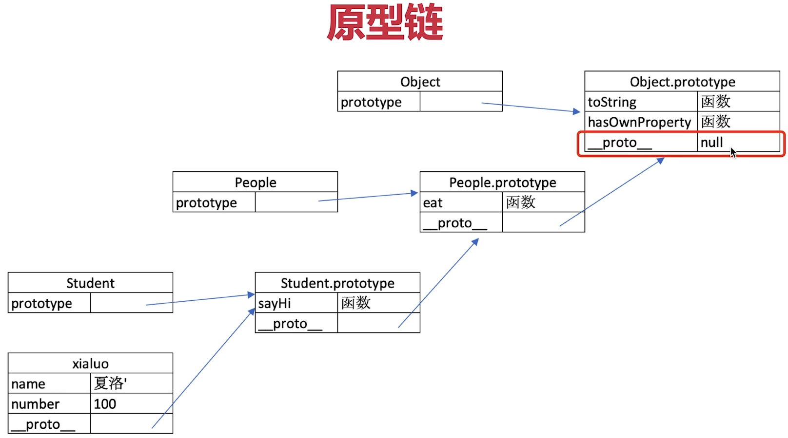

class 是 ES6 语法规范，由 ECMA 委员会发布

以上实现方式都是 V8 引擎的实现方式，

### new Object() 和 Object.create 区别 m1

Object.create(null) 没有原型

### consolewhat

https://juejin.cn/post/6844903782229213197

https://zhuanlan.zhihu.com/p/22989691

```js
var F = function () {};

Object.prototype.a = function () {
	console.log("a");
};

Function.prototype.b = function () {
	console.log("b");
};

var f = new F();

f.a();
f.b();

F.a();
F.b();
```

```js
function Person(name) {
	this.name = name;
}
let p = new Person("Tom");
```

问题 1：1. p.**proto**等于什么？ Person.prototype

问题 2：Person.**proto**等于什么？Function.prototype

-   题目 4

```js
var foo = {},
	F = function () {};
Object.prototype.a = "value a";
Function.prototype.b = "value b";

console.log(foo.a); //  'value a';
console.log(foo.b); // undefined

console.log(F.a); //  'value a';
console.log(F.b); //  'value b';
```

```js
function Person(name, age) {
  this.name = name;
  this.age = age;
  this.eat = function() {
    console.log(age + "岁的" + name + "在吃饭。");
  }
}

let p1 = new Person("jsliang", 24);
let p2 = new Person("jsliang", 24);

console.log(p1.eat === p2.eat); ？？？
```

### 自测：

Q1:

js 是采用原型继承的，每个构造函数有个 prototype 属性指向一个原型对象，上面可以挂载公共属性和方法。

构造函数的实例都有一个--proto--属性，也指向该原型对象。

原型链：

以数组[1, 2, 3]举例，他的原型是 Array.prototype

访问一个对象属性时，先从自身查找，如果没有就去他的原型--proto--，查找，如果还查不到，就去原型对象的--proto--查找，【就这样向上一层层形成的链条称为原型链。】原型的顶层是 null

Q2:

1、原型继承。父类的实例作为子类的原型

缺点：不能传参；需手动修改 constructor

【❤ 原型对象上的引用类型属性被子类共享】

2 构造继承 子类中调用父类函数

缺点：不能继承父类原型上的属性和方法。实例不是父类的实例。

【❤4 寄生组合继承】

为了解决构造函数被执行两次的问题, 我们将`指向父类实例`改为`指向父类原型`, 减去一次构造函数的执行

由于子类原型和父类原型指向同一个对象，我们对子类原型的操作会影响到父类原型，

为了解决这个问题，我们给`Parent.prototype`做一个浅拷贝

```
function Child() {
    // 构造函数继承
    Parent.call(this, 'zhangsan')
}

let F = new Function();
F.prototype = Parent.prototype;
Child.prototype = new F();
Child.prototype.constructor = Child

let child = new Child();
```

或

```
Child.prototype = Object.create(Parent.prototype)  //将`指向父类实例`改为`指向父类原型`
```

### 资料：

[深入理解 javascript 原型和闭包系列](https://www.cnblogs.com/wangfupeng1988/p/4001284.html)

## F. this 指向

### Q1: `this`关键字如何工作？请提供一些例子 m1p0

由于函数可以在不同的运行环境执行，所以需要有一种机制，能够在函数体内部获得当前的运行环境（context）。所以，this 就出现了，它的设计目的就是在函数体内部，指代函数当前的运行环境。

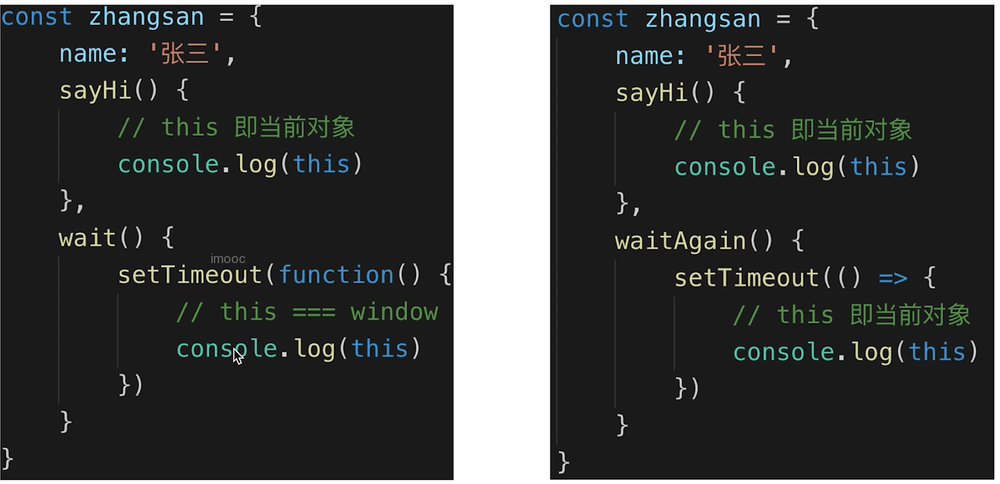

### Q1-1 谈谈 This 的理解。m1p0

this 是一个关键字，代表函数运行时，自动生成的一个内部对象，

this 的值是在执行时才能确认，定义时不能，this 指向函数的直接调用者。

如果有 new 关键字 this 指向生成的实例对象。

最后几种情况也就是 `bind` 这些改变上下文的 API 了，对于这些函数来说，`this` 取决于第一个参数，如果第一个参数为空，那么就是 `window`。

### Q1-2 **new 运算符原理** M1p0 done

1.创建一个空对象；

2、将空对象的\_\_proto\_\_指向构造函数的 prototype

3、通过 apply 执行构造函数，属性和方法被添加到上面的空对象。

4、如果构造函数中没有返回其它对象，那么返回 this，即创建的这个的新对象，否则，返回构造函数中返回的对象

```js
function _new(func) {
	// 第一步 创建新对象
	let obj = {};
	// 第二步 空对象的_proto_指向了构造函数的prototype成员对象
	obj.__proto__ = func.prototype; //
	// 一二步合并就相当于 let obj=Object.create(func.prototype)

	// 第三步 使用apply调用构造器函数，属性和方法被添加到 this 引用的对象中
	let result = func.apply(obj);
	if (result && (typeof result == "object" || typeof result == "function")) {
		// 如果构造函数执行的结果返回的是一个对象，那么返回这个对象
		return result;
	}
	// 如果构造函数返回的不是一个对象，返回创建的新对象
	return obj;
}
```

### Q2. call、apply、bind 的区别？源码实现 m1P0 done，

call 和 apply 谁性能更好

```js
思路： 目标对象添加fn属性，
Function.prototype.call = function(target, ...rest) {
	target.fn = this;
	const context = target || window;
	const result = function() {
  	return context.fn(arguments);
	}
	delete target.fn;
	return result;
}

优化
 if (typeof this !== 'function') {
    throw new TypeError('Error')
  }

属性symbol
const fn = Symbol();
target[fn] = this;
```

```js
Function.prototype.apply = function (target, paramList) {
	target.fn = this;
	const context = target || window;
	const result = function () {
		return context.fn(...paramList);
	};
	delete target.fn;
	return result;
};
```

记忆：

bind 返回的函数被 new 时处理

见 6-4，3:03

```js
Function.prototype.bind = function (target, ...rest) {
	const _this = this;
	const context = target || window;

	return function Fn() {
		if (this instanceof Fn) {
			return new _this(...rest, ...argument);
		}
		return myCall(target, ...rest, ...arguments);
	};
};
```

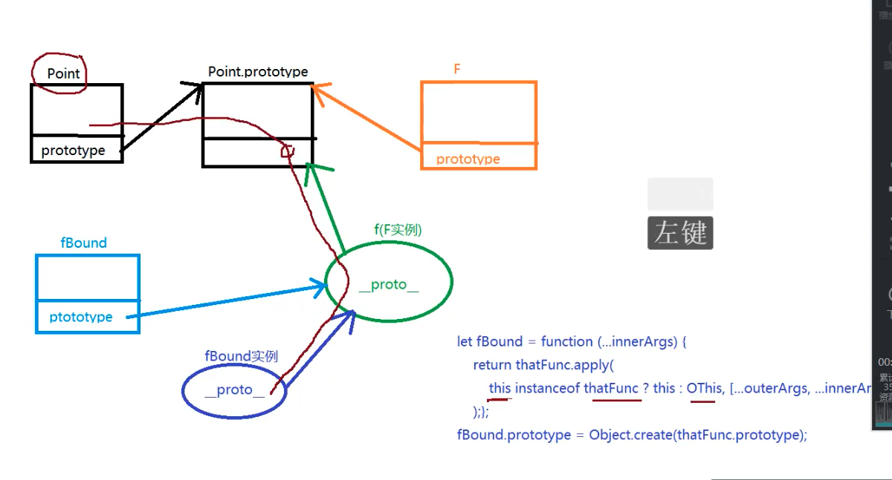

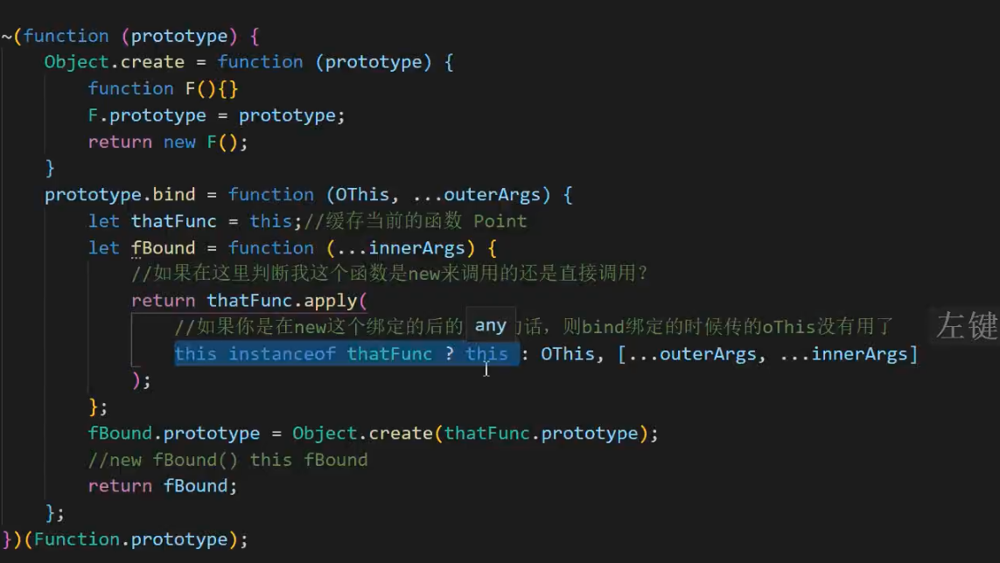

#### 性能：

call 更好

jsperf.com 访问不了

### Q2-1 箭头函数中 this 与普通函数 m1P0

取决于 context

第二可以解决 ES6 之前函数执行中 this 是全局变量的问 题，看如下代码

```js
function fn() {
	console.log("real", this); // {a: 100} ，该作用域下的 this 的真实的值
	var arr = [1, 2, 3];
	// 普通 JS
	arr.map(function (item) {
		console.log("js", this); // window 。普通函数，这里打印出来的是全局变量，令人费解
		return item + 1;
	});
	// 箭头函数
	arr.map(item => {
		console.log("es6", this); // {a: 100} 。箭头函数，这里打印的就是父作用域的 this
		return item + 1;
	});
}
fn.call({ a: 100 });
```

### Q3 手动实现一个 bind 方法。 P0

### consolewhat

易错

```
let a = {}
let fn = function () { console.log(this) }
fn.bind().bind(a)() // => ?
```

如果你认为输出结果是 `a`，那么你就错了，其实我们可以把上述代码转换成另一种形式

```js
// fn.bind().bind(a) 等于
let fn2 = function fn1() {
	return function () {
		return fn.apply();
	}.apply(a);
};
fn2();
```

可以从上述代码中发现，不管我们给函数 `bind` 几次，`fn` 中的 `this` 永远由第一次 `bind` 决定，所以结果永远是 `window`。

```
function fn1() {console.log(1);}
function fn2() {console.log(2);}
fn1.call.call(fn2);
```

```js
Function.prototype.myCallFinal = function (obj, ...args) {
	const fn = Symbol("fn");
	context = obj || window; // context为fn2
	context[fn] = this; // this是call fn2[fn] = call
	const result = context[fn](...args); // fn2[fn]
	delete context[fn];
	return result;
};
```

// fn2[fn]

最终的调用者还是 fn2，它的 fn 方法即 call 方法

即 fn2.call();

### 自测

## G.Web-API(事件 B/DOMAjax)

### Q0-1 事件绑定

DOM 2 级 写法：el.addEventListener(event-name, callback, useCapture)

useCapture: 默认是 false，代表事件句柄在冒泡阶段执行

最后，**如果面试被问到 IE 低版本兼容性问题，我劝你果断放弃这份工作机会**。现在互联网流量都在 App 上， IE 占比越来越少，再去为 IE 浪费青春不值得，要尽量去做 App 相关的工作。

DOM 3 级 写法和 DOM2 级一致 只是在 DOM 2 级事件的基础上添加了更多的事件类型

> UI 事件，当用户与页面上的元素交互时触发，如：load、scroll

> 焦点事件，当元素获得或失去焦点时触发，如：blur、focus

> 鼠标事件，当用户通过鼠标在页面执行操作时触发如：dblclick、mouseup

> 滚轮事件，当使用鼠标滚轮或类似设备时触发，如：mousewheel

> 文本事件，当在文档中输入文本时触发，如：textInput

> 键盘事件，当用户通过键盘在页面上执行操作时触发，如：keydown、keypress

> 合成事件，当为 IME（输入法编辑器）输入字符时触发，如：compositionstart

> 变动事件，当底层 DOM 结构发生变化时触发，如：DOMsubtreeModified

> 同时 DOM3 级事件也允许使用者自定义一些事件。

作者：Big shark@LX
链接：https://juejin.cn/post/6844904148899463175
来源：掘金
著作权归作者所有。商业转载请联系作者获得授权，非商业转载请注明出处。

实际上，DOM0 级标准是不存在的，所谓的 DOM0 级是 DOM 历史坐标中的一个参照点而已，具体说呢，DOM0 级指的是 IE4 和 Netscape 4.0 这些浏览器最初支持的 DHTML..大概 2000 年的时候争论过 DOM0 的问题，最后结论大概是，没有官方形成此标准.。

DOM1 级（DOM Level 1）于 1998 年 10 月成为 W3C 的推荐标准。DOM1 级由两个模块组成：DOM 核心（DOM Core）和 DOM HTML。其中，DOM 核心规定的是如何映射基于 XML 的文档结构，以便简化对文档中任意部分的访问和操作。DOM HTML 模块则在 DOM 核心的基础上加以扩展，添加了针对 HTML 的对象和方法。

DOM2 级在原来 DOM 的基础上又扩充了（DHTML 一直都支持的）鼠标和用户界面事件、范围、遍历（迭代 DOM 文档的方法）等细分模块，而且通过对象接口增加了对 CSS（Cascading Style Sheets，层叠样式表）的支持。

DOM2 级引入了下列新模块，也给出了众多新类型和新接口的定义。

DOM 视图（DOM Views）：定义了跟踪不同文档（例如，应用 CSS 之前和之后的文档）视图的接口；

DOM 事件（DOM Events）：定义了事件和事件处理的接口；

DOM 样式（DOM Style）：定义了基于 CSS 为元素应用样式的接口；

DOM 遍历和范围（DOM Traversal and Range）：定义了遍历和操作文档树的接口。

https://blog.csdn.net/qq_17335153/article/details/49866895

### 通用事件绑定函数 m1p1

```js
// 通用的事件绑定函数
// function bindEvent(elem, type, fn) {
//     elem.addEventListener(type, fn)
// }
function bindEvent(elem, type, selector, fn) {
	if (fn == null) {
		fn = selector;
		selector = null;
	}
	elem.addEventListener(type, event => {
		const target = event.target;
		if (selector) {
			// 代理绑定
			if (target.matches(selector)) {
				fn.call(target, event);
			}
		} else {
			// 普通绑定
			fn.call(target, event);
		}
	});
}

// 普通绑定
const btn1 = document.getElementById("btn1");
bindEvent(btn1, "click", function (event) {
	// console.log(event.target) // 获取触发的元素
	event.preventDefault(); // 阻止默认行为
	alert(this.innerHTML);
});

// 代理绑定
const div3 = document.getElementById("div3");
bindEvent(div3, "click", "a", function (event) {
	event.preventDefault();
	alert(this.innerHTML);
});
```

### Q0-2: 事件的触发过程是怎么样的(事件流)？m0p1

事件从 window 一直向里进行传播，遇到注册的捕获事件会触发；

1. 捕获阶段：事件从 window 对象自上而下向目标节点传播的阶段；

2. 目标阶段：真正的目标节点正在处理事件的阶段；

3. 冒泡阶段：事件从目标节点自下而上向 window 对象传播的阶段。

target.addEventListener(type, listener[, options]);

target.addEventListener(type, listener[, useCapture]);

第一个参数 type：表示监听事件类型的字符串。如'click'、'mouseover'

第二个参数 listener： 是一个实现了 EventListener 接口的对象，或者是一个函数。函数名

第三个参数 boolean： 决定是否事件捕获阶段触发 默认为 false。

即默认在

### Q1: 事件委托(代理) M1P0

通过把事件注册到目标元素的父级或以上层级元素，当点击目标元素时，事件会冒泡到父级，可节省内存开销，再有 event.target 找到目标元素

### Q2: 请解释事件冒泡以及如何阻止它？m1P0

基于 DOM 树形结构，

事件会顺着触发元素向上冒泡

1.阻止默认行为：event. preventDefault()

什么是默认事件呢？例如表单一点击提交按钮(submit)跳转页面、a 标签默认页面跳转或是锚点定位等

2.阻止冒泡：

event.stopPropagation() 方法阻止事件冒泡到父元素，阻止任何父事件处理程序被执行

stopImmediatePropagation 既能阻止事件向父元素冒泡，也能阻止元素同事件类型的其它监听器被触发

3.event.target & event.currentTarget
event.target :真正触发事件的元素；

event.currentTarget 始终是监听事件者，

自定义事件 p3

```
创建事件, Event是无法传递参数的
var event = new Event('build');
创建事件, CustomEvent是可以传递参数的
var event = new CustomEvent('build', { detail: elem.dataset.time })

监听事件Listen for the event.
elem.addEventListener('build', function (e) { //... }, false);

分发/触发事件Dispatch the event.
elem.dispatchEvent(event);
```

### Q4: BOM m1

浏览器对象模型，是浏览器本身的一些信息的设置和获取，例如浏览器宽度、高度，设置跳转地址

navigator screen location history

获取浏览器特性（即俗称的`UA`）然后识别客户端，例如判断是不是 Chrome 浏览器

```
var ua = navigator.userAgent
var isChrome = ua.indexOf('Chrome')
console.log(isChrome)
```

获取屏幕的宽度和高度

```
console.log(screen.width)
console.log(screen.height)
```

获取网址、协议、path、参数、hash 等

```js
// 例如当前网址是 https://juejin.cn/timeline/frontend?a=10&b=10#some
console.log(location.href); // https://juejin.cn/timeline/frontend?a=10&b=10#some
console.log(location.protocol); // https:
console.log(location.pathname); // /timeline/frontend
// 查询参数
console.log(location.search); // ?a=10&b=10
console.log(location.hash); // #some
```

另外，还有调用浏览器的前进、后退功能等

```
history.back()
history.forward()
```

### encodeURI、encodeURIComponent 区别

[一张图看懂 encodeURI、encodeURIComponent、decodeURI、decodeURIComponent 的区别](https://www.cnblogs.com/shuiyi/p/5277233.html)

https://www.cnblogs.com/shuiyi/p/5277233.html

https://segmentfault.com/q/1010000012370558

在项目对比卡页面，存在一个查询参数中需要包含多个值的需要，其中选用了逗号（,）作为分隔符，查询参数如下所示：

itemIds=1,2,3,4

项目对比页面中解析该字符串的代码如下所示：

```
const {itemIds} = ``this``.router.params; ``// taro 路由``const comItemIds = itemIds.split(``','``);
```

而在美学辞典中，我需要拼装查询参数并跳转到项目对比卡页面。我的代码如下所示：

```
const url = ``new` `URL(targetUrl); ``// targetUrl 变量表示项目对比卡页面的 url``url.searchParams.set(``'itemIds'``, ``'1,2,3,4'``);``window.href = url.toString();
```

但跳转后，项目对比卡页面展示异常。

原因

使用 URL 对象添加查询参数时，会对查询参数进行百分号编码（percent-encoding），结果如下（结果等价于对字符串『1,2,3,4』使用 encodeURIComponent 方法）：

itemIds=1%2C2%2C3%2C4

在项目对比页面 taro 路由并不会自动对查询参数进行 decodeURIComponent 导致 itemIds 的值为存在原始百分号编码的字符串：1%2C2%2C3%2C4，故导致之后按照逗号进行分割的代码执行结果错误。

为什么 URL / SearchParams / encodeURIComponent 会对逗号进行百分号编码

根据 URI 规范 [RFC 3986](http://tools.ietf.org/html/rfc3986) 逗号（comma）是规范中的保留字符，故 Web 规范中的 Api 会对其进行百分号编码以避免可能发生的冲突。

**2.2. Reserved Characters**
Many URI include components consisting of or delimited by, certain special characters. These characters are called “reserved”, since their usage within the URI component is limited to their reserved purpose. If the data for a URI component would conflict with the reserved purpose, then the conflicting data must be escaped before forming the URI.

reserved = “;” | “/“ | “?” | “:” | “@” | “&” | “=” | “+” |
“$” | “,”

The “reserved” syntax class above refers to those characters that are allowed within a URI, but which may not be allowed within a particular component of the generic URI syntax

**2.2 保留字符**

许多 URI 包括由某些特殊字符组成的组件或由某些特殊字符分隔的组件。这些字符被称为『保留字符』，因为它们在 URI 组件中的使用仅限于它们的保留用途。如果 URI 组件的数据与保留用途冲突，则必须在形成 URI 之前对冲突数据进行转义。

reserved = “;” | “/“ | “?” | “:” | “@” | “&” | “=” | “+” |
“$” | “,”

上面的“保留”语法类是指那些在 URI 中允许的字符，但在通用 URI 语法的特定组件中可能不允许这些字符

为什么浏览器不会自动地对地址栏 url 中的逗号进行百分号编码

当地址栏 url 的查询参数中存在汉字，如『query=热玛吉』，此时虽然在浏览器地址栏的视图中仍展示为『query=热玛吉』，但是浏览器内部实则按照百分号编码进行处理，如下图：

Network 面板中

而为什么逗号（,）没有被浏览器自动编码呢？我找到了一些线索，通过维基百科（[https://zh.wikipedia.org/wiki/%E7%BB%9F%E4%B8%80%E8%B5%84%E6%BA%90%E6%A0%87%E5%BF%97%E7%AC%A6](https://zh.wikipedia.org/wiki/统一资源标志符)）可知，URI 规范的发展历程如下：

[RFC 1738](https://tools.ietf.org/html/rfc1738)（最早） → RFC 2396 → RFC 2732 → RFC 3986（最新）

URI 规范最早的版本 rfc1738（这里：https://datatracker.ietf.org/doc/html/rfc1738），其中的保留字中并没有包含逗号。

reserved = “;” | “/“ | “?” | “:” | “@” | “&” | “=”

浏览器是需要向下兼容该规范的，所以并不对其进行处理。而 encodeURIComponent 方法的是定义在 ECMA262 规范中的，可以看到该方法内部的编码规则是按照 RFC 2732 规范进行的，而在该规范中逗号已经作为保留字符存在了，如下所示。

结论

当大家定义的查询参数中存在以下之外的字符时，需要注意，使用时要对其进行解码操作（decodeURIComponent）。

List of allowed URL characters

A B C D E F G H I J K L M N O P Q R S T U V W X Y Z
a b c d e f g h i j k l m n o p q r s t u v w x y z
0 1 2 3 4 5 6 7 8 9 - \_ . ~

### Q5: DOM 定义、DOM 和 HTML 区别和联系

当网页被加载时，浏览器会创建页面的文档对象模型（*D*ocument *O*bject *M*odel）。

DOM 就是 JS 能识别的 HTML 结构，一个普通的 JS 对象或数组。

获取 DOM API

byClaassName

byId byTagName

querySelector querySelectorAll

### Q6: property 和 attribute 的区别是什么？m1

property 是指 DOM 节点的属性，例如 style className nodeName nodeType,这些都是 JS 范畴的属性，符合 JS 语法标准的

```
var pList = document.querySelectorAll('p')
var p = pList[0]
console.log(p.style.width)  // 获取样式
p.style.width = '100px'  // 修改样式
console.log(p.className)  // 获取 class
p.className = 'p1'  // 修改 class

// 获取 nodeName 和 nodeType
console.log(p.nodeName)
console.log(p.nodeType)
```

而 attribute 是 HTML 的属性，

```
var pList = document.querySelectorAll('p')
var p = pList[0]
p.getAttribute('data-name')
p.setAttribute('data-name', 'juejin')
p.getAttribute('style')
p.setAttribute('style', 'font-size:30px;')
```

### Q7: DOM 操作的基本 API 有哪些？M1P0

新增节点：

```js
var div1 = document.getElementById("div1");
var p1 = document.createElement("p");
p1.innerHTML = "this is p1";
div.appendChild(p1);

移动;
var div2 = document.getElementById("div2");
div.appendChild(div2);
```

父元素

```
parentElement
```

子元素

```
childNodes
```

删除节点

```
var div1 = document.getElementById('div1');
var child = div1.childNodes;
div1.removeChild(child[0]);
```

### attr 和 property 的区别 M1P0

porperty:

js 变量的属性

```js
const pList = document.getElementsByClassName("test");
const p1 = pList[0];
console.log(p1.style);
p1.style.width = 100;
console.log(p1.style.width);
p1.className = 100;
console.log(p1.className);
console.log(p1.nodeName);
console.log(p1.nodeType);
```

attr

attr 修改的是标签的属性，

```
const pList = document.getElementsByClassName('test');
const p1 = pList[0];
p1.setAttribute('data-name': 'imooc');
console.log(p1.getAttribute('data-name'));
p1.setAttribute('style', 'font-size: 50px');
```

### Q8: scrollHeight , scrollTop , offsetHeight

```
    /* 判断滚动条是否到底部 */
    handerScrolltolower(){
       const { scrolltolower } = this.props
       const { scrollHeight , scrollTop ,  offsetHeight } = this.node
       if(scrollHeight === scrollTop + offsetHeight){ /* 到达容器底部位置 */
           scrolltolower && scrolltolower()
       }
    }
```

网页可见区域高：document.body.clientHeight

网页正文全文高：document.body.scrollHeight
网页可见区域高（包括边线的高）：document.body.offsetHeight
网页被卷去的高：document.body.scrollTop

**Element.scrollHeight**

**`Element.scrollHeight`** 这个只读属性是一个元素内容高度的度量，包括由于溢出导致的视图中不可见内容。

`scrollHeight `的值等于该元素在不使用滚动条的情况下为了适应视口中所用内容所需的最小高度。 没有垂直滚动条的情况下，scrollHeight 值与元素视图填充所有内容所需要的最小值[`clientHeight`](https://developer.mozilla.org/zh-CN/docs/Web/API/Element/clientHeight)相同。包括元素的 padding，但不包括元素的 border 和 margin。scrollHeight 也包括 [`::before`](https://developer.mozilla.org/zh-CN/docs/Web/CSS/::before) 和 [`::after`](https://developer.mozilla.org/zh-CN/docs/Web/CSS/::after)这样的伪元素。

**Element.scrollTop**

`**Element.scrollTop**` 属性可以获取或设置一个元素的内容垂直滚动的像素数。

一个元素的 `scrollTop` 值是这个元素的**内容顶部**（卷起来的）到它的视口可见内容（的顶部）的距离的度量。当一个元素的内容没有产生垂直方向的滚动条，那么它的 `scrollTop` 值为`0`。

**HTMLElement.offsetHeight**

**`HTMLElement.offsetHeight`** 是一个只读属性，它返回该元素的像素高度，高度包含该元素的垂直内边距和边框，且是一个整数。

通常，元素的 offsetHeight 是一种元素 CSS 高度的衡量标准，包括元素的边框、内边距和元素的水平滚动条（如果存在且渲染的话），不包含:before 或:after 等伪类元素的高度。

对于文档的 body 对象，它包括代替元素的 CSS 高度线性总含量高。浮动元素的向下延伸内容高度是被忽略的。

### 手写 ajax 请求 不借助任何 m1p2 R

XMLHttpRequest

```js
var xhr = new XMLHttpRequest();
xhr.open("GET", "/api", false);
xhr.onreadystatechange = function () {
	// 这里的函数异步执行，可参考之前 JS 基础中的异步模块
	if (xhr.readyState == 4) {
		if (xhr.status == 200) {
			alert(xhr.responseText);
		}
	}
};
xhr.send(null);
```

状态码说明

上述代码中，有两处状态码需要说明。`xhr.readyState`是浏览器判断请求过程中各个阶段的，`xhr.status`是 HTTP 协议中规定的不同结果的返回状态说明。

`xhr.readyState`的状态码说明：

-   0 -代理被创建，但尚未调用 `open()` 方法。
-   1 -`open()` 方法已经被调用。
-   2 -`send()` 方法已经被调用，并且头部和状态已经可获得。
-   3 -下载中， `responseText` 属性已经包含部分数据。
-   4 -下载解析已完成，可在客户端使用。

```js
function ajax(url) {
	const p = new Promise((resolve, reject) => {
		const xhr = new XMLHttpRequest();
		xhr.open("GET", url, true);
		xhr.onreadystatechange = function () {
			if (xhr.readyState === 4) {
				if (xhr.status === 200) {
					resolve(JSON.parse(xhr.responseText));
				} else if (xhr.status === 404 || xhr.status === 500) {
					reject(new Error("404 not found"));
				}
			}
		};
		xhr.send(null);
	});
	return p;
}

const url = "/data/test.json";
ajax(url)
	.then(res => console.log(res))
	.catch(err => console.error(err));
```

### 一次性插入多个 DOM 节点，如何处理

假如插入一个列表，缓存列表的 Length，字符串拼接，

文档碎片

### 自测

q0-1: onclick=

addEventListener('click', callback, capture) // 第 3 个参数是否在捕获阶段执行。

Q0-2：3 个节点，

事件捕获阶段【从 window 自上而下向目标节点传播的阶段】

目标阶段 【真正的事件对象执行事件阶段】

事件冒泡阶段 【事件从目标节点自下而上向 window 对象传播的阶段。】

事件代理：

也称”事件委托“,经常出现在一个 list 中，无需为每个元素注册事件，只给其父元素注册事件，【使父元素负责监听任务】。

减少内存开销。

BOM：

screen location history navigator(UA )

dom 操作： createElement innerText/HTML appendChild removeChild

property

【property 是 DOM 节点的属性，例如 style classname nodeName nodeType】

【attr 是 html 标签的属性】

```
let xhr = new XMLHttpRequest();
【【ajax.open('post', '/api', false);
xhr.onreadystatechange = function() {
	if (xhr.readyState === 4 && xhr.status === 200) {
	  alert(xhr.responseText)
	}
}
xhr.send();
```

## H. ES6

### Q2: 请解释 ES5 和 ES6 的不同点

### Q3: for...in 与 for...of 的区别 P1

for in 遍历的是对象的可枚举属性

for of 遍历的是对象的可枚举属性的值 只要有 inter 接口的

for in 可以遍历到 myObject 的原型方法 method,如果不想遍历原型方法和属性的话，可以在循环内部判断一下,hasOwnPropery 方法可以判断某属性是否是该对象的实例属性

for of 遍历的只是数组内的元素，而不包括数组的原型属性 method 和索引 name

for in 遍历数组的毛病

1.index 索引为字符串型数字，不能直接进行几何运算 2.遍历顺序有可能不是按照实际数组的内部顺序 3.使用 for in 会遍历数组所有的可枚举属性，包括原型。例如上栗的原型方法 method 和 name 属性

```jsx
for (var key in myObject) {
　　if（myObject.hasOwnProperty(key)){
　　　　console.log(key);
　　}
}
```

同样可以通过 ES5 的 Object.keys(myObject)获取对象的实例属性组成的数组，不包括原型方法和属性

for..of 适用遍历数/数组对象/字符串/map/set 等拥有迭代器对象的集合.但是不能遍历普通对象,因为没有迭代器对象.与 forEach()不同的是，它可以正确响应 break、continue 和 return 语句

-   **当你为对象添加 myObject.toString()方法后，就可以将对象转化为字符串，同样地，当你向任意对象添加 myObject[Symbol.iterator]()方法，就可以遍历这个对象了。**
    举个例子，假设你正在使用 jQuery，尽管你非常钟情于里面的.each()方法，但你还是想让 jQuery 对象也支持 for-of 循环，你可以这样做：

```jsx
jQuery.prototype[Symbol.iterator] = Array.prototype[Symbol.iterator];
```

所有拥有[Symbol.iterator]()的对象被称为可迭代的。在接下来的文章中你会发现，可迭代对象的概念几乎贯穿于整门语言之中，不仅是 for-of 循环，还有 Map 和 Set 构造函数、解构赋值，以及新的展开操作符。

-   for...of 的步骤
    for-of 循环首先调用集合的[Symbol.iterator]()方法，紧接着返回一个新的迭代器对象。迭代器对象可以是任意具有.next()方法的对象；for-of 循环将重复调用这个方法，每次循环调用一次。举个例子，这段代码是我能想出来的最简单的迭代器：

```jsx
var zeroesForeverIterator = {
	[Symbol.iterator]: function () {
		return this;
	},
	next: function () {
		return { done: false, value: 0 };
	},
};
```

作者：Haiya_32ef
链接：https://www.jianshu.com/p/c43f418d6bf0

拓展【记忆】

for in 可用于异步的遍历。

Q4: async await P0 见异步章节

### Q5: var、let 及 const 区别？m1p0 d

什么是提升？什么是暂时性死区？

对于这个问题，我们应该先来了解提升（hoisting）这个概念。

```js
console.log(a); // undefined
var a = 1;
```

从上述代码中我们可以发现，虽然变量还没有被声明，但是我们却可以使用这个未被声明的变量，这种情况就叫做提升，并且提升的是声明。

接下来我们再来看 `let` 和 `const` 。

我们先来看一个例子：

```js
var a = 1;
let b = 1;
const c = 1;
console.log(window.b); // undefined
console.log(window.c); // undefined

function test() {
	console.log(a);
	let a;
}
test();
```

首先在全局作用域下使用 `let` 和 `const` 声明变量，变量并不会被挂载到 `window` 上，这一点就和 `var` 声明有了区别。

再者当我们在声明 `a` 之前如果使用了 `a`，就会出现报错的情况

那么最后我们总结下这小节的内容：

-   函数提升优先于变量提升，函数提升会把整个函数挪到作用域顶部，变量提升只会把声明挪到作用域顶部
-   `var` 存在提升，我们能在声明之前使用。`let`、`const` 因为暂时性死区的原因，不能在声明前使用
-   【`var` 在全局作用域下声明变量会导致变量挂载在 `window` 上，其他两者不会】
-   `let` 和 `const` 作用基本一致，但是后者声明的变量不能再次赋值

### Q6:Proxy 实现什么功能？ P1

构造函数 接收 2 个参数 ，target 拦截对象 handler， `handler` 用来自定义对象中的操作，比如可以用来自定义 `set` 或者 `get` 函数。

```js
let onWatch = (obj, setBind, getLogger) => {
	let handler = {
		get(target, property, receiver) {
			getLogger(target, property);
			return Reflect.get(target, property, receiver);
		},
		set(target, property, value, receiver) {
			setBind(value, property);
			return Reflect.set(target, property, value);
		},
	};
	return new Proxy(obj, handler);
};
```

当然这是简单版的响应式实现，如果需要实现一个 Vue 中的响应式，需要我们在 `get` 中收集依赖，在 `set` 派发更新，之所以 Vue3.0 要使用 `Proxy` 替换原本的 API 原因在于 `Proxy` 无需一层层递归为每个属性添加代理，一次即可完成以上操作，性能上更好，并且原本的实现有一些数据更新不能监听到，但是 `Proxy` 可以完美监听到任何方式的数据改变，唯一缺陷可能就是浏览器的兼容性不好了。

### Q7:Generator 是？p2 暂略

https://juejin.cn/book/6844733763675488269/section/6844733763763568647

### Q8 ES6 class 和普通构造函数的区别 复习

class 是新的语法形式，class xxx，语法糖

构造函数的函数体的内容放在 class 中的 contructor 函数中，即构造器，初始化实例时默认执行

实现继承方便。

### Q9: ES6 中新增的数据类型有哪些？复习

set map

set 集合

该结构类似于数组，但元素不可重复。有 size add delete has clear 方法

遍历 set.keys() set.values() set.entries() set.forEach

字典 map

类似于对象，但普通对象的 Key 必须是字符串或数字，而 map 的 key 可以是任何数据类型。

promise

Promise 是 ES6 用于解决异步编程的一种解决规范，可以将回调函数编程链式调用的写法，流程更加清晰，代码更加简洁。 (3-2-1 记忆法)，有 3 个状态 pending，fulfilled rejected ，一旦状态由 pending 变为 fulfilled 或 rejected，则不可逆，

通过 then 方法能够得到异步的结果

`Promise`是 CommonJS 提出来的这一种规范，有多个版本，在 ES6 当中已经纳入规范，原生支持 Promise 对象，非 ES6 环境可以用类似 Bluebird、Q 这类库来支持。

### Q10 es6 转 es5 实现思路

1、将代码字符串转换成 AST 抽象语法树

2、对 AST 进行处理

3、根据处理后的 AST 再生成 ES5

https://www.jianshu.com/p/692dfc11633f

```
let a = 1;
[1,2,3].map(item => item);
```

```
"use strict";

var a = 1;
[1, 2, 3].map(function (item) {
  return item;
});
```

1.Babeljs，[在线转换地址](https://babeljs.io/repl/#?babili=false&evaluate=true&lineWrap=false&presets=es2015,react,stage-2&targets=&browsers=&builtIns=false&debug=false&code=)
2.es6console， [在线转换及运行](https://es6console.com/)

### 手写 promise 代码的？p1

### Qn：为什么要使用模块化？都有哪几种方式可以实现模块化，各有什么特点？p1

目的：解决命名冲突、提高代码复用性、提高代码可维护性。

IIFE、AMD、CMD、ES Module(import export)

CommonJS

CommonJS 最早是 Node 在使用，目前也仍然广泛使用，比如在 Webpack 中你就能见到它，当然目前在 Node 中的模块管理已经和 CommonJS 有一些区别了。

```js
module.exports = {
	a: 1,
};
```

```js
// AMD
define(["./a", "./b"], function (a, b) {
	// 加载模块完毕可以使用
	a.do();
	b.do();
});
// CMD
define(function (require, exports, module) {
	// 加载模块
	// 可以把 require 写在函数体的任意地方实现延迟加载
	var a = require("./a");
	a.doSomething();
});
```

### Qn+1 并发（concurrency）和并行（parallelism）区别 pn

```!
涉及面试题：并发与并行的区别？
```

异步和这小节的知识点其实并不是一个概念，但是这两个名词确实是很多人都常会混淆的知识点。其实混淆的原因可能只是两个名词在中文上的相似，在英文上来说完全是不同的单词。

并发是宏观概念，我分别有任务 A 和任务 B，在一段时间内通过任务间的切换完成了这两个任务，这种情况就可以称之为并发。

并行是微观概念，假设 CPU 中存在两个核心，那么我就可以同时完成任务 A、B。同时完成多个任务的情况就可以称之为并行。

## I.异步

### todo

模拟 setTimeout

### 1.同步异步区别，JS 为什么需要异步,场景 m1p0

**前端异步使用场景:**

网络请求、定时任务。

自己：

基于 JS 是单线程的。同步任务会阻塞代码；异步任务不会阻塞代码。

遇到等待(网络请求、定时任务）不能卡住。

浏览器和 nodejs 已支持 JS 启动进程，例如 Web Worker

鲨鱼哥补充：

**JS 语言一大特点就是单线 程，同一时间只能做一件事。如果前一个任务耗时很长，后一个任务不得不一直等着。JS 语言设计者意识到这个问题，将任务分为同步任务(snchronous)和异步任务(asynchronous)**

同步任务指的是，在主线程上排队执行的任务，只有前一个任务执行完毕，才能执行后一个任务。

异步任务指的是，进入任务队列中的任务，只有任务队列通知主线程，某个异步任务可以执行了，该任务才会进入主线程执行。

详细见下方。

```
var a = true;
setTimeout(function(){
    a = false;
}, 100)
while(a){
		console.log('while执行了')
}
```

```
这是一个很有迷惑性的题目，不少候选人认为100ms了，之后，由于 a 变成了 false, 实际不是这样，因为JS是单线程的，所以进入while了，所以这个代码跑起来是个死循环!
，所以 就中止 循环之后，没有「时间」(线程)去跑定时器
```

callback hell 回调地狱: 层级越套越深。

promise 写法类似于管道的形式。

定时器
网络请求，如 Ajax img 加载

img 代码示例(常用于打点统计)

```
console.log('start')
var img = document.createElement('img') // 或者 img = new Image()
img.onload = function () {
    console.log('loaded')
    img.onload = null
}
img.src = '/xxx.png'
console.log('end')
```

### event loop m1P0 复习

为什么会有：计算机系统的一种运行机制，用来解决 JS 单线程运行带来的一些问题。

JS 遇到大量或耗时任务（网络请求等）会出现假死，

所以出现了 2 类任务，同步和异步

1、所有同步任务都在主线程上执行，形成一个执行栈；而异步任务进入 event table 并注册回调函数，

2、当异步任务有了结果，event table 会将这个回调函数移入 event queue，进入等待状态

3、当主线程内的同步任务执行完成，会去 event queue 中读取对应的函数，并结束它的等待状态，进入主线程执行

4、主线程不断重复上面的步骤，也就是常说的 event loop(事件循环)

h暂时隐藏不显示ttps://p3-juejin.byteimg.com/tos-cn-i-k3u1fbpfcp/c4ebfae17a484276befa18316277f6bb~tplv-k3u1fbpfcp-watermark.awebp

❤ 请描述 event loop(事件循环/事件轮询)的机制，可画图。

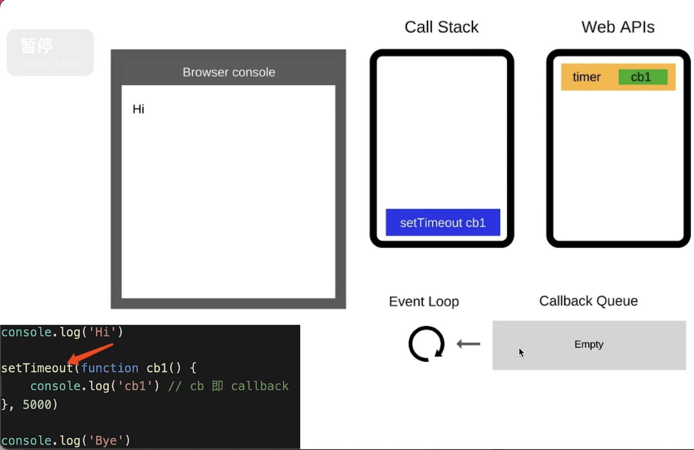

5s 之后，把 cb1 放到 callback queue 中，同步代码执行完，call stack 为空后，启动 event loop 机制进行轮询查找 callback queue

说法 2：

同步代码，一行一行放在 call stack 执行；

遇到异步，会先“记录”下，等待时机（定时，网络请求等)

时机到了，就移动到 callback queue

如果 call stack 为空（即同步代码执行完) event loop 开始工作

轮询查找 callback queue，如有则移动到 call stack 执行

继续轮询查找(永动机)

鲨鱼哥版本：

整体的 script(作为第一个宏任务)开始执行的时候，会把所有代码分为两部分：“同步任务”、“异步任务”；

同步任务会直接进入主线程依次执行；

异步任务会再分为宏任务和微任务；

宏任务进入到 Event Table 中，并在里面注册回调函数，每当指定的事件完成时，Event Table 会将这个函数移到 Event Queue 中；

微任务也会进入到另一个 Event Table 中，并在里面注册回调函数，每当指定的事件完成时，Event Table 会将这个函数移到 Event Queue 中；

当主线程内的任务执行完毕，主线程为空时，会检查微任务的 Event Queue，如果有任务，就全部执行，如果没有就执行下一个宏任务；

上述过程会不断重复，这就是 Event Loop 事件循环；（链接：https://juejin.cn/post/6844904148899463175）

#### DOM 渲染与 event loop 关系

Call Stack 清空尝试 DOM 渲染

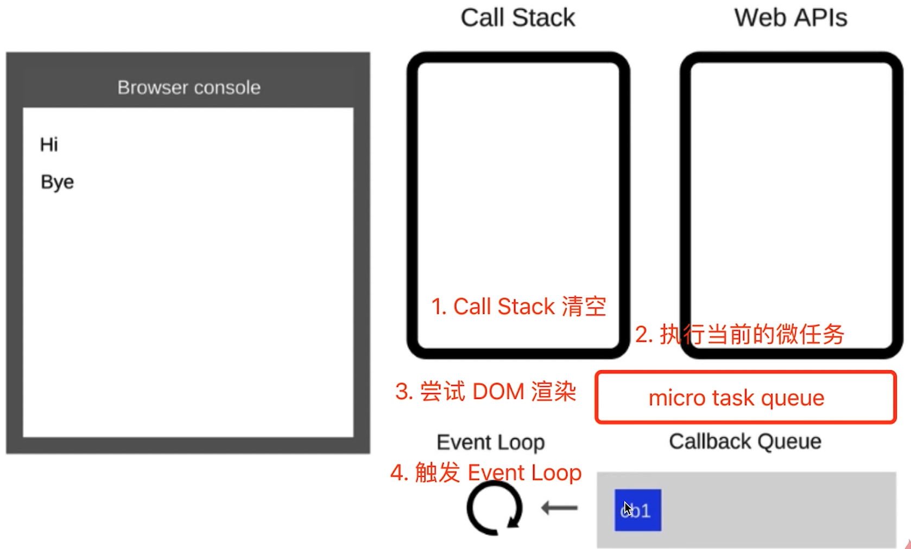

```js
const $p1 = $("<p>一段文字</p>");
const $p2 = $("<p>一段文字</p>");
const $p3 = $("<p>一段文字</p>");
$("#container").append($p1).append($p2).append($p3);
console.log($("#container").children.length);
```

不同的任务源会被分配到不同的 Task 队列中，任务源可以分为 **微任务**（microtask） 和 **宏任务**（macrotask）。在 ES6 规范中，microtask 称为 `jobs`，macrotask 称为 `task`。下面来看以下代码的执行顺序：

#### 顺序

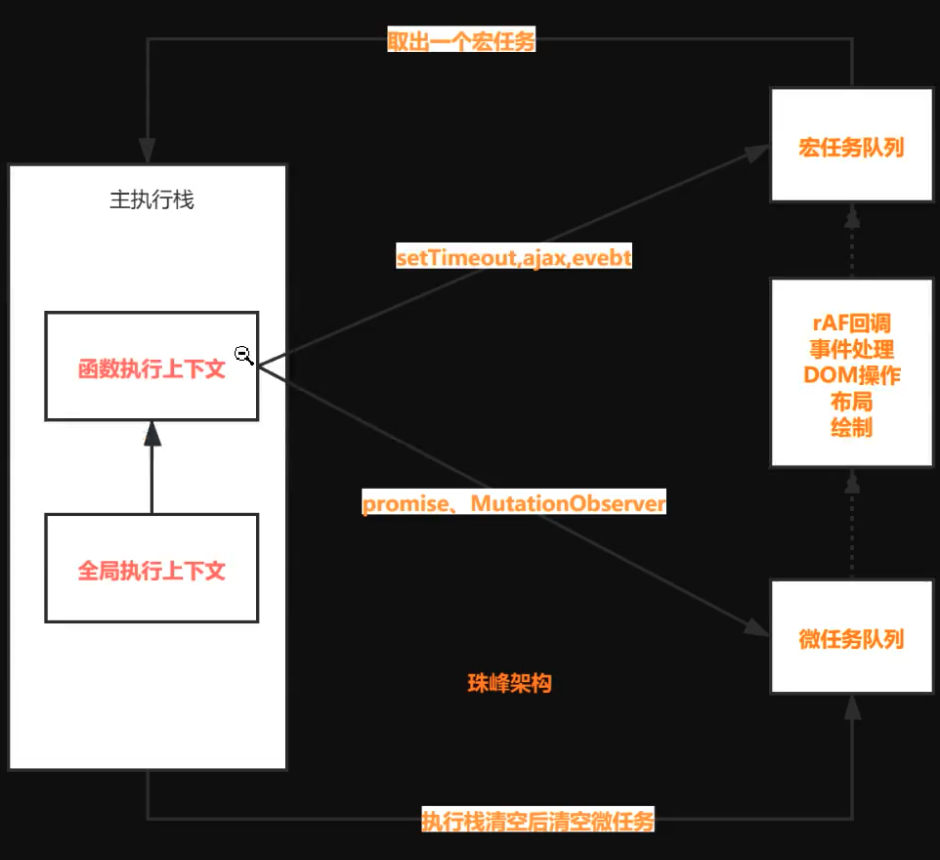

#### 宏任务

宏任务包括 `script` ， `setTimeout` ，`setInterval` ，`setImmediate` ，`I/O` ，`UI rendering`。(Ajax DOM 事件)
MessageChannel

1. script(整体代码)
2. setTimeout
3. setInterval、setImmediate
4. I/O
5. postMessage
6. MessageChannel

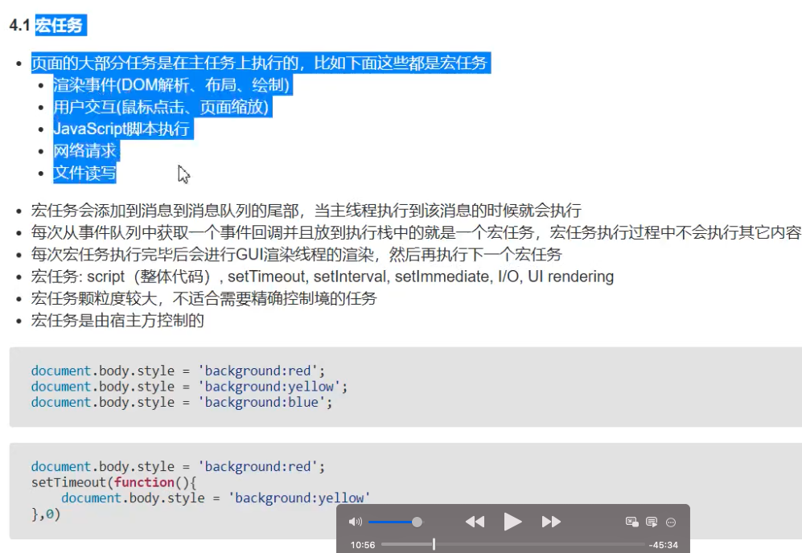

```js
    <script>
        // document.body.style = 'background: red';
        // document.body.style = 'background: yellow';
        // document.body.style = 'background: blue';
        document.body.style = 'background: red';
        setTimeout(() => {
            document.body.style = 'background: yellow';
            setTimeout(() => {
                document.body.style = 'background: blue';
            }, 0)
        }, 0)
    </script>
```

会闪动

因为先宏，检查微任务为空，渲染 。

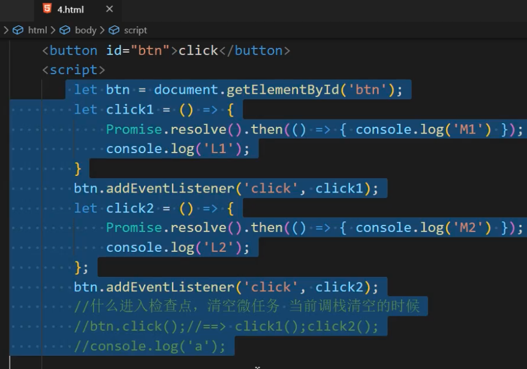

#### 微任务

微任务包括`Promise.then()或catch()` ，`MutationObserver`，`process.nextTick`、`Promise为基础开发的其它技术，比如fetch API`、 async await `V8`的垃圾回收过程、`Node独有的process.nextTick`。

微任务意义(鲨鱼哥补充)：减少更新时的渲染次数，因为根据 HTML 标准，会在宏任务执行结束之后，在下一个宏任务开始执行之前，UI 都会重新渲染。如果在 microtask 中就完成数据更新，当 macro-tack 结束就可以得到最新的 UI 了。

如果是新建一个 macro-task 来做数据更新的话，那么渲染会执行两次。

拓展阅读：Vue 源码 nextTick 实现。 todo

##### mutationObserver

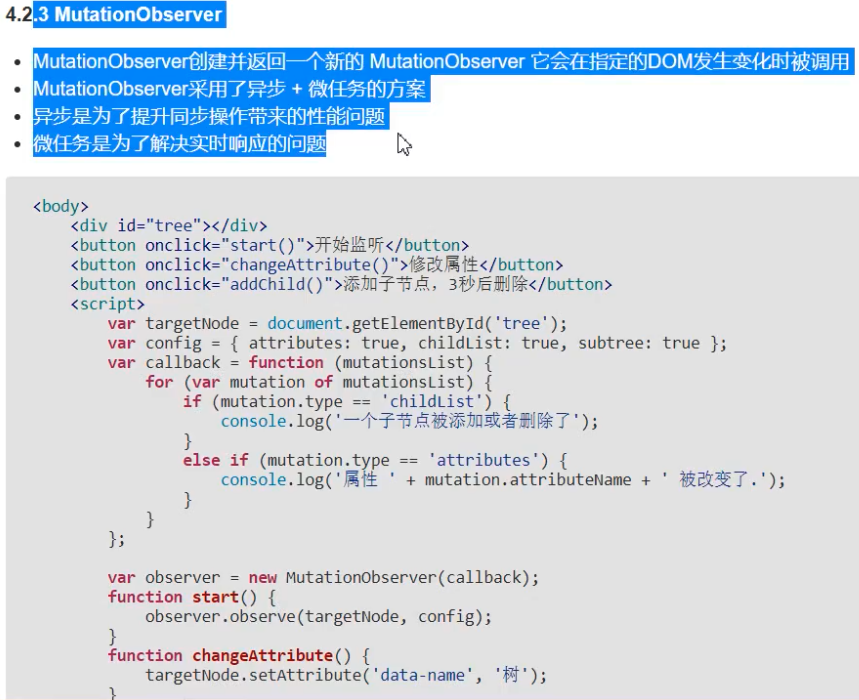

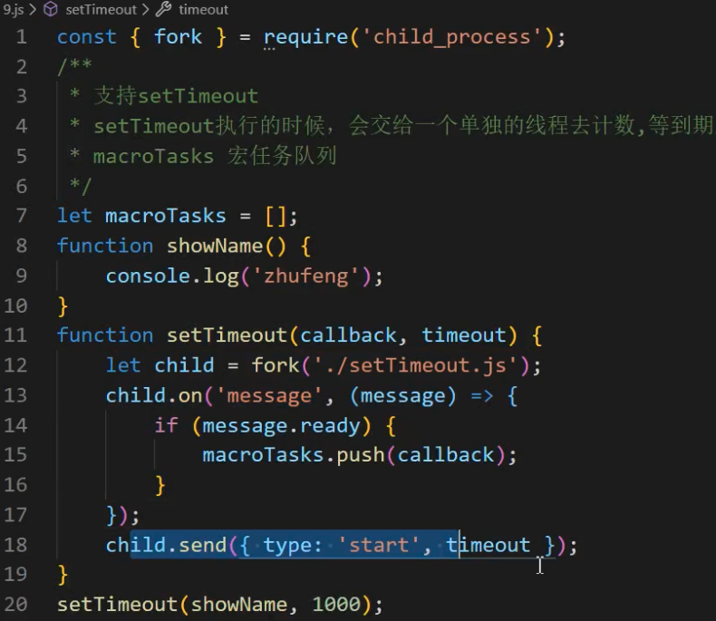

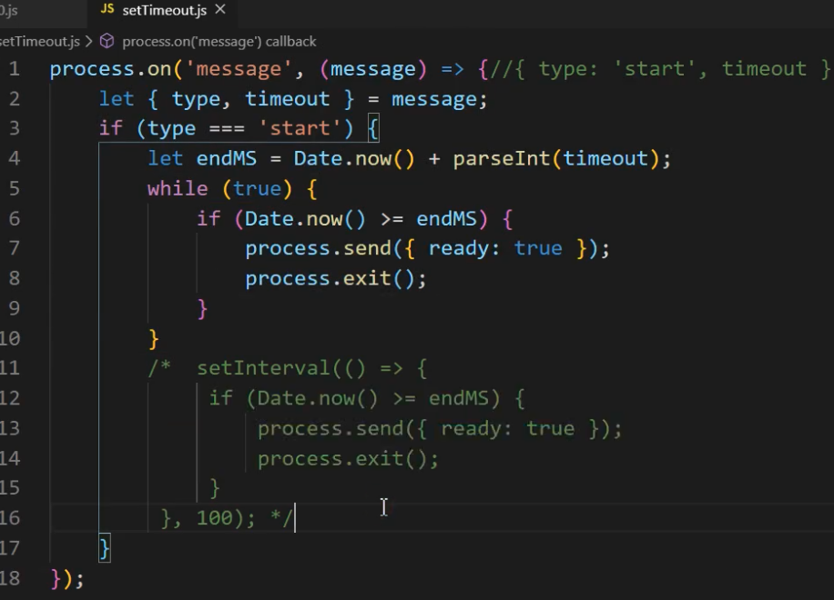

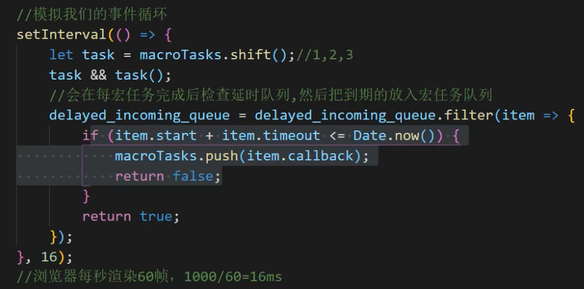

✗ npm i readline-sync -S

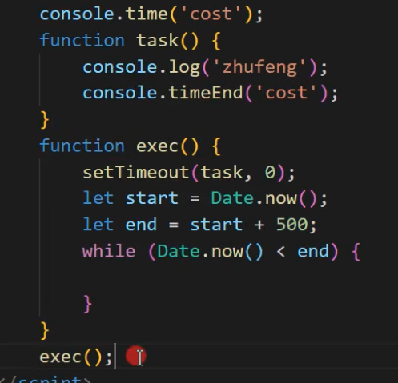

不一定是 0 秒后执行

嵌套定时器的最小间隔为 4ms

最大嵌套深度为 5 层

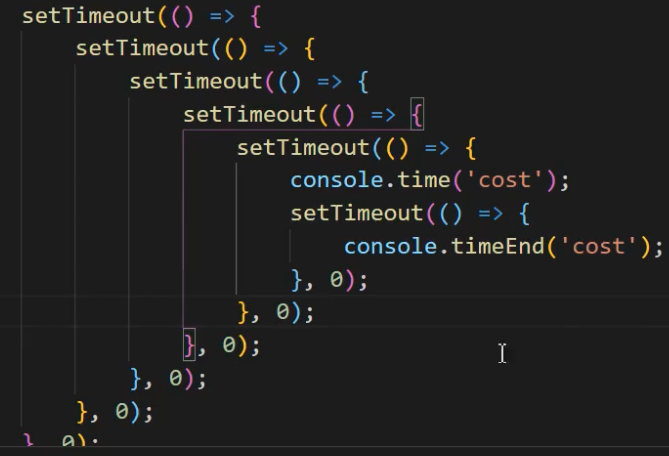

#### 常见误区

这里很多人会有个误区，认为微任务快于宏任务，其实是错误的。因为宏任务中包括了 `script` ，浏览器会**先执行一个宏任务**，接下来有异步代码的话才会先执行微任务。

#### 微任务和宏任务区别

微任务：DOM 渲染前触发 如 promise

宏任务：DOM 渲染后触发；如 setTimeOut

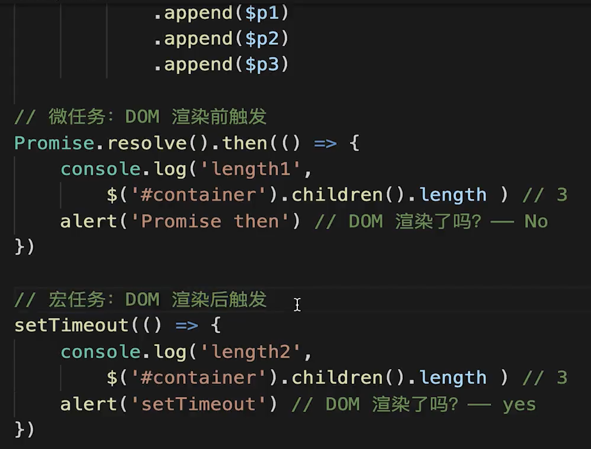

微任务是 ES6 规定的，宏任务是

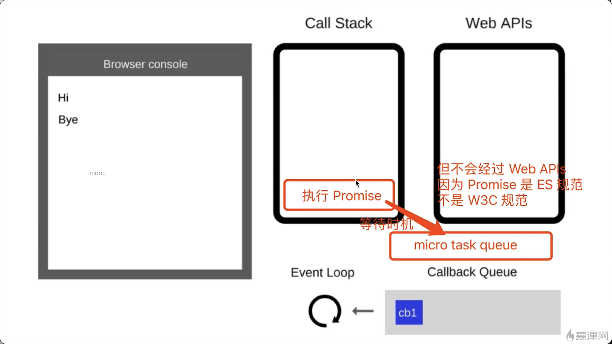

29min

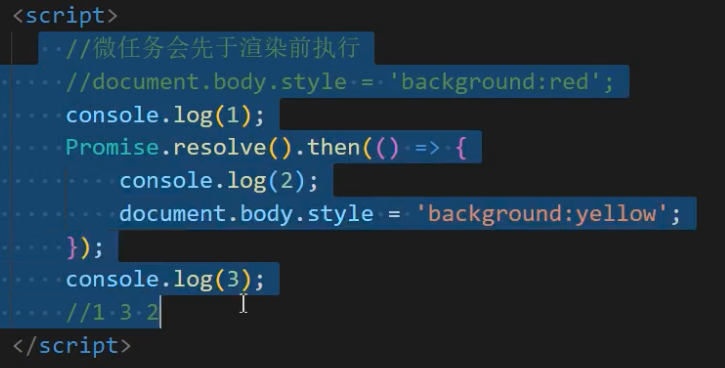

页面直接为黄色，不闪动，

32min

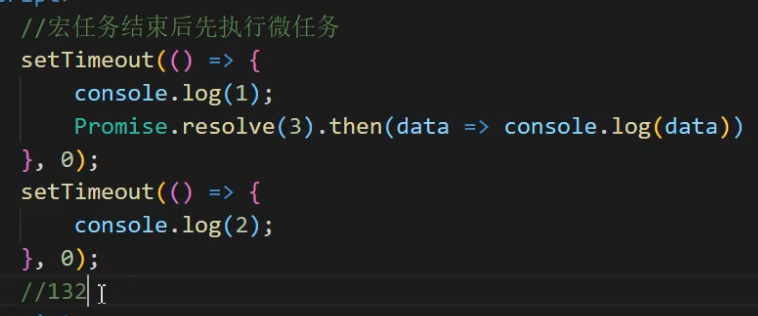

L1 M1 L2 M2

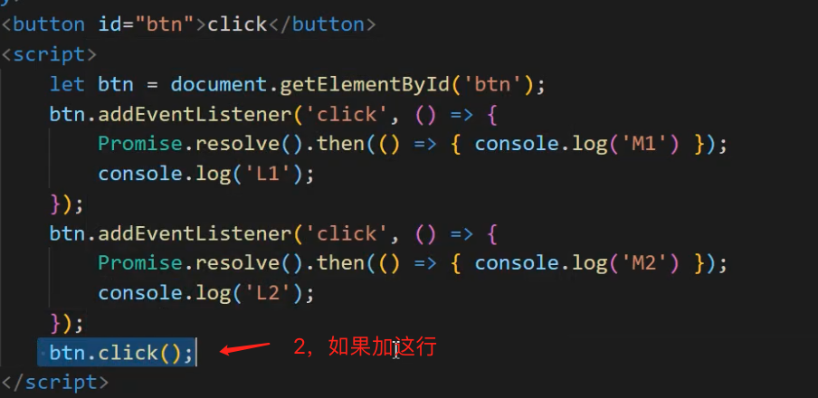

当前执行栈清空后，进入检查点 ，清空微任务。

L1 L2 M1 M2

代码写 btn.click()

但第一个 click 事件执行完，执行栈还未清空，不会检测微任务，还会执行第 2 个 click 事件

但是用手点的话不一样，点的话，第一次执行栈中只有第一个 click 的 callback

#### eventloop 自测

宏任务：script setTimeout setInterval setImmediate UIrender IO

微任务： promise.then / catch

#### dom 事件也是基于 event loop 实现的。

#### 题目

**易错**

```js
console.log('script start')

async function async1() {
  await async2()
  console.log('async1 end')
}
async function async2() {
  console.log('async2 end')
}
async1()

setTimeout(function() {
  console.log('setTimeout')
}, 0)

new Promise(resolve => {
  console.log('Promise')
  resolve()
})
  .then(function() {
    console.log('promise1')
  })
  .then(function() {
    console.log('promise2')
  })

console.log('script end')
// script start => async2 end => Promise => script end => promise1 => promise2 => async1 end => setTimeout
注意：新的浏览器中不是如上打印的，因为 await 变快了，具体内容可以往下看
```

首先先来解释下上述代码的 `async` 和 `await` 的执行顺序。当我们调用 `async1` 函数时，会马上输出 `async2 end`，并且函数返回一个 `Promise`，接下来在遇到 `await`的时候会就让出线程开始执行 `async1` 外的代码，所以我们完全可以把 `await` 看成是**让出线程**的标志。

然后当同步代码全部执行完毕以后，就会去执行所有的异步代码，那么又会回到 `await` 的位置执行返回的 `Promise` 的 `resolve` 函数，这又会把 `resolve` 丢到微任务队列中，接下来去执行 `then` 中的回调，当两个 `then` 中的回调全部执行完毕以后，又会回到 `await` 的位置处理返回值，这时候你可以看成是 `Promise.resolve(返回值).then()`，然后 `await` 后的代码全部被包裹进了 `then` 的回调中，所以 `console.log('async1 end')` 会优先执行于 `setTimeout`。

如果你觉得上面这段解释还是有点绕，那么我把 `async` 的这两个函数改造成你一定能理解的代码

```js
new Promise((resolve, reject) => {
	console.log("async2 end");
	// Promise.resolve() 将代码插入微任务队列尾部
	// resolve 再次插入微任务队列尾部
	resolve(Promise.resolve());
}).then(() => {
	console.log("async1 end");
});
```

也就是说，如果 `await` 后面跟着 `Promise` 的话，`async1 end` 需要等待三个 tick 才能执行到。那么其实这个性能相对来说还是略慢的，所以 V8 团队借鉴了 Node 8 中的一个 Bug，在引擎底层将三次 tick 减少到了二次 tick。但是这种做法其实是违法了规范的，当然规范也是可以更改的，这是 V8 团队的一个 [PR](https://link.juejin.cn/?target=https%3A%2F%2Fgithub.com%2Ftc39%2Fecma262%2Fpull%2F1250)，目前已被同意这种做法。

所以 Event Loop 执行顺序如下所示：

-   首先执行同步代码，这属于宏任务
-   当执行完所有同步代码后，执行栈为空，查询是否有异步代码需要执行
-   执行所有微任务
-   当执行完所有微任务后，如有必要会渲染页面
-   然后开始下一轮 Event Loop，执行宏任务中的异步代码，也就是 `setTimeout` 中的回调函数

所以以上代码虽然 `setTimeout` 写在 `Promise` 之前，但是因为 `Promise` 属于微任务而 `setTimeout` 属于宏任务，所以会有以上的打印。

### `Q1: Promise`？ P0

Promise 的特点是什么，分别有什么优缺点？什么是 Promise 链？Promise 构造函数执行和 then 函数执行有什么区别？

Promise 是一种异步编程的解决方案，它本身是一个的构造函数。

解决了回调地狱问题。

参数为一个 callback，有 2 个参数，resolve 和 reject，

promise 有 3 种状态 pending resolved rejected，也就是说一旦状态变为 resolved 后，就不能再次改变

`Promise` 实现了链式调用，也就是说每次调用 `then` 之后返回的都是一个 `Promise`，并且是一个全新的 `Promise`，原因也是因为状态不可变。如果你在 `then` 中 使用了 `return`，那么 `return` 的值会被 `Promise.resolve()` 包装 【记忆】

```js
Promise.resolve(1)
	.then(res => {
		console.log(res); // => 1
		return 2; // 包装成 Promise.resolve(2)
	})
	.then(res => {
		console.log(res); // => 2
	});
```

**其实它也是存在一些缺点的，比如无法取消 `Promise`，错误需要通过回调函数捕获。**

```
const p1 = Promise.resolve(100);
console.log(p1) // 得到一个resolved状态的promise
p1.then(res => {
	console.log(res);
})

const p2 = Promise.reject(100);
p2.catch(res => {
	console.log(res);
})
```

【记忆】

then 正常返回 resolved，里面有报错(throw error)，则返回一个 rejected 的 promise

Catch 正常返回 resolved，里面有报错(throw error)，则返回一个 rejected 的 promise

#### 易错

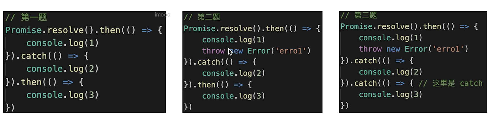

```js
const p4 = Promise.resolve();
p4.then(data => {
	console.log("data4: ", data);
}).catch(err => {
	console.log("err4: ", err);
});
console.log("p4: ", p4); // resolved
// then 正常返回一个resolved状态的promise，报错则返回rejected的promise
// catch正常返回一个resolved状态的promise，报错则返回rejected的promise

const p5 = Promise.reject();
p5.then(data => {
	console.log("data5: ", data);
}).catch(err => {
	console.log("err5: ", err);
});

const p6 = Promise.reject().catch(() => console.log(1111));
console.log("p6: ", p6); // resolved
```

resolved 状态触发 then 方法

rejected 触发 catch 方法

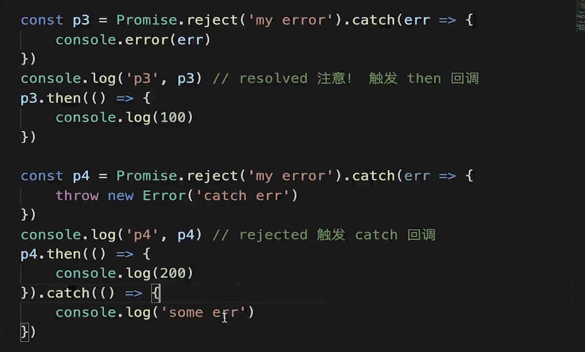

8-7 节

#### 自测

https://juejin.cn/post/6844904077537574919

### 手写 promise 加载一张图片 m1p0

```js
function loadImg(src) {
	const p = new Promise((resolve, reject) => {
		const img = document.createElement("img");
		img.onload = () => {
			resolve(img);
		};
		img.onerror = () => {
			const err = new Error(`图片加载失败 ${src}`);
			reject(err);
		};
		img.src = src;
	});
	return p;
}
```

console what

```js
// 第一题
// Promise.resolve().then(() => {
//     console.log(1);
// }).catch(() => {
//     console.log(2);
// }).then(() => {
//     console.log(3);
// })

// 第二题 易错 复习
// Promise.resolve().then(() => {
//     console.log(1);
//     throw new Error('error1')
// }).catch(() => {
//     console.log(2);
// }).then(() => {
//     console.log(3);
// })

// 第三题
Promise.resolve()
	.then(() => {
		console.log(1);
		throw new Error("error1");
	})
	.catch(() => {
		console.log(2);
	})
	.catch(() => {
		console.log(3);
	});
```

### Q4: async await m1P0

一个函数如果加上 `async` ，那么该函数就会返回一个 `Promise`

`async` 就是将函数返回值使用 `Promise.resolve()` 包裹了下，和 `then` 中处理返回值一样，并且 `await` 只能配套 `async` 使用

await 后面如果紧跟一个 promise，await 相当于 promise 里的 then；如果接一个非 promise，则直接返回

Try catch 捕获异常

优点：异步代码改造成同步的写法，

缺点： 如果多个异步代码没有依赖性，则导致性能的降低。

下面来看一个使用 `await` 的例子：

易错

```js
let a = 0;
let b = async () => {
	a = a + (await 10);
	console.log("2", a);
};
b();
a++;
console.log("1", a);
```

对于以上代码你可能会有疑惑，让我来解释下原因

-   首先函数 `b` 先执行，在执行到 `await 10` 之前变量 `a` 还是 0，因为 `await` 内部实现了 `generator` ，`generator` 会保留堆栈中东西，所以这时候 `a = 0` 被保存了下来
-   因为 `await` 是异步操作，后来的表达式不返回 `Promise` 的话，就会包装成 `Promise.reslove(返回值)`，然后会去执行函数外的同步代码
-   同步代码执行完毕后开始执行异步代码，将保存下来的值拿出来使用，这时候 `a = 0 + 10`

答案： // -> '2' 10

// -> '1' 1

上述解释中提到了 `await` 内部实现了 `generator`，其实 `await` 就是 `generator` 加上 `Promise` 的语法糖，且内部实现了自动执行 `generator`。如果你熟悉 co 的话，其实自己就可以实现这样的语法糖。

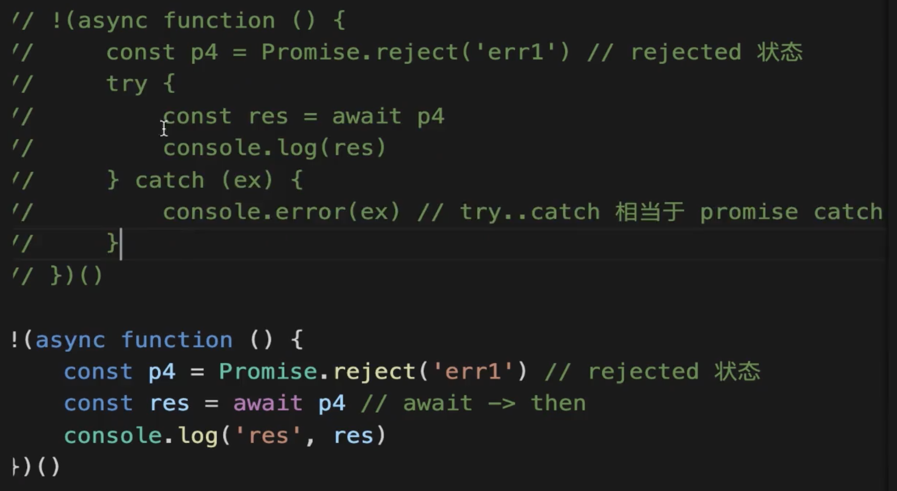

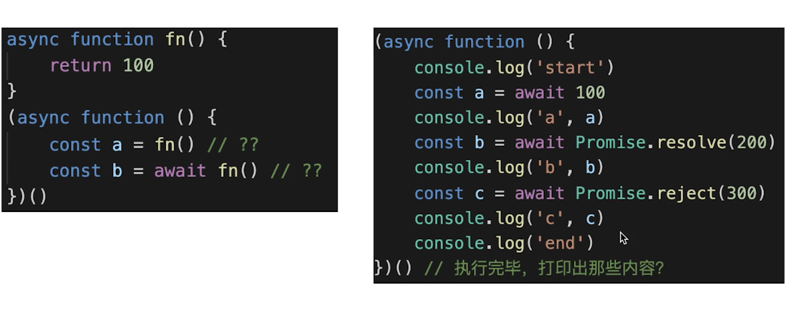

```js
async function async1() {
	console.log("async1 start");
	await async2();
	console.log("async1 end");
}
async function async2() {
	console.log("async2");
}
console.log("script start");
async1();
console.log("script end");
```

#### for of

```js
// 8-12
function muti(num) {
	return new Promise(resolve => {
		setTimeout(() => {
			resolve(num * num);
		}, 1000);
	});
}

const nums = [1, 2, 3];
// nums.forEach(async i => {
// 	const res = await muti(i);
// 	console.log(res);
// });

// 报错
// for (const num of nums) {
//     const res = await muti(i);
//     console.log(res);
// }

!(async function () {
	for (const value of nums) {
		const res = await muti(value);
		console.log(res);
	}
})();
```

// 1s 后，同时打印

// 和 forEach 相比，会异步执行，每隔 1s，打印一个值

见 8-17

```
async function fn() {
	return 100;
}
(async function () {
	const a = fn();
	console.log("a:", a);
	const b = await fn();
	console.log("b: ", b);
})();
// 易错
(async function () {
	console.log("start");
	const a = await 100;
	console.log("a:", a);
	const b = await Promise.resolve(200);
	console.log("b: ", b);
	const c = await Promise.reject(300);
	console.log("c: ", c);
	console.log("end");
})();
```

### xml 实现

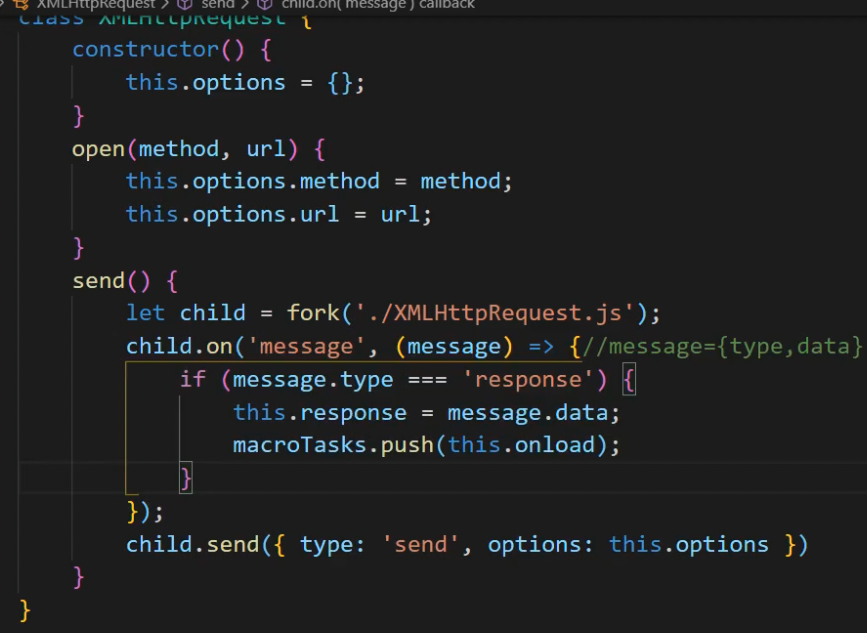

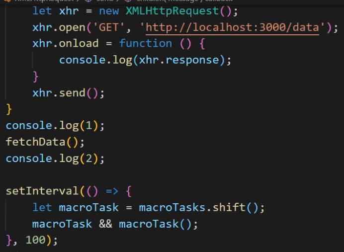

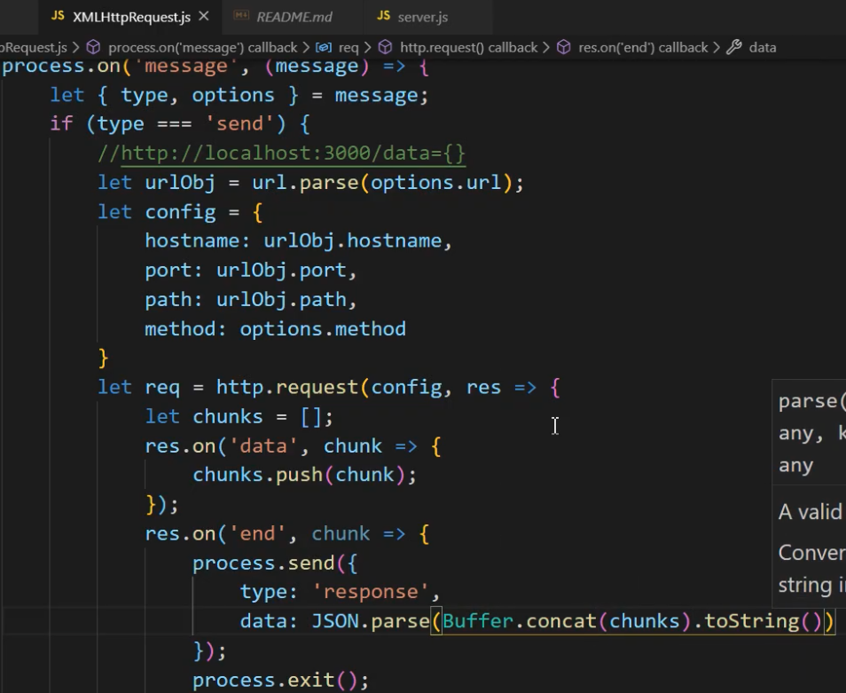

req.send

### Node 中的 Event Loop p3

和浏览器中的有什么区别？process.nexttick 执行顺序？

#### timer

timers 阶段会执行 `setTimeout` 和 `setInterval` 回调，并且是由 poll 阶段控制的。

同样，在 Node 中定时器指定的时间也不是准确时间，只能是**尽快**执行。

#### I/O

I/O 阶段会处理一些上一轮循环中的**少数未执行**的 I/O 回调

#### idle, prepare

idle, prepare 阶段内部实现，这里就忽略不讲了。

#### poll

poll 是一个至关重要的阶段，这一阶段中，系统会做两件事情

1. 回到 timer 阶段执行回调
2. 执行 I/O 回调

并且在进入该阶段时如果没有设定了 timer 的话，会发生以下两件事情

-   如果 poll 队列不为空，会遍历回调队列并同步执行，直到队列为空或者达到系统限制
-   如果 poll 队列为空时，会有两件事发生
    -   如果有 `setImmediate` 回调需要执行，poll 阶段会停止并且进入到 check 阶段执行回调
    -   如果没有 `setImmediate` 回调需要执行，会等待回调被加入到队列中并立即执行回调，这里同样会有个超时时间设置防止一直等待下去

当然设定了 timer 的话且 poll 队列为空，则会判断是否有 timer 超时，如果有的话会回到 timer 阶段执行回调。

#### check

check 阶段执行 `setImmediate`

#### close callbacks

close callbacks 阶段执行 close 事件

首先在有些情况下，定时器的执行顺序其实是**随机**的

```js
setTimeout(() => {
	console.log("setTimeout");
}, 0);
setImmediate(() => {
	console.log("setImmediate");
});
```

对于以上代码来说，`setTimeout` 可能执行在前，也可能执行在后

-   首先 `setTimeout(fn, 0) === setTimeout(fn, 1)`，这是由源码决定的
-   进入事件循环也是需要成本的，如果在准备时候花费了大于 1ms 的时间，那么在 timer 阶段就会直接执行 `setTimeout` 回调
-   那么如果准备时间花费小于 1ms，那么就是 `setImmediate` 回调先执行了

当然在某些情况下，他们的执行顺序一定是固定的，比如以下代码：

```js
const fs = require("fs");

fs.readFile(__filename, () => {
	setTimeout(() => {
		console.log("timeout");
	}, 0);
	setImmediate(() => {
		console.log("immediate");
	});
});
```

在上述代码中，`setImmediate` 永远**先执行**。因为两个代码写在 IO 回调中，IO 回调是在 poll 阶段执行，当回调执行完毕后队列为空，发现存在 `setImmediate` 回调，所以就直接跳转到 check 阶段去执行回调了。

上面介绍的都是 macrotask 的执行情况，对于 microtask 来说，它会在以上每个阶段完成前**清空** microtask 队列，下图中的 Tick 就代表了 microtask

```js
setTimeout(() => {
	console.log("timer21");
}, 0);

Promise.resolve().then(function () {
	console.log("promise1");
});
```

对于以上代码来说，其实和浏览器中的输出是一样的，microtask 永远执行在 macrotask 前面。

最后我们来讲讲 Node 中的 `process.nextTick`，这个函数其实是独立于 Event Loop 之外的，它有一个自己的队列，当每个阶段完成后，如果存在 nextTick 队列，就会**清空队列中的所有回调函数**，并且优先于其他 microtask 执行。

```js
setTimeout(() => {
	console.log("timer1");

	Promise.resolve().then(function () {
		console.log("promise1");
	});
}, 0);

process.nextTick(() => {
	console.log("nextTick");
	process.nextTick(() => {
		console.log("nextTick");
		process.nextTick(() => {
			console.log("nextTick");
			process.nextTick(() => {
				console.log("nextTick");
			});
		});
	});
});
```

对于以上代码，大家可以发现无论如何，永远都是先把 nextTick 全部打印出来。

### 执行栈

```!
涉及面试题：什么是执行栈？
```

可以把执行栈认为是一个存储函数调用的**栈结构**，遵循先进后出的原则。

### 题

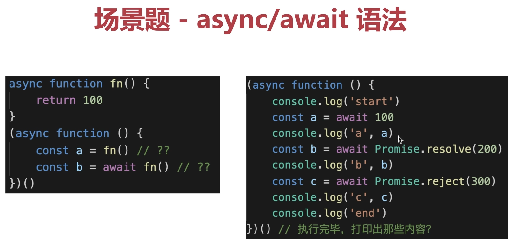

### 自测

同步异步：

单线程、主线程、任务队列、阻塞

js 是单线程的，如果存在比较耗时的任务（网络请求、定时器），就会阻塞代码执行，给用户造成假死现象，js 设计者考虑到这点，将任务分为同步、异步。

同步代码按顺序执行，遇到异步代码，会将其放到一个任务队列中，同步代码继续执行，等待时机到了，再执行异步回调。

Event loop

【计算机系统的一种运行机制。用来解决解决 js 单线程运行，产生的一些问题】

js 将任务分为同步和异步。

js 脚本在执行过程中，遇到同步代码，会丢到执行栈，遇到异步代码（网络请求，定时任务，ui render 等），放到任务队列中，并注册回调函数，待主线程事件执行完毕后，会开启 event loop 轮询，将排在队首的事件推到执行栈中， 这样不断轮询的机制 就叫 eventloop

执行栈清空后，会尝试进行 DOM 渲染。

**任务队列（消息队列）**

任务队列中存着的是异步任务，这些异步任务一定要等到执行栈清空后才会执行。

异步任务，【会先到事件列表(event table)中注册回调函数。如果事件列表中的事件触发了，会将这个函数移入到任务队列(event queue)中】，

异步任务分为宏任务和微任务。

宏任务有 ajax settimeout setinterval ... script 【io】【uirender】

微任务 有 promise.then .catch async awiait 【MutationObserver】 【fetch 的一些 api】

宏任务是浏览器规定的，微任务是 ecam script 规范

【微任务意义：减少渲染次数，在下一个宏任务开启之前，更新数据】

区别：

执行时机： 微任务在 DOM 渲染之前执行。宏任务在 DOM 渲染后。

MutationObserver 可监听指定 DOM 发生变化时被调用。

## Z.其它

### 防抖 m1p0 差不多

重复触发事件函数，只执行最后一次。

类似于做电梯。

应用场景：搜索 sug、input 框 频繁点赞、取消点赞

代码实现及原理：

1、利用闭包设置一个 timer 存储 setTimeout，开每次调用都清空 timer,再开启 setTimeout 执行

```js
function debounce(callback, delay) {
	let timer = null;
	return function () {
		timer && clearSetTimeout(timer);
		timer = setTimeout(() => {
			callback && callback();
		}, delay);
	};
}
```

错！！！

持续触发事件时，一段时间内没有再触发此事件，才会执行；期间再次触发，会重新计时延时执行。

丢了 this，和 fn 的参数

```js
function debounce(fn, delay) {
	let timerId = null;
	return function () {
		const that = this;
		timerId && clearSetTimeout(timerId);
		timerId = setTimeout(() => {
			fn && fn.call(that, arguments);
		}, delay);
	};
}
```

### 节流 差不多

降低事件的执行频率，

应用场景：mousemove resize 事件等。

代码实现及原理：

#### 方法 1 时间戳

还是闭包，先记录一个时间戳 time1。 函数执行时判断当前时间与上次时间的差，如果小于 duration，直接 return，大于等于则执行,然后重新赋值 time1,

```js
function throttle(callback, duration) {
	let time1 = new Date();
	return function () {
		let time2 = new Date();
		if (itme2 - time1 >= duration) {
			callback && callback();
		}
	};
}
```

错！！！

```js
function throttle(func, duration) {
	let context, args;
	let prev = 0;

	return function () {
		context = this;
		let now = new Date();
		args = arguments;
		if (now - prev >= duration) {
			func && func.apply(context, args);
			prev = now;
		}
	};
}
```

#### 方法 2 flag + setTimeout

```
function throttle(func, duration) {
	let flag = false;
	let timer;
  return function() {
    context = this;
    if (!flag) {
    	timer = setTimeout(() => {
    		func.call(context, arguments);
    		flag = true;
      })
    }
  }
}
```

3 setTimeout

```
function throttle(func, wait) {
	let timeout;
	let prev = 0;
	return function() {
			context = this;
			args = arguments;
			if (!timeout) {
				setTimeOut(function() {
					timeout = null;
					func.apply(context, args);
				}, wait);
			}
	}
}
```

### 为什么 0.1 + 0.2 != 0.3 p1

为什么 0.1 + 0.2 != 0.3？如何解决这个问题？

先说原因，因为 JS 采用 IEEE 754 双精度版本（64 位），并且只要采用 IEEE 754 的语言都有该问题。

我们都知道计算机是通过二进制来存储东西的，那么 `0.1` 在二进制中会表示为

```js
// (0011) 表示循环
0.1 = 2^-4 * 1.10011(0011)
```

我们可以发现，`0.1` 在二进制中是无限循环的一些数字，其实不只是 `0.1`，其实很多十进制小数用二进制表示都是无限循环的。这样其实没什么问题，但是 JS 采用的浮点数标准却会裁剪掉我们的数字。

IEEE 754 双精度版本（64 位）将 64 位分为了三段

-   第一位用来表示符号
-   接下去的 11 位用来表示指数
-   其他的位数用来表示有效位，也就是用二进制表示 `0.1` 中的 `10011(0011)`

那么这些循环的数字被裁剪了，就会出现精度丢失的问题，也就造成了 `0.1` 不再是 `0.1` 了，而是变成了 `0.100000000000000002`

```js
0.100000000000000002 === 0.1; // true
```

那么同样的，`0.2` 在二进制也是无限循环的，被裁剪后也失去了精度变成了 `0.200000000000000002`

```js
0.200000000000000002 === 0.2; // true
```

所以这两者相加不等于 `0.3` 而是 `0.300000000000000004`

```js
0.1 + 0.2 === 0.30000000000000004; // true
```

那么可能你又会有一个疑问，既然 `0.1` 不是 `0.1`，那为什么 `console.log(0.1)` 却是正确的呢？

因为在输入内容的时候，二进制被转换为了十进制，十进制又被转换为了字符串，在这个转换的过程中发生了取近似值的过程，所以打印出来的其实是一个近似值，你也可以通过以下代码来验证

```js
console.log(0.100000000000000002); // 0.1
```

那么说完了为什么，最后来说说怎么解决这个问题吧。其实解决的办法有很多，这里我们选用原生提供的方式来最简单的解决问题

```js
parseFloat((0.1 + 0.2).toFixed(10)) === 0.3; // true
```

### 常用定时器函数

```!
涉及面试题：setTimeout、setInterval、requestAnimationFrame 各有什么特点？
```

异步编程当然少不了定时器了，常见的定时器函数有 `setTimeout`、`setInterval`、`requestAnimationFrame`。我们先来讲讲最常用的`setTimeout`，很多人认为 `setTimeout` 是延时多久，那就应该是多久后执行。

其实这个观点是错误的，因为 JS 是单线程执行的，如果前面的代码影响了性能，就会导致 `setTimeout` 不会按期执行。当然了，我们可以通过代码去修正 `setTimeout`，从而使定时器相对准确

```js
let period = 60 * 1000 * 60 * 2;
let startTime = new Date().getTime();
let count = 0;
let end = new Date().getTime() + period;
let interval = 1000;
let currentInterval = interval;

function loop() {
	count++;
	// 代码执行所消耗的时间
	let offset = new Date().getTime() - (startTime + count * interval);
	let diff = end - new Date().getTime();
	let h = Math.floor(diff / (60 * 1000 * 60));
	let hdiff = diff % (60 * 1000 * 60);
	let m = Math.floor(hdiff / (60 * 1000));
	let mdiff = hdiff % (60 * 1000);
	let s = mdiff / 1000;
	let sCeil = Math.ceil(s);
	let sFloor = Math.floor(s);
	// 得到下一次循环所消耗的时间
	currentInterval = interval - offset;
	console.log(
		"时：" + h,
		"分：" + m,
		"毫秒：" + s,
		"秒向上取整：" + sCeil,
		"代码执行时间：" + offset,
		"下次循环间隔" + currentInterval
	);

	setTimeout(loop, currentInterval);
}

setTimeout(loop, currentInterval);
```

接下来我们来看 `setInterval`，其实这个函数作用和 `setTimeout` 基本一致，只是该函数是每隔一段时间执行一次回调函数。

通常来说不建议使用 `setInterval`。第一，它和 `setTimeout` 一样，不能保证在预期的时间执行任务。第二，它存在执行累积的问题，请看以下伪代码

```js
function demo() {
	setInterval(function () {
		console.log(2);
	}, 1000);
	sleep(2000);
}
demo();
```

以上代码在浏览器环境中，如果定时器执行过程中出现了耗时操作，多个回调函数会在耗时操作结束以后同时执行，这样可能就会带来性能上的问题。

如果你有循环定时器的需求，其实完全可以通过 `requestAnimationFrame` 来实现

```js
function setInterval(callback, interval) {
	let timer;
	const now = Date.now;
	let startTime = now();
	let endTime = startTime;
	const loop = () => {
		timer = window.requestAnimationFrame(loop);
		endTime = now();
		if (endTime - startTime >= interval) {
			startTime = endTime = now();
			callback(timer);
		}
	};
	timer = window.requestAnimationFrame(loop);
	return timer;
}

let a = 0;
setInterval(timer => {
	console.log(1);
	a++;
	if (a === 3) cancelAnimationFrame(timer);
}, 1000);
```

首先 `requestAnimationFrame` 自带函数节流功能，基本可以保证在 16.6 毫秒内只执行一次（不掉帧的情况下），并且该函数的延时效果是精确的，没有其他定时器时间不准的问题，当然你也可以通过该函数来实现 `setTimeout`。

### 手写深度比较 模拟 lodash isEqual m1p0

```js
function isEqual(obj1, obj2) {
	if (!obj1 | !obj2) retrun false; // 错， 判断是否为对象

	let keys1 = Object.keys(obj1);
	let keys2 = Object.keys(obj2);
	if(obj1 === obj2) return true;
	if (keys1.length !== keys2.length) return false;
	for (const key in obj1) {
		if (Object.hasOwnProperty.call(obj1, key)) {
        const res = isEqual(obj1[key], obj2[key]);
        if (!res) return false;
    }
	}
	return true;
}

function isObject(obj) {
		return typeof obj === 'object' && object != null;
}
```

### 正则 写一个全字母 6 个数字 m1 复习

18-10

判断字符串以字母开头，后面字母数字 下划线 长度 6-30

```
/^(\w|[0-9]){6-30}$/
```

```
/^[a-zA-Z]\w{5-29}/
```

### 手写 trim m1 复习

见 18-9

```

return str.replace(/^\s+/, '').replace(/\s+$/, '')
```

### 获取 search 参数

```js
// // 传统方式
// function query(name) {
//     const search = location.search.substr(1) // 类似 array.slice(1)
//     // search: 'a=10&b=20&c=30'
/////// [^&]代表排异 不包含&号
//     const reg = new RegExp(`(^|&)${name}=([^&]*)(&|$)`, 'i')
//     const res = search.match(reg)
//     if (res === null) {
//         return null
//     }
//     return res[2]
// }
// query('d')

// URLSearchParams
function query(name) {
	const search = location.search;
	const p = new URLSearchParams(search);
	return p.get(name);
}
console.log(query("b"));
```

### 数组扁平化

8 数组扁平化.html

```
arr.flat(Infinity);
```

2、tostring

3、

```
Json.st
```

```js
function flat(arr) {
	const isDeep = arr.some(item => item instanceof Array);
	if (!isDeep) return arr;
	const res = Array.prototype.concat.apply([], arr);
	return flat(res);
}
const res = flat([1, 2, [3, 4, [5, 6]]]);
```

### 数组去重

knowledge 有

### 捕获 JS 异常

见 18-11

### 什么是 JSON

### 编写 parse 函数 实现访问对象里的属性的值

parse.js

### 实现一个不可变对象

不可拓展

Object.preventExtensions() 可以使一个对象不可再添加新的属性（老的属性可以删除，可以改），参数为目标对象，返回修改后的对象。

```js
(function () {
	console.log(8);
	var obj = { name: "zhuzhu" };
	console.log(Object.isExtensible(obj));
	Object.preventExtensions(obj);
	console.log(Object.isExtensible(obj));
	obj.age = 10;
	console.log(obj.age); // undefined
})();
```

写一个 add 方法

```
console.log(add(1, 2, 3, 4, 5));
```

### 鲨鱼哥补充

**JS 为啥是单线程**

js 作为浏览器脚本语言，主要用于用户交互及操作 Dom，假如 js 有 2 个线程，一个线程在 DOM 上添加内容，一个线程删除该 DOM，js 此时该如何处理

### 自测

防抖节流

定义：持续触发事件时，如果在指定时间间隔内再次触发该事件，则会重新计时，到达时间间隔才会真正执行

实现 settimeout ，不为空，则置空。

时间戳。

```

```

节流：持续触发事件时，降低事件的执行频率，指定时间间隔执行一次。

时间戳根据 prev now 比较时间差，执行完重置 now >=

```

```

search 参数

```
let search = location.search
let params = new URLSearchParams(search);
return params.get(name);
```

数组扁平化

【arr.flat(Infinity)】、

arr.toString().split(',').map(Number);

// 3.序列化后正则

```
        const str = JSON.stringify(arr3).replace(/(\[|\])/g, '');
        // console.log(str.split(',').map(item => Number(item)));
        console.log(str.split(',').map(Number));
        // 数组扁平化-序列化后正则，是不对的，比如有这样的一个数组：['[]1']，得到的结果就会是['1']
```

4、concat

```
 let arr4 = [1, 2, [3, 4], [[5, 6], 7]];
        while (arr4.some(Array.isArray)) {
            arr4 = [].concat(...arr4);
        }
        console.log('arr4: ', arr4);
```

遍历+递归

数组去重

1、set 2、对象属性 3、双层循环 4、 遍历 +indexOf

```
let set1 = new Set()
const newArr = [...set1]
```

错！！！

```
Array.from(new Set(array));
```

```
function unique(arr) {

}
```

# React

## 前置知识

### 什么是声明式编程


### 声明式编程 vs 命令式编程

声明式编程的编写方式描述了应该做什么

命令式编程描述了如何做

```
const numbers = [1,2,3,4,5];

// 声明式
const doubleWithDec = numbers.map(number => number * 2);

console.log(doubleWithDec)

// 命令式
const doubleWithImp = [];
for(let i=0; i<numbers.length; i++) {
    const numberdouble = numbers[i] * 2;
    doubleWithImp.push(numberdouble)
}

console.log(doubleWithImp)
```

### 函数式编程

是声明式编程的一部分。

核心概念

#### 不可变性(immutability)

不可改变函数外的数据

#### 纯函数 复习

纯函数是始终接受一个或多个参数并计算参数并返回数据或函数的函数。 它没有副作用，例如设置全局状态，更改应用程序状态，它总是将参数视为不可变数据。

我想使用 **appendAddress** 的函数向`student`对象添加一个地址。 如果使用非纯函数，它没有参数，直接更改 `student` 对象来更改全局状态。

使用纯函数，它接受参数，基于参数计算，返回一个新对象而不修改参数。

```js
let student = {
    firstName: "testing",
    lastName: "testing",
    marks: 500
}

// 非纯函数
function appendAddress() {
    student.address = {streetNumber:"0000", streetName: "first", city:"somecity"};
}

console.log(appendAddress());

// 纯函数
function appendAddress(student) {
    let copystudent = Object.assign({}, student);
    copystudent.address = {streetNumber:"0000", streetName: "first", city:"somecity"};
    return copystudent;
}

console.log(appendAddress(student));

console.log(student);
```

#### 数据转换

我们讲了很多关于不可变性的内容，如果数据是不可变的，我们如何改变数据。如上所述，我们总是生成原始数据的转换副本，而不是直接更改原始数据。

再介绍一些 javascript内置函数，当然还有很多其他的函数，这里有一些例子。所有这些函数都不改变现有的数据，而是返回新的数组或对象。

```
let cities = ["irving", "lowell", "houston"];

// we can get the comma separated list
console.log(cities.join(','))
// irving,lowell,houston

// if we want to get cities start with i
const citiesI = cities.filter(city => city[0] === "i");
console.log(citiesI)
// [ 'irving' ]

// if we want to capitalize all the cities
const citiesC = cities.map(city => city.toUpperCase());
console.log(citiesC)
// [ 'IRVING', 'LOWELL', 'HOUSTON' ]
复制代码
```


#### 高阶函数

高阶函数是将函数作为参数或返回函数的函数，或者有时它们都有。 这些高阶函数可以操纵其他函数。

`Array.map，Array.filter和Array.reduce`是高阶函数，因为它们将函数作为参数。

#### 递归 recursion

递归是一种函数在满足一定条件之前调用自身的技术。只要可能，最好使用递归而不是循环。你必须注意这一点，浏览器不能处理太多递归和抛出错误。

#### 组合

在React中，我们将功能划分为小型可重用的纯函数，我们必须将所有这些可重用的函数放在一起，最终使其成为产品。 将所有较小的函数组合成更大的函数，最终，得到一个应用程序，这称为**组合**。

实现组合有许多不同方法。 我们从Javascript中了解到的一种常见方法是链接。 链接是一种使用**点**表示法调用前一个函数的返回值的函数的方法。

这是一个例子。 我们有一个`name`，如果`firstName`和`lastName`大于5个单词的大写字母，刚返回，并且打印名称的名称和长度。

```
const name = "Bhargav Bachina";

const output = name.split(" ")
    .filter(name => name.length > 5)
    .map(val => {
    val = val.toUpperCase();
    console.log("Name:::::"+val);
    console.log("Count::::"+val.length);
    return val;
});

console.log(output)
/*
Name:::::BHARGAV
Count::::7
Name:::::BACHINA
Count::::7
[ 'BHARGAV', 'BACHINA' ]
*/
复制代码
```

在React中，我们使用了不同于链接的方法，因为如果有30个这样的函数，就很难进行链接。这里的目的是将所有更简单的函数组合起来生成一个更高阶的函数。

```
const name = compose(
    splitmyName,
    countEachName,
    comvertUpperCase,
    returnName
)

console.log(name);
复制代码
```


## A 组件基础

### 01、你怎样理解 React? REACT是什么

me:

React是一个简单的javascript UI库，用于构建高效、快速的用户界面。它是一个轻量级库，因此很受欢迎。它遵循组件设计模式、声明式编程范式和函数式编程概念，以使前端应用程序更高效。它使用虚拟DOM来有效地操作DOM。它遵循从高阶组件到低阶组件的单向数据流。

### 02、React 为什么要用 JSX? P0 ❤

me: 

JSX是javascript的语法扩展。它就像一个拥有javascript全部功能的模板语言。它生成React元素，这些元素将在DOM中呈现。React建议在组件使用JSX。在JSX中，我们结合了javascript和HTML，并生成了可以在DOM中呈现的react元素。

作者：Fundebug
链接：https://juejin.cn/post/6844903857135304718


### 03、如何避免生命周期中的坑

### 04、类组件与函数式组件有什么区别

### 05、如何设计 React 组件

### 06、refs

### 07、在 React 当中 Element 和 Component 有何区别？P1

### 08、什么是高阶组件和常见的高阶组件 P0

08-2 Render Props
09、React 事件为何绑定 this

### 10、受控组件 VS 非受控组件 P0

受控组件是在 React 中处理输入表单的一种技术。表单元素通常维护它们自己的状态，而react则在组件的状态属性中维护状态。我们可以将两者结合起来控制输入表单。这称为受控组件。因此，在受控组件表单中，数据由React组件处理。

这里有一个例子。当用户在 todo 项中输入名称时，调用一个javascript函数`handleChange`捕捉每个输入的数据并将其放入状态，这样就在 `handleSubmit`中的使用数据。

作者：Fundebug
链接：https://juejin.cn/post/6844903857135304718

大多数情况下，建议使用受控组件。有一种称为非受控组件的方法可以通过使用`Ref`来处理表单数据。在非受控组件中，`Ref`用于直接从`DOM`访问表单值，而不是事件处理程序。

我们使用`Ref`构建了相同的表单，而不是使用React状态。 我们使用`React.createRef()` 定义`Ref`并传递该输入表单并直接从`handleSubmit`方法中的`DOM`访问表单值。


### 11、setState 不可变值 P0

12、setState 合并更新

## B、状态管理

### 1、setState 是同步更新还是异步更新 P0

### 2、组件之间如何跨层级传输 P0

### 3、react 状态管理框架

#### redux P0

Redux 是 React的一个状态管理库，它基于flux。 Redux简化了React中的单向数据流。 Redux将状态管理完全从React中抽象出来。

在React中，组件连接到 redux ，如果要访问 redux，需要派出一个包含 `id`和负载(payload) 的 `action`。action 中的 `payload` 是可选的，action 将其转发给 Reducer。

当`reducer`收到`action`时，通过 `swithc...case` 语法比较 `action` 中`type`。 匹配时，更新对应的内容返回新的 `state`。

当`Redux`状态更改时，连接到`Redux`的组件将接收新的状态作为`props`。当组件接收到这些`props`时，它将进入更新阶段并重新渲染 UI。
作者：Fundebug
链接：https://juejin.cn/post/6844903857135304718

    store action reducer dispatch
    react-redux

#### action creators

#### 组件如何与 `redux` 进行连接

通过react-redux中的provider将react应用包裹进去，向provider注入store，

维护

为了方便在组件中获取store中状态，可采用mapStateToProps, mapDispatchToProps

对组件进行包装，可以子组件就能通过this.props获取了。

**mapStateToProps**：此函数将`state`映射到 `props` 上，因此只要`state`发生变化，新 state 会重新映射到 `props`。 这是订阅`store`的方式。

**mapDispatchToProps**：此函数用于将 `action creators` 绑定到你的`props` 。以便我们可以在第`12`行中使用This . `props.actions.sendemail()`来派发一个动作。

`connect`和`bindActionCreators`来自 redux。 前者用于连接 store ，如第22行，后者用于将 action creators 绑定到你的 `props` ，如第20行。

```js
// import connect
import { connect } from 'react-redux'
import { bindActionCreators } from 'redux'

// import action creators
import * as userActions from '../../../actions/userActions';

export class User extends React.Component {
  
    handleSubmit() {
        // dispatch an action
        this.props.actions.sendEmail(this.state.email);
    }
  
}

// you are mapping you state props
const mapStateToProps = (state, ownProps) => ({user: state.user})
// you are binding your action creators to your props
const mapDispatchToProps = (dispatch) => ({actions: bindActionCreators(userActions, dispatch)})

export default connect(mapStateToProps, mapDispatchToProps)(User);
```

作者：Fundebug
链接：https://juejin.cn/post/6844903857135304718
来源：稀土掘金
著作权归作者所有。商业转载请联系作者获得授权，非商业转载请注明出处。

#### 单向数据流 P0

#### 异步 action P0

### 4、调用 setState 的时候，发生了什么？P0

5、context P1

## C 渲染流程

### 01、解释虚拟 DOM react 工作原理 P0

2、与其他框架相比，React 的 Diff 算法有什么不同 P1
3、如何理解 React 的渲染流程 P1
4、 React 的渲染异常会造成什么结果 P2

## D、性能优化

1、如何分析和调优性能瓶颈 p1

### 2、如何避免重复渲染 P0

SCU purecomponent 和 memo immutable.js
3、如何提升 React 代码的可维护性 p2

## E、hooks

### 1、reackhook 的使用限制 P0

### 2、useEffect 和 useLayoutEffect 的区别 P2

https://kaiwu.lagou.com/course/courseInfo.htm?courseId=566#/detail/pc?id=5807

如果你读过 React Hooks 的官方文档，你可能会发现这么一段描述：useLayoutEffect 的函数签名与 useEffect 相同。

那什么是函数签名呢？函数签名就像我们在银行账号上签写的个人签名一样，独一无二，具有法律效应。以下面这段代码为例：


MyObject.prototype.myFunction(value)
应用 MDN 的描述，在 JavaScript 中的签名通常包括这样几个部分：

**该函数是安装在一个名为 MyObject 的对象上；**

**该函数安装在 MyObject 的原型上（因此它是一个实例方法，而不是一个静态方法/类方法）；**

**该函数的名称是 myFunction；**

**该函数接收一个叫 value 的参数，且没有进一步定义。**

那为什么说 useEffect 与 useLayoutEffect 函数签名相同呢？它们俩的名字完全不同啊。这是因为在源码中，它们调用的是同一个函数。下面的这段代码是 React useEffect 与 useLayoutEffect 在 ReactFiberHooks.js 源码中的样子。

```tsx
// useEffect

useEffect(

   create: () => (() => void) | void,

   deps: Array<mixed> | void | null,

 ): void {

   currentHookNameInDev = 'useEffect';

   mountHookTypesDev();

   checkDepsAreArrayDev(deps);

   return mountEffect(create, deps);

 },

 

function mountEffect(

	  create: () => (() => void) | void,

	  deps: Array<mixed> | void | null,

	): void {

	  if (__DEV__) {

	    // $FlowExpectedError - jest isn't a global, and isn't recognized outside of tests

	    if ('undefined' !== typeof jest) {

	      warnIfNotCurrentlyActingEffectsInDEV(currentlyRenderingFiber);

	    }

	  }

	  return mountEffectImpl(
	    UpdateEffect | PassiveEffect | PassiveStaticEffect,
	    HookPassive,
	    create,
	    deps,
	  );
	}
 

// useLayoutEffect

useLayoutEffect(
   create: () => (() => void) | void,
   deps: Array<mixed> | void | null,
 ): void {
   currentHookNameInDev = 'useLayoutEffect';
   mountHookTypesDev();
   checkDepsAreArrayDev(deps);
   return mountLayoutEffect(create, deps);
 },

function mountLayoutEffect(
	  create: () => (() => void) | void,
	  deps: Array<mixed> | void | null,
	): void {
	  return mountEffectImpl(UpdateEffect, HookLayout, create, deps);
}
```

（其中 UpdateEffect、PassiveEffect、PassiveStaticEffect 就是 Fiber 的标记；HookPassive 和 HookLayout 就是当前 Effect 的标记。）

可以看出：

useEffect 先调用 mountEffect，再调用 mountEffectImpl；

useLayoutEffect 会先调用 mountLayoutEffect，再调用 mountEffectImpl。

那么你会发现最终调用的都是同一个名为 mountEffectImpl 的函数，入参一致，返回值也一致，所以函数签名是相同的。

从代码角度而言，虽然是两个函数，但使用方式是完全一致的，甚至一定程度上可以相互替换。

**运用效果**

从运用效果上而言，useEffect 与 useLayoutEffect 两者都是**用于处理副作用**，这些副作用包括改变 DOM、设置订阅、操作定时器等。在函数组件内部操作副作用是不被允许的，所以需要使用这两个函数去处理。

虽然看起来很像，但在执行效果上仍然有些许差异。React 官方团队甚至直言，如果不能掌握 useLayoutEffect，不妨直接使用 useEffect。在使用 useEffect 时遇到了问题，再尝试使用 useLayoutEffect。

#### 不同点

**使用场景**

虽然官方团队给出了一个看似友好的建议，但我们并不能将这样模糊的结果作为正式答案回复给面试官。所以两者的差异在哪里？我们不如用代码来说明。下面通过一个案例来讲解两者的区别。

先使用 useEffect 编写一个组件，在这个组件里面包含了两部分：

- 组件展示内容，也就是 className 为 square 的部分会展示一个圆圈；
- 在 useEffect 中操作修改 square 的样式，将它的样式重置到页面正中间。

```tsx
import React, { useEffect } from "react";

import "./styles.css";

export default () => {

  useEffect(() => {

    const greenSquare = document.querySelector(".square");

    greenSquare.style.transform = "translate(-50%, -50%)";

    greenSquare.style.left = "50%";

    greenSquare.style.top = "50%";

  });

  return (

    <div className="App">

      <div className="square" />

    </div>

  );

};
```

下面再补充一下样式文件，其中 App 样式中规中矩设置间距，square 样式主要设置圈儿的颜色与大小，接下来就可以看看它的效果了。

```tsx
.App {

  text-align: center;

  margin: 0;

  padding: 0;

}

.square {

  width: 100px;

  height: 100px;

  position: absolute;

  top: 50px;

  left: 0;

  background: red;

  border-radius: 50%;

}
```

然后执行代码， 你就会发现红圈在渲染后出现了肉眼可见的瞬移，一下飘到了中间。

那如果使用 useLayoutEffect 又会怎么样呢？其他代码都不需要修改，只需要像下面这样，将 useEffect 替换为 useLayoutEffect：

接下来再看执行的效果，你会发现红圈是静止在页面中央，仿佛并没有使用代码强制调整样式的过程。

虽然在实际的项目中，我们并不会这么粗暴地去调整组件样式，但这个案例足以说明两者的区别与使用场景。在 React 社区中最佳的实践是这样推荐的，大多数场景下可以直接使用**useEffect**，但是如果你的代码引起了页面闪烁，也就是引起了组件突然改变位置、颜色及其他效果等的情况下，就推荐使用**useLayoutEffect**来处理。那么总结起来就是如果有直接操作 DOM 样式或者引起 DOM 样式更新的场景更推荐使用 useLayoutEffect。

那既然内部都是调用同一个函数，为什么会有这样的区别呢？在探讨这个问题时就需要从 Hooks 的设计原理说起了。

**设计原理**

首先可以看下这个图：


这个图表达了什么意思呢？首先所有的 Hooks，也就是 useState、useEffect、useLayoutEffect 等，都是导入到了 Dispatcher 对象中。在调用 Hook 时，会通过 Dispatcher 调用对应的 Hook 函数。所有的 Hooks 会按顺序存入对应 Fiber 的状态队列中，这样 React 就能知道当前的 Hook 属于哪个 Fiber，这里就是[上一讲](https://kaiwu.lagou.com/course/courseInfo.htm?courseId=566&sid=20-h5Url-0#/detail/pc?id=5806)所提到的**Hooks 链表**。但 Effect Hooks 会有些不同，它涉及了一些额外的处理逻辑。每个 Fiber 的 Hooks 队列中保存了 effect 节点，而每个 effect 的类型都有可能不同，需要在合适的阶段去执行。

那么 LayoutEffect 与普通的 Effect 都是 effect，但标记并不一样，所以在调用时，就会有些许不同。回到前面的底层代码，你会发现只有第一个参数和第二个参数是不一样的，其中 UpdateEffect、PassiveEffect、PassiveStaticEffect 就是 Fiber 的标记；HookPassive 和 HookLayout 就是当前 Effect 的标记。如下代码所示：

```tsx
// useEffect 调用的底层函数
function mountEffect(
	  create: () => (() => void) | void,
	  deps: Array<mixed> | void | null,
	): void {
	  if (__DEV__) {
	    // $FlowExpectedError - jest isn't a global, and isn't recognized outside of tests
	    if ('undefined' !== typeof jest) {
	      warnIfNotCurrentlyActingEffectsInDEV(currentlyRenderingFiber);
	    }
	  }

	  return mountEffectImpl(
	    UpdateEffect | PassiveEffect | PassiveStaticEffect,
	    HookPassive,
	    create,
	    deps,
	  );
	}
// useLayoutEffect 调用的底层函数

function mountLayoutEffect(
	  create: () => (() => void) | void,
	  deps: Array<mixed> | void | null,
	): void {
	  return mountEffectImpl(UpdateEffect, HookLayout, create, deps);
	}
```

标记为 HookLayout 的 effect 会在所有的 DOM 变更之后同步调用，所以可以使用它来读取 DOM 布局并同步触发重渲染。但既然是同步，就有一个问题，计算量较大的耗时任务必然会造成阻塞，所以这就需要根据实际情况酌情考虑了。如果非必要情况下，使用标准的 useEffect 可以避免阻塞。这段代码在 react/packages/react-reconciler/src/ReactFiberCommitWork.new.js 中，有兴趣的同学可以研读一下。


### 3、谈谈 React Hook 的设计模式(原理？) P1

## F、React 生态及其他未分类

### 1、React-Router 的实现原理及工作方式是什么 P0


2、React 中你常用的工具库有哪些 P2

### 3、react16 新特性 time slice 和 suspense P1

### 4、展示组件 VS 容器组件 p0

函数/无状态/展示组件

函数或无状态组件是一个纯函数，它可接受接受参数，并返回react元素。这些都是没有任何副作用的纯函数。这些组件没有状态或生命周期方法

类或有状态组件具有状态和生命周期方可能通过`setState()`方法更改组件的状态。类组件是通过扩展React创建的。它在构造函数中初始化，也可能有子组件

#### 容器组件

容器组件是处理获取数据、订阅 redux 存储等的组件。它们包含展示组件和其他容器组件，但是里面从来没有html。

### 6、Portals P1 done

### 7、异步加载组件 p0

### 8、合成事件机制 p1

### 9.说一下 React 的 batchUpdate 机制 p1


# Vue

## vue和react的区别

```
React 并不像 vue 那样响应式数据流。 在 vue 中有专门的 dep 做依赖收集，可以自动收集字符串模版的依赖项，只要没有引用的 data 数据， 通过 `this.aaa = bbb` ，在 vue 中是不会更新渲染的。但是在 React 中只要触发 setState 或 useState ，如果没有渲染控制的情况下，组件就会渲染，暴露一个问题就是，如果视图更新不依赖于当前 state ，那么这次渲染也就没有意义。所以对于视图不依赖的状态，就可以考虑不放在 state 中。
```

异步调度

```
v15 版本的 React 同样面临着如上的问题，由于对于大型的 React 应用，会存在一次更新，递归遍历大量的虚拟 DOM ，造成占用 js 线程，使得浏览器没有时间去做一些动画效果，伴随项目越来越大，项目会越来越卡。

如何解决以上的问题呢，首先对比一下 vue 框架，vue 有这 template 模版收集依赖的过程，轻松构建响应式，使得在一次更新中，vue 能够迅速响应，找到需要更新的范围，然后以组件粒度更新组件，渲染视图。但是在 React 中，一次更新 React 无法知道此次更新的波及范围，所以 React 选择从根节点开始 diff ，查找不同，更新这些不同。

React 似乎无法打破从 root 开始‘找不同’的命运，但是还是要解决浏览器卡顿问题，那怎么办，解铃还须系铃人，既然更新过程阻塞了浏览器的绘制，那么把 React 的更新，交给浏览器自己控制不就可以了吗，如果浏览器有绘制任务那么执行绘制任务，在空闲时间执行更新任务，就能解决卡顿问题了。与 vue 更快的响应，更精确的更新范围，React 选择更好的用户体验。而今天即将讲的调度（ Scheduler ）就是具体的实现方式。
```

与 vue 更快的响应，更精确的更新范围，React 选择更好的用户体验。这句话怎么理解

vue 有相应式，能够精确的知道哪个组件发生改变，react 需要从 fiber root 开始向下找不同。但是 react 把更新任务交给浏览器，浏览器空闲的时候，去执行更新任务。


## Q1：说出 4 个 vue 当中的指令以及用法

## Q2：导航钩子有哪些，他们有哪些参数？

## Q3：V-model 是什么，Vue 中标签怎么绑定事件

**Q4\*\***：Vue 组件如何通信？（组件之间传参）\*\*

## Q5：你对 MVVM 的理解?

**Q6\*\***：你对 Vue 生命周期的理解？\*\*

## Q7：Vue 组件封装的过程（怎样封装一个 Vue 组件）

## Q8：vue 组件中 data 必须是一个函数的原因

**Q9\*\***：Vue 是如何实现双向绑定的?\*\*

**Q10\*\***：虚拟 DOM 的理解\*\*

**Q10-1 你是如何理解 Vue 的响应式系统的**

## Q11：Vue 中的 key 到底有什么用？ 写 React / Vue 项目时为什么要在组件中写 key，其作用是什么 P0

## Q12：用过插槽吗？用的是具名插槽还是匿名插槽？

## Q13: computed 和 watch 有什么区别?

## Q14：vue 路由的实现原理

## Q15：Vue 的路由如何传参？

## Q16：Vue 的优缺点？

## Q18 Vue3.0 p1

# Webpack

https://mp.weixin.qq.com/s/UdsP3u_LR64dzffNPCx-2g 吐血整理」再来一打 Webpack 面试题

## 0.有哪些常见的 Loader？你用过哪些 Loader？p0

(我开始熟悉的报起了菜名)

-   `raw-loader`：加载文件原始内容（utf-8）
-   `file-loader`：把文件输出到一个文件夹中，在代码中通过相对 URL 去引用输出的文件 (处理图片和字体)
-   `url-loader`：与 file-loader 类似，区别是用户可以设置一个阈值，大于阈值时返回其 publicPath，小于阈值时返回文件 base64 形式编码 (处理图片和字体)
-   `source-map-loader`：加载额外的 Source Map 文件，以方便断点调试
-   `svg-inline-loader`：将压缩后的 SVG 内容注入代码中
-   `image-loader`：加载并且压缩图片文件
-   `json-loader` 加载 JSON 文件（默认包含）
-   `handlebars-loader`: 将 Handlebars 模版编译成函数并返回
-   `babel-loader`：把 ES6 转换成 ES5
-   `ts-loader`: 将 TypeScript 转换成 JavaScript
-   `awesome-typescript-loader`：将 TypeScript 转换成 JavaScript，性能优于 ts-loader
-   `sass-loader`：将 SCSS/SASS 代码转换成 CSS
-   `css-loader`：加载 CSS，支持模块化、压缩、文件导入等特性
-   `style-loader`：把 CSS 代码注入到 JavaScript 中，通过 DOM 操作去加载 CSS
-   `postcss-loader`：扩展 CSS 语法，使用下一代 CSS，可以配合 autoprefixer 插件自动补齐 CSS3 前缀
-   `eslint-loader`：通过 ESLint 检查 JavaScript 代码
-   `tslint-loader`：通过 TSLint 检查 TypeScript 代码
-   `mocha-loader`：加载 Mocha 测试用例的代码
-   `coverjs-loader`：计算测试的覆盖率
-   `vue-loader`：加载 Vue.js 单文件组件
-   `i18n-loader`: 国际化
-   `cache-loader`: 可以在一些性能开销较大的 Loader 之前添加，目的是将结果缓存到磁盘里

## 1.有哪些常见的 Plugin？你用过哪些 Plugin？p0

(这大兄弟好像听上瘾了，继续开启常规操作)

-   `define-plugin`：定义环境变量 (Webpack4 之后指定 mode 会自动配置)
-   `ignore-plugin`：忽略部分文件
-   `html-webpack-plugin`：简化 HTML 文件创建 (依赖于 html-loader)
-   `web-webpack-plugin`：可方便地为单页应用输出 HTML，比 html-webpack-plugin 好用
-   `uglifyjs-webpack-plugin`：不支持 ES6 压缩 (Webpack4 以前)
-   `terser-webpack-plugin`: 支持压缩 ES6 (Webpack4)
-   `webpack-parallel-uglify-plugin`: 多进程执行代码压缩，提升构建速度
-   `mini-css-extract-plugin`: 分离样式文件，CSS 提取为独立文件，支持按需加载 (替代 extract-text-webpack-plugin)
-   `serviceworker-webpack-plugin`：为网页应用增加离线缓存功能
-   `clean-webpack-plugin`: 目录清理
-   `ModuleConcatenationPlugin`: 开启 Scope Hoisting
-   `speed-measure-webpack-plugin`: 可以看到每个 Loader 和 Plugin 执行耗时 (整个打包耗时、每个 Plugin 和 Loader 耗时)
-   `webpack-bundle-analyzer`: 可视化 Webpack 输出文件的体积 (业务组件、依赖第三方模块)

## 2.那你再说一说 Loader 和 Plugin 的区别？p0

me: 因为 webpack 只能识别 js， loader 是将非 js 格式的文件转化为 js 文件的模块打包器

plugin 是插件，是开发者在是

`Loader` 本质就是一个函数，在该函数中对接收到的内容进行转换，返回转换后的结果。因为 Webpack 只认识 JavaScript，所以 Loader 就成了翻译官，对其他类型的资源进行转译的预处理工作。

`Plugin` 就是插件，基于事件流框架 `Tapable`，插件可以扩展 Webpack 的功能，在 Webpack 运行的生命周期中会广播出许多事件，Plugin 可以监听这些事件，在合适的时机通过 Webpack 提供的 API 改变输出结果。

`Loader` 在 module.rules 中配置，作为模块的解析规则，类型为数组。每一项都是一个 Object，内部包含了 test(类型文件)、loader、options (参数)等属性。

`Plugin` 在 plugins 中单独配置，类型为数组，每一项是一个 Plugin 的实例，参数都通过构造函数传入。

## 3.Webpack 构建流程简单说一下 p0

Webpack 的运行流程是一个串行的过程，从启动到结束会依次执行以下流程：

-   `初始化参数`：从配置文件和 Shell 语句中读取与合并参数，得出最终的参数
-   `开始编译`：用上一步得到的参数初始化 Compiler 对象，加载所有配置的插件，执行对象的 run 方法开始执行编译
-   `确定入口`：根据配置中的 entry 找出所有的入口文件
-   `编译模块`：从入口文件出发，调用所有配置的 Loader 对模块进行翻译，再找出该模块依赖的模块，再递归本步骤直到所有入口依赖的文件都经过了本步骤的处理
-   `完成模块编译`：在经过第 4 步使用 Loader 翻译完所有模块后，得到了每个模块被翻译后的最终内容以及它们之间的依赖关系
-   `输出资源`：根据入口和模块之间的依赖关系，组装成一个个包含多个模块的 Chunk，再把每个 Chunk 转换成一个单独的文件加入到输出列表，这步是可以修改输出内容的最后机会
-   `输出完成`：在确定好输出内容后，根据配置确定输出的路径和文件名，把文件内容写入到文件系统

在以上过程中，`Webpack` 会在特定的时间点广播出特定的事件，插件在监听到感兴趣的事件后会执行特定的逻辑，并且插件可以调用 Webpack 提供的 API 改变 Webpack 的运行结果。

简单说

-   初始化：启动构建，读取与合并配置参数，加载 Plugin，实例化 Compiler
-   编译：从 Entry 出发，针对每个 Module 串行调用对应的 Loader 去翻译文件的内容，再找到该 Module 依赖的 Module，递归地进行编译处理
-   输出：将编译后的 Module 组合成 Chunk，将 Chunk 转换成文件，输出到文件系统中

## 4.使用 webpack 开发时，你用过哪些可以提高效率的插件？p1

(这道题还蛮注重实际，用户的体验还是要从小抓起的)

-   `webpack-dashboard`：可以更友好的展示相关打包信息。（https://github.com/FormidableLabs/webpack-dashboard)
-   `webpack-merge`：提取公共配置，减少重复配置代码
-   `speed-measure-webpack-plugin`：简称 SMP，分析出 Webpack 打包过程中 Loader 和 Plugin 的耗时，有助于找到构建过程中的性能瓶颈。
-   `size-plugin`：监控资源体积变化，尽早发现问题
-   `HotModuleReplacementPlugin`：模块热替换
-   `jarvis` 通过浏览器展示结果，它能收集 webpack 编译或者运行阶段的信息。
-   webpack-bundle-analyzer


https://blog.csdn.net/u010352770/article/details/101538528

## 5.source map 是什么？生产环境怎么用？p0

`source map` 是将编译、打包、压缩后的代码映射回源代码的过程。打包压缩后的代码不具备良好的可读性，想要调试源码就需要 soucre map。

map 文件只要不打开开发者工具，浏览器是不会加载的。

线上环境一般有三种处理方案：

-   `hidden-source-map`：借助第三方错误监控平台 Sentry 使用
-   `nosources-source-map`：只会显示具体行数以及查看源代码的错误栈。安全性比 sourcemap 高
-   `sourcemap`：通过 nginx 设置将 .map 文件只对白名单开放(公司内网)

注意：避免在生产中使用 `inline-` 和 `eval-`，因为它们会增加 bundle 体积大小，并降低整体性能。

## 6.模块打包原理知道吗？

Webpack 实际上为每个模块创造了一个可以导出和导入的环境，本质上并没有修改 代码的执行逻辑，代码执行顺序与模块加载顺序也完全一致。

## 7.文件监听原理呢？

## 8.说一下 Webpack 的热更新原理吧 p0 了解

大概流程是我们用 webpack-dev-server 启动一个服务之后，浏览器和服务端是通过 websocket 进行长连接，webpack 内部实现的 watch 就会监听文件修改，只要有修改 webpack就会重新打包编译到内存中，然后 webpack-dev-server 依赖中间件 webpack-dev-middleware 和 webpack 之间进行交互，每次热更新都会请求一个携带 hash 值的 json 文件和一个 js，websocker 传递的也是 hash 值，内部机制通过 hash 值检查进行热更新， 至于内部原理，因为水平限制，目前还看不懂。

https://zhuanlan.zhihu.com/p/222582852

webpack 的热更新需要依赖一个插件 HotModelReplacement.

简版：因为 webpack 打包后的 bundle.js 文件并不具备热更新的能力，HMR 插件将 HMR Runtime 注入到 bundle.js 中，使 bundle.js 与 HMR Server 建立 webSocket 通信。

(h暂时隐藏不显示ttps://upload-images.jianshu.io/upload_images/4279446-19af56898345f459.png?imageMogr2/auto-orient/strip|imageView2/2/w/786/format/png)

### 1. 启动阶段 **①->②->A->B**

-   代码文件通过 `webpack Compile` 进行打包
-   将打包好的文件传输给 `Bundle Server`
-   然后`Bundle Server`会让文件以服务器的方式让浏览器可以访问到
-   代码展示到浏览器

### 2. 更新阶段 **①->②->③->④**

-   变更后的代码同样会通过 `webpack Compile` 进行打包编译，
-   编译好之后会发送给 `HMR Server`
-   `HMR Server`即可知道哪些资源、js 模块、文件发生了改变
-   然后通过 websorket 传输`.hot-update.json`的形式，通知 `HMR Runtime`
-   `HMR Runtime` 在接收到文件变化后，就会更新代码
-   最终代码更新，且无需刷新浏览器

作者：刘员外\_\_
链接：https://www.jianshu.com/p/d37475f1bae1
来源：简书
著作权归作者所有。商业转载请联系作者获得授权，非商业转载请注明出处。

代码到客户端:

1,text editor 进行编写代码；

2,生成 file 文件，扔给 webpack 处理;

3,webpack compiler 在服务端进行编译打包成 bundle.js 文件;

4,通过 Bundle Server 将 bundle.js 在浏览器（客户端）中访问;

此刻 HRM 已经把 HMR Runtime 工具注入到 bundle.js 中可以与服务端的 HMR Server 进行 websocket 通信了

5,当编译后的文件进行改变之后，HMR Server 将变化的文件传输给 HMR Runtime。

6,HMR Runtime 把更改的文件注入到浏览器中，websocket 通信显示文件内容。

作者：山野乔治
链接：https://www.jianshu.com/p/a66bdbeb3ff1
(h暂时隐藏不显示ttps://upload-images.jianshu.io/upload_images/17121180-3df976b68030c6cb.png?imageMogr2/auto-orient/strip|imageView2/2/w/1157/format/png)

https://www.jianshu.com/p/d37475f1bae1

更深入：

https://zhuanlan.zhihu.com/p/30623057

https://segmentfault.com/a/1190000038918698

[](https://camo.githubusercontent.com/0e9bf75e909e6bc040f3eb8c3deda0eb7a4a15a693ae560e291754bb06994354/68747470733a2f2f63646e2e6e6c61726b2e636f6d2f79757175652f302f323032312f706e672f313530303630342f313631353931303532373031312d33333963353763652d323262322d343636302d626362352d3933613763366563313133622e706e673f782d6f73732d70726f636573733d696d616765253246726573697a65253243775f31353030)

⾸先要知道server端和client端都做了处理⼯作：

1. 第⼀步，在 webpack 的 watch 模式下，⽂件系统中某⼀个⽂件发⽣修改，webpack 监听到⽂件变化，根据配置⽂

件对模块重新编译打包，并将打包后的代码通过简单的 JavaScript 对象保存在内存中。

1. 第⼆步是 webpack-dev-server 和 webpack 之间的接⼝交互，⽽在这⼀步，主要是 dev-server 的中间件 webpack- dev-middleware 和 webpack 之间的交互，webpack-dev-middleware 调⽤ webpack 暴露的 API对代码变化进⾏监 控，并且告诉 webpack，将代码打包到内存中。
2. 第三步是 webpack-dev-server 对⽂件变化的⼀个监控，这⼀步不同于第⼀步，并不是监控代码变化重新打包。当我们在配置⽂件中配置了devServer.watchContentBase 为 true 的时候，Server 会监听这些配置⽂件夹中静态⽂件的变化，变化后会通知浏览器端对应⽤进⾏ live reload。注意，这⼉是浏览器刷新，和 HMR 是两个概念。
3. 第四步也是 webpack-dev-server 代码的⼯作，该步骤主要是通过 sockjs（webpack-dev-server 的依赖）在浏览器端和服务端之间建⽴⼀个 websocket ⻓连接，将 webpack 编译打包的各个阶段的状态信息告知浏览器端，同时也包括第三步中 Server 监听静态⽂件变化的信息。浏览器端根据这些 socket 消息进⾏不同的操作。当然服务端传递的最主要信息还是新模块的 hash 值，后⾯的步骤根据这⼀ hash 值来进⾏模块热替换。
4. webpack-dev-server/client 端并不能够请求更新的代码，也不会执⾏热更模块操作，⽽把这些⼯作⼜交回给了webpack，webpack/hot/dev-server 的⼯作就是根据 webpack-dev-server/client 传给它的信息以及 dev-server 的配置决定是刷新浏览器呢还是进⾏模块热更新。当然如果仅仅是刷新浏览器，也就没有后⾯那些步骤了。
5. HotModuleReplacement.runtime 是客户端 HMR 的中枢，它接收到上⼀步传递给他的新模块的 hash 值，它通过JsonpMainTemplate.runtime 向 server 端发送 Ajax 请求，服务端返回⼀个 json，该 json 包含了所有要更新的模块的 hash 值，获取到更新列表后，该模块再次通过 jsonp 请求，获取到最新的模块代码。这就是上图中 7、8、9 步骤。
6. ⽽第 10 步是决定 HMR 成功与否的关键步骤，在该步骤中，HotModulePlugin 将会对新旧模块进⾏对⽐，决定是否更新模块，在决定更新模块后，检查模块之间的依赖关系，更新模块的同时更新模块间的依赖引⽤。
7. 最后⼀步，当 HMR 失败后，回退到 live reload 操作，也就是进⾏浏览器刷新来获取最新打包代码。


## 9.如何对 bundle 体积进行监控和分析？ P1

`VSCode` 中有一个插件 `Import Cost` 可以帮助我们对引入模块的大小进行实时监测，还可以使用 `webpack-bundle-analyzer` 生成 `bundle` 的模块组成图，显示所占体积。

`bundlesize` 工具包可以进行自动化资源体积监控。

## 10.文件指纹是什么？怎么用？p0

文件指纹是打包后输出的文件名的后缀。

-   `hash`：和整个项目的构建相关，只要项目文件有修改，整个项目构建的 hash 值就会更改
-   `chunkhash`：和 Webpack 打包的 chunk 有关，不同的 entry 会生出不同的 chunkhash
-   `contenthash`：根据文件内容来定义 hash，文件内容不变，则 contenthash 不变

详见https://juejin.cn/post/6844904007362674701#heading-11

https://mp.weixin.qq.com/s/UdsP3u_LR64dzffNPCx-2g

## 11.在实际工程中，配置文件上百行乃是常事，如何保证各个 loader 按照预想方式工作？

可以使用 `enforce` 强制执行 `loader` 的作用顺序，`pre` 代表在所有正常 loader 之前执行，`post` 是所有 loader 之后执行。(inline 官方不推荐使用)

## 12.如何优化 Webpack 的构建速度？p0

-   多进程/多实例构建

    -   HappyPack、thread-loader

-   压缩代码

    -   Mini-css-extract-plugin 提取 chunk 中 css 代码到单独文件，通过 css-loader 的 minimize 选项开启 cssnano 压缩 CSS p0 了解

-   图片压缩

-   缩小打包作用域

-   提取页面公共资源

-   DLL，使用 DllPlugin 进行分包，使用 DllReferencePlugin(索引链接) 对 manifest.json 引用，让一些基本不会改动的代码先打包成静态资源，避免反复编译浪费时间。p0 了解

-   充分利用缓存提升二次构建速度：

    -   babel-loader 开启缓存
    -   terser-webpack-plugin 开启缓存
    -   使用 cache-loader 或者 hard-source-webpack-plugin

-   `Scope hoisting`

    -   构建后的代码会存在大量闭包，造成体积增大，运行代码时创建的函数作用域变多，内存开销变大。Scope hoisting 将所有模块的代码按照引用顺序放在一个函数作用域里，然后适当的重命名一些变量以防止变量名冲突
    -   必须是 ES6 的语法，因为有很多第三方库仍采用 CommonJS 语法，为了充分发挥 Scope hoisting 的作用，需要配置 mainFields 对第三方模块优先采用 jsnext:main 中指向的 ES6 模块化语法

-   `动态Polyfill`

-   -   建议采用 polyfill-service 只给用户返回需要的 polyfill，社区维护。(部分国内奇葩浏览器 UA 可能无法识别，但可以降级返回所需全部 polyfill)

## 13.你刚才也提到了代码分割，那代码分割的本质是什么？有什么意义呢？p1

## 14.是否写过 Loader？简单描述一下编写 loader 的思路？p1

## 15.是否写过 Plugin？简单描述一下编写 Plugin 的思路？p0

## 16.聊一聊 Babel 原理吧

# 浏览器

## todo

http://www.javascriptpeixun.cn/goods/show/53?targetId=353&preview=0

第 1 章节

https://gitee.com/jw-speed/zhufeng-public/tree/master/browser-optimize-1
https://gitee.com/jw-speed/zhufeng-public/tree/master/browser-optimize-2

第 2 章节 https://gitee.com/zhufengpeixun/zhufeng-browser

遇到外联资源怎么办？

js 放后面，css 放前面

进程

-   浏览器加载页面和渲染过程
-   性能优化
-   Web 安全

进程

Browser 进程：主进程，负责浏览器界面

## 浏览器从加载页面到渲染页面的过程 m1p0

1、假如输入 baidu.coom，会先缓存、host 文件查找、查不到会经过

DNS 解析，找到对应的 IP，浏览器向该 IP 发送 http 请求。

server 端接收到 http 请求，经过计算，返回一段 html

2、浏览器拿到 html 后，开始解析并渲染，生成一颗 dom 树，将 CSS 生成 CSSOM,再将 DOM 和 CSSOM 整合成 renderTree, 计算 layout，开始渲染。

中间遇到 script 标签会执行并阻塞渲染。优先加载并执行 js 代码，完成后再继续。

todo 带 src 的标签会阻塞渲染吗？？？

百度的多益大神

http://fex.baidu.com/blog/2014/05/what-happen/

me:

建立 TCP 连接，客户端接收服务端返回的数据

浏览器 js 引擎、渲染引擎加载 html、css 合成 DOM 树 CSSOM 树，

计算 layout，

页面渲染。

## V8 下的垃圾回收机制是怎么样的？p2

https://juejin.cn/book/6844733763675488269/section/6844733763767762952

## 跨域？为什么浏览器要使用同源策略？解决跨域问题？了解预检请求嘛？m1p0

两个 url，协议、域名、端口只要有一处不同，就会出现跨越问题。浏览器出于安全问题使用了同源策略，

但是 HTML 中几个标签能逃避过同源策略——`<script src="xxx">`、``、`<link href="xxxx">`，这三个标签的`src/href`可以加载其他域的资源，不受同源策略限制。

因此，这使得这三个标签可以做一些特殊的事情。

-   ``可以做打点统计，因为统计方并不一定是同域的，在讲解 JS 基础知识异步的时候有过代码示例。除了能跨域之外，``几乎没有浏览器兼容问题，它是一个非常古老的标签。
-   `<script>`和`<link>`可以使用 CDN，CDN 基本都是其他域的链接。
-   另外`<script>`还可以实现 JSONP，能获取其他域接口的信息，接下来马上讲解。

开发阶段：devServer

Jsonp cors document.domain postMessage（iframe）

Jsonp 利用 script 标签没有跨域限制的漏洞，通过 scr 属性指向一个地址，

还有前端本地设置 proxy 正向代理也是常见的非同源请求方式之一啊

. 可能你会想到介入 node 中间件进行一个代理。做一个 proxy 的二次请求

记忆

个人理解，本地设置了代理服务器之后，这个代理服务器同时充当了前端项目静态页面托管服务器，和前端项目网络请求的服务器，所以相当于前端项目的服务请求自己的服务接口，这样不会引起跨域，然后代理服务器拿到请求之后转去目标服务器请求，而服务器与服务器之间是没有跨域行为的，拿到数据之后再把数据给前端；总结起来就是开了本地代理之后，web 项目地址端口就没啥用了，所有的请求都是请求到了代理服务器，这是一种可能；另一种可能是前端 web 项目地址依然有用，只是一旦开始请求目标服务器，就伪造成目标服务器相同域名端口发起请求，至于如何伪造的就是代理的具体过程了，内容不详；

jsonp cors postmessage document.domain

window.name location.hash http-proxy

nginx websocket

### JSONP

JSONP 使用简单且兼容性不错，但是只限于 `get` 请求。

JSONP 的原理非常简单，就是 HTML 标签中，很多带 src 属性的标签都可以跨域请求内容，比如我们熟悉的 img 图片标签。同理，script 标签也可以，可以利用 script 标签来执行跨域的 javascript 代码。通过这些代码，我们就能实现前端跨域请求数据。最关键的方法是这样的：前端网页中写一个 fun1，接受跨域传来的数据并处理。请求的跨域 script 标签中的代码则是执行这个函数，里面包含跨域的数据：fun1(data)。这样跨域的数据就可以被原有的前端 js 接受并处理了。我们来看一下最简单的 JSONP 的例子：html 代码，直接浏览器打开即可 html

```js

  <body>
    <div>
      receive <span id="qwerty"> </span>
    </div>
  </body>
  <script>
    function callfun(data) {
      document.getElementById('qwerty').innerHTML = data;
    }
  </script>
  <script src="http://127.0.0.1:10010/js?call=callfun"></script>
</html>
后端使用的egg.js，核心代码只有ctx.body那一句'use strict';

const Controller = require('egg').Controller;
class JsonpController extends Controller {
  async index() {
    const { ctx } = this;
    console.log(ctx.query);
    ctx.set('content-type', 'text/javascript');
    ctx.body = ctx.query.call + '("nihao")';
  }
}
为了让后端知道我们前端的回调函数的名字，我们在script的请求中加入了call=callfun参数，后端接收到ctx.query.call， 再和'("nihao")'合并，最后形成了字符串 callfun("nihao")这一句JS代码，传到前端。这个"nihao"就是我们从后端跨域传输到前端的数据了。callfun函数处理这个数据，显示到了屏幕中。
作者：jzplp
链接：https://www.zhihu.com/question/19966531/answer/1719857050
来源：知乎
著作权归作者所有。商业转载请联系作者获得授权，非商业转载请注明出处。
```

https://lemon.baidu.com/ala/questions?q=%E5%8F%8C%E7%9C%BC%E7%9A%AE&from=5715&city=%E5%8C%97%E4%BA%AC&c=%E5%85%B6%E4%BB%96

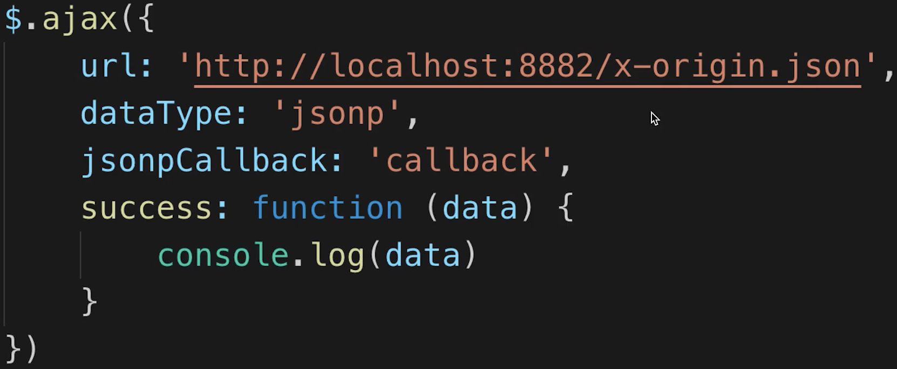

fetch 返回的 Promise 不会标记为 reject

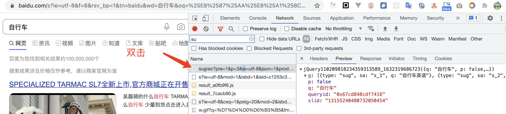

https://lemon.baidu.com/ala/baike/project?isThermage=0&contentid=ymzstp_1015&query=%E9%9D%A2%E9%83%A8%E5%90%B8%E8%84%82&resouce_id=5995

https://opendata.baidu.com/api.php?tn=baidu&format=json&dsp=iphone&query=%E9%9D%A2%E9%83%A8%E5%90%B8%E8%84%82&resource_id=5995&cb=newBaikeCb&callback=newBaikeCb&_=1632320874784

### CORS：

设置 Access-Control-Allow-Origin

虽然设置 CORS 和前端没什么关系，但是通过这种方式解决跨域问题的话，会在发送请求时出现两种情况，分别为**简单请求和复杂请求**。

简单请求：get post head

1. `Content-Type` 的值仅限于下列三者之一：
    - `text/plain`
    - `multipart/form-data`
    - `application/x-www-form-urlencoded`

对于复杂请求来说，首先会发起一个预检请求，该请求是 `option` 方法的，通过该请求来知道服务端是否允许跨域请求。

以下以 express 框架举例：

```js
app.use((req, res, next) => {
	res.header("Access-Control-Allow-Origin", "*");
	res.header(
		"Access-Control-Allow-Methods",
		"PUT, GET, POST, DELETE, OPTIONS"
	);
	res.header(
		"Access-Control-Allow-Headers",
		"Origin, X-Requested-With, Content-Type, Accept, Authorization, Access-Control-Allow-Credentials"
	);
	next();
});
```

该请求会验证你的 `Authorization` 字段，没有的话就会报错。

当前端发起了复杂请求后，你会发现就算你代码是正确的，返回结果也永远是报错的。因为预检请求也会进入回调中，也会触发 `next` 方法，因为预检请求并不包含 `Authorization` 字段，所以服务端会报错。

想解决这个问题很简单，只需要在回调中过滤 `option` 方法即可

```js
res.statusCode = 204;
res.setHeader("Content-Length", "0");
res.end();
```

## cookie 和 localStorage 有何区别？m1p0

### cookie

cookie 本身不是用来做服务器端存储的（计算机领域有很多这种“狗拿耗子”的例子，例如 CSS 中的 float），它是设计用来在服务器和客户端进行信息传递的，因此我们的每个 HTTP 请求都带着 cookie。但是 cookie 也具备浏览器端存储的能力（例如记住用户名和密码），因此就被开发者用上了。

使用起来也非常简单，`document.cookie = ....`即可。

（document.cookie = 'a=100;b=200'）

```
document.cookie = ’a=100'
document.cookie = ’b=200'
console.log(document.cookie) // 'a=100;b=200'
```

但是 cookie 有它致命的缺点：

-   存储量太小，只有 4KB
-   所有 HTTP 请求都带着，会影响获取资源的效率
-   API 简单，需要封装才能用

api 怪异

localStorage: 5M

setItem getItem

### localStorage 和 sessionStorage

后来，HTML5 标准就带来了`sessionStorage`和`localStorage`，先拿`localStorage`来说，它是专门为了浏览器端缓存而设计的。其优点有：

-   存储量增大到 5MB
-   不会带到 HTTP 请求中
-   API 适用于数据存储 `localStorage.setItem(key, value)` `localStorage.getItem(key)`

`sessionStorage`的区别就在于它是根据 session 过去时间而实现，而`localStorage`会永久有效，应用场景不同。例如，一些需要及时失效的重要信息放在`sessionStorage`中，一些不重要但是不经常设置的信息，放在`localStorage`中。

另外告诉大家一个小技巧，针对`localStorage.setItem`，使用时尽量加入到`try-catch`中，某些浏览器是禁用这个 API 的，要注意。

## 有几种方式可以实现存储功能，分别有什么优缺点？什么是 Service Worker？

## Window.onload 和 DOMContentLoaded m1

1、当 `onload`事件触发时，页面上所有的 DOM，样式表，脚本，图片，flash 都已经加载完成了。
2、当 `DOMContentLoaded` 事件触发时，仅当 DOM 加载完成，不包括样式表，图片，flash。

```
window.addEventListener('load', function () {
    // 页面的全部资源加载完才会执行，包括图片、视频等
})
document.addEventListener('DOMContentLoaded', function () {
    // DOM 渲染完即可执行，此时图片、视频还可能没有加载完
})
```

## 进程和线程

浏览器主进程：

 控制其它子进程的创建和销毁；

 浏览器界面显示，比如

渲染进程： 我们常说的浏览器内核

网络进程：处理网络请求、文件访问

GPU 进程：用于 3D 绘制

第三方插件进程

node 是属于单进程单线程

pm2 可读取是 CPU 是几核的

## 渲染进程

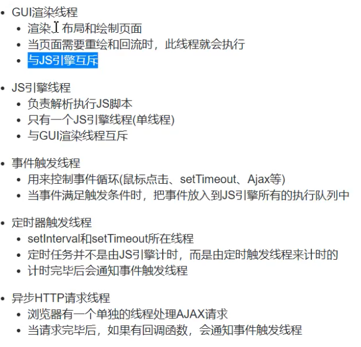

事件触发线程：

 用来控制事件循环

 当事件

## 介绍一下 RAF requsetAnimateFrame

18-12 以后了

## 自测

DNS 解析

客户端与服务端建立 TCP 链接，

服务端处理 http 请求，并返回 html

客户端渲染 DOM CSS 生成 CSSOM,整合二者为 render tree

遇到 script 标签，停止渲染，执行脚本

跨域：由于浏览器同源策略，两个

协议、域名、端口有一个不同都会发生跨域。获取不到他域资源。

解决方法

cors

jsonp【利用可跨域的 script 标签执行 js 代码】

document.domain 【一级域名 —— 二级域名】

postMessage（iframe）[window.onmessage]

其它：name hash socket nginx

# http

## http 常见的状态码 m1p0

`xhr.status`即 HTTP 状态码，有 `2xx` `3xx` `4xx` `5xx` 这几种，比较常用的有以下几种：

-   1xx 服务端收到请求

-   `200` 请求成功

-   ```
    3xx
    ```

    -   `301` 永久重定向。如`http://xxx.com`这个 GET 请求（最后没有`/`），就会被`301`到`http://xxx.com/`（最后是`/`）
    -   `302` 临时重定向。临时的，不是永久的
    -   `304` 资源未被修改。 资源找到但是不符合请求条件，不会返回任何主体。如发送 GET 请求时，head 中有`If-Modified-Since: xxx`（要求返回更新时间是`xxx`时间之后的资源），如果此时服务器端资源未更新，则会返回`304`，即不符合要求

-   `404` 找不到资源 403 客户端没权限

-   `5xx` 服务器端出错了 505 网关超时

看完要明白，为何上述代码中要同时满足`xhr.readyState == 4`和`xhr.status == 200`。

点击百度搜到的结果，会跳转到 a 标签中的 link 地址，服务端会返回 302，和一个 location 字段，

跳转到目标地址。

短网址

## Restful API m1

get 获取数据

Post 新建数据

Patch/put 更新数据

Delete 删除数据

传统 api 设计：把每个 Url 当做一个功能设计。

Restful api 设计： 把每个 Url 当做唯一资源

原则：

尽量不用 url 参数

传统 api: /api/list?pageIndex=2

Restful: /api/list/2

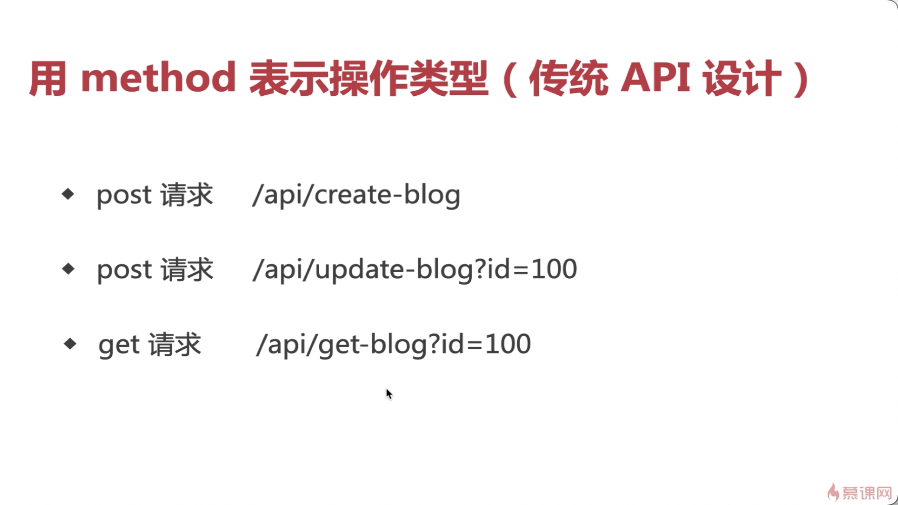

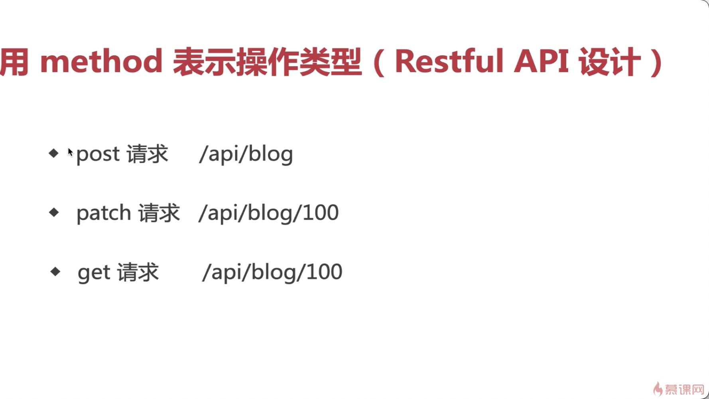

## 常见的 http headers m1p0

Request headers

-   Aceept 浏览器可接收的数据格式
-   Accept-Encoding 浏览器可接收的压缩算法，如 gizp
-   Accept-Language :浏览器可接收语言 zh-CN,zh;q=0.9,en;q=0.8
-   Connection: keep-alive 一次 TCP 连接重复使用
-   cookie
-   host
-   User-Agent 浏览器信息
-   Content-type 发送数据的格式，如 application/json; js 文件： content-type: application/x-javascript
-   content-length: 534

### Response header

-   Content-type 返回数据的格式，如 application/json
-   Content-length 返回数据的大小 字节
-   Content-Encoding 返回数据的压缩算法 如 gzip
-   Set-cookie
-   Cache-Control expires 缓存
-   Last-Modified if-modified-since
-   Etag if-none-match

Aceept 浏览器可接收的数据格式(Accept:text/html,application/xhtml+xml,application/xml;q=0.9,image/avif,image/webp,image/apng,_/_;q=0.8,application/signed-exchange;v=b3;q=0.9)

（HTTP keep-alive 也称为 HTTP 长连接。它通过重用一个 TCP 连接来发送/接收多个 HTTP 请求，来减少创建/关闭多个 TCP 连接的开销。）

-   Cache-Control 见缓存机制篇章。(如果在[`Cache-Control`](https://developer.mozilla.org/zh-CN/docs/Web/HTTP/Headers/Cache-Control)响应头设置了 "max-age" 或者 "s-max-age" 指令，那么 `Expires` 头会被忽略。)
-   Expires 响应头包含日期/时间， 即在此时候之后，响应过期。
-   Last-Modified（最后修改日期）服务端返给客户端 if-modified-since【Request Headers】 客户端返给服务端
-   同上，Etag 【客户端 Request Header： if-none-match】

详细见 shayu.md


## http 缓存机制 m1p0

缓存：非首次进入页面，把没有必要重新发起网络请求获取的数据存起来的行为。

### 缓存位置：

Service worker

Memory cache

disk cache

Push cache

网络请求

内存和磁盘缓存应该优先级是高于 service worker 的，当存在内存/磁盘缓存的时候，优先命中，控制台也看得到(???搜索 todo 优先级)

#### Service worker

Service Worker 的缓存与浏览器其他内建的缓存机制不同，它可以让我们**自由控制**缓存哪些文件、如何匹配缓存、如何读取缓存，并且**缓存是持续性的**。

当 Service Worker 没有命中缓存的时候，我们需要去调用 `fetch` 函数获取数据。也就是说，如果我们没有在 Service Worker 命中缓存的话，会根据缓存查找优先级去查找数据。**但是不管我们是从 Memory Cache 中还是从网络请求中获取的数据，浏览器都会显示我们是从 Service Worker 中获取的内容。**

#### Memory cache

内存中的缓存，读取内存比读取硬盘快，但缓存的持续性低，随着进程的释放而释放，

关闭 tab，

下方 from memory 了

```
curl 'https://lemon.cdn.bcebos.com/lemon-c-h5-default%2FtopBar%2Fmessage.png' \
  -H 'Referer: https://lemon.baidu.com/' \
  -H 'User-Agent: Mozilla/5.0 (iPhone; CPU iPhone OS 13_2_3 like Mac OS X) AppleWebKit/605.1.15 (KHTML, like Gecko) Version/13.0.3 Mobile/15E148 Safari/604.1' \
  --compressed
etag: "18f27322ec31604a518b4bc58b84436d"
expires: Thu, 02 Sep 2021 15:40:08 GMT
last-modified: Tue, 16 Jun 2020 09:48:39 GMT
```

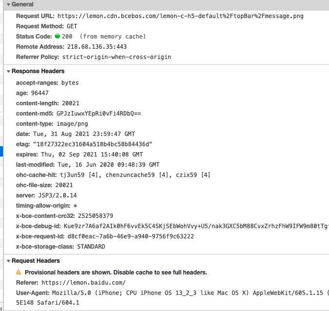

下方没有 memory cache

304

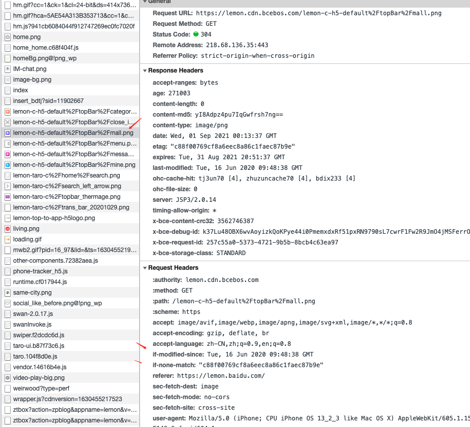

https://www.cnblogs.com/moxiaotao/p/9670109.html HTTP 的请求头标签 If-Modified-Since

#### Disk cache

硬盘中的缓存，读取速度慢，**胜在容量和存储时效性上。**，

HTTP Herder 中的字段判断哪些资源需要缓存，哪些资源可以不请求直接使用，哪些资源已经过期需要重新请求。**并且即使在跨站点的情况下，相同地址的资源一旦被硬盘缓存下来，就不会再次去请求数据。**

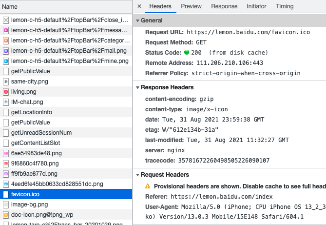

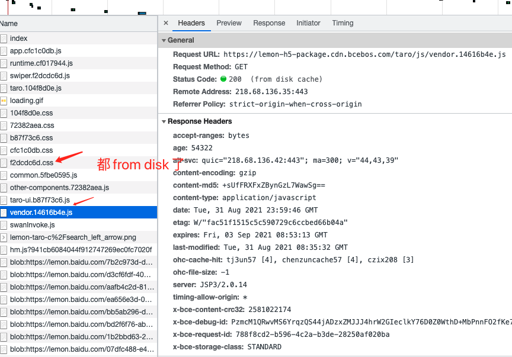

下面没有走缓存

默认占位图

```
curl 'https://lemon.cdn.bcebos.com/lemon-taro-c/image-bg.png' \
  -H 'authority: lemon.cdn.bcebos.com' \
  -H 'if-modified-since: Fri, 13 Dec 2019 02:33:45 GMT' \
  -H 'user-agent: Mozilla/5.0 (iPhone; CPU iPhone OS 13_2_3 like Mac OS X) AppleWebKit/605.1.15 (KHTML, like Gecko) Version/13.0.3 Mobile/15E148 Safari/604.1' \
  -H 'if-none-match: "3f6369d9ab3468d32c284fb3e6166338"' \
  -H 'accept: image/avif,image/webp,image/apng,image/svg+xml,image/*,*/*;q=0.8' \
  -H 'sec-fetch-site: cross-site' \
  -H 'sec-fetch-mode: no-cors' \
  -H 'sec-fetch-dest: image' \
  -H 'referer: https://lemon-h5-package.cdn.bcebos.com/' \
  -H 'accept-language: zh-CN,zh;q=0.9,en;q=0.8' \
  --compressed
```

Response header

```
etag: "3f6369d9ab3468d32c284fb3e6166338"
expires: Tue, 31 Aug 2021 15:58:16 GMT
last-modified: Fri, 13 Dec 2019 02:33:45 GMT
```

#### Push Cache

Push Cache 是 HTTP/2 中的内容，当以上三种缓存都没有命中时，它才会被使用。**并且缓存时间也很短暂，只在会话（Session）中存在，一旦会话结束就被释放。**

Push Cache 在国内能够查到的资料很少，也是因为 HTTP/2 在国内不够普及，但是 HTTP/2 将会是日后的一个趋势。这里推荐阅读 [HTTP/2 push is tougher than I thought](https://link.juejin.cn/?target=https%3A%2F%2Fjakearchibald.com%2F2017%2Fh2-push-tougher-than-i-thought%2F) 这篇文章，但是内容是英文的，我翻译一下文章中的几个结论，有能力的同学还是推荐自己阅读

-   所有的资源都能被推送，但是 Edge 和 Safari 浏览器兼容性不怎么好
-   可以推送 `no-cache` 和 `no-store` 的资源
-   一旦连接被关闭，Push Cache 就被释放
-   多个页面可以使用相同的 HTTP/2 连接，也就是说能使用同样的缓存
-   Push Cache 中的缓存只能被使用一次
-   浏览器可以拒绝接受已经存在的资源推送
-   你可以给其他域名推送资源

### 缓存策略 p0

分为强缓存和协商缓存，并且缓存策略都是通过 http header 实现的

通过设置 expires(有效期)和 Cache-Control: max-age=

#### 强缓存

指在缓存期间，不需要请求，state code 为 200

#### [Expires](https://developer.mozilla.org/zh-CN/docs/Web/HTTP/Headers/Expires)

```http
Expires: Wed, 22 Oct 2018 08:41:00 GMT
```

`Expires` 是 HTTP/1 的产物，表示资源会在 `Wed, 22 Oct 2018 08:41:00 GMT` 后过期，需要再次请求。并且 `Expires` **受限于本地时间**，如果修改了本地时间，可能会造成缓存失效。

已被 Cache-Control 代替。

#### [Cache-control](https://developer.mozilla.org/zh-CN/docs/Web/HTTP/Headers/Cache-Control)

```http
Cache-control: max-age=30
```

`Cache-Control` 出现于 HTTP/1.1，**优先级高于 `Expires`** 。该属性值表示资源会在 30 秒后过期，需要再次请求。

`Cache-Control` **可以在请求头或者响应头中设置**，并且可以组合使用多种指令

max-age ： 设置缓存存储的最大周期，超过这个时间缓存被认为过期(单位秒)。与`Expires`相反，时间是相对于请求的时间。

no-cache 不用本地强制缓存，去服务端请求。

no-store 不用本地缓存，切不同服务端缓存。

private 只允许最终用户做缓存

public 允许中间路由做缓存

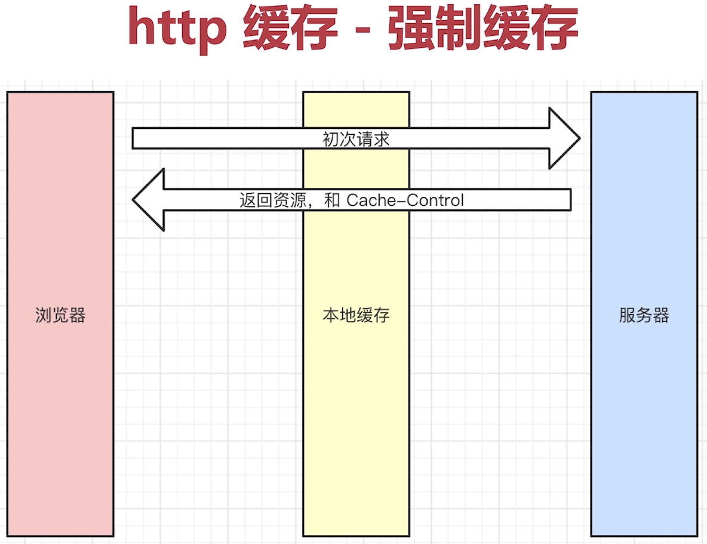

cache-control 如果没到过期时间的话：会从本地缓存直接返回，netWork 里显示 from diskcache（不请求服务器)

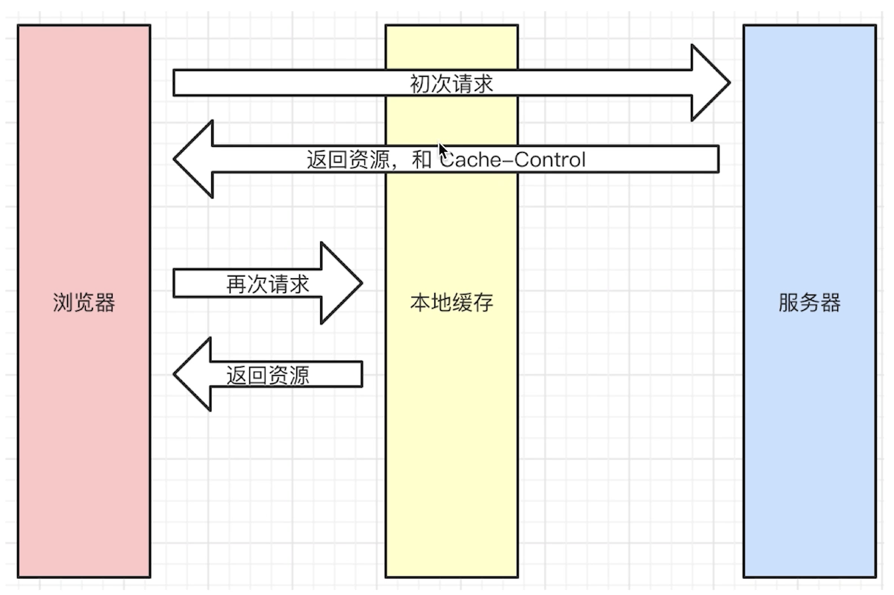

#### 协商缓存

服务端的缓存策略。

缓存过期了，就需要发起请求验证资源是否有更新。协商

通过 last-Modified(修改)和 Etag(版本号)设置

当浏览器发起请求验证客户端资源是否与服务端一致，如果资源没有做改变，那么服务端就会返回 304 状态码，并且更新浏览器缓存有效期。否则返回 200 状态码

资源标识 Last-Modified、Etag

#### Last-Modified 和 If-Modified-Since

`Last-Modified` 表示本地文件最后修改日期，`If-Modified-Since`字段 会将 `Last-Modified` 的值发送给服务器，询问服务器在该日期后资源是否有更新，有更新的话就会将新的资源发送回来，否则返回 304 状态码。

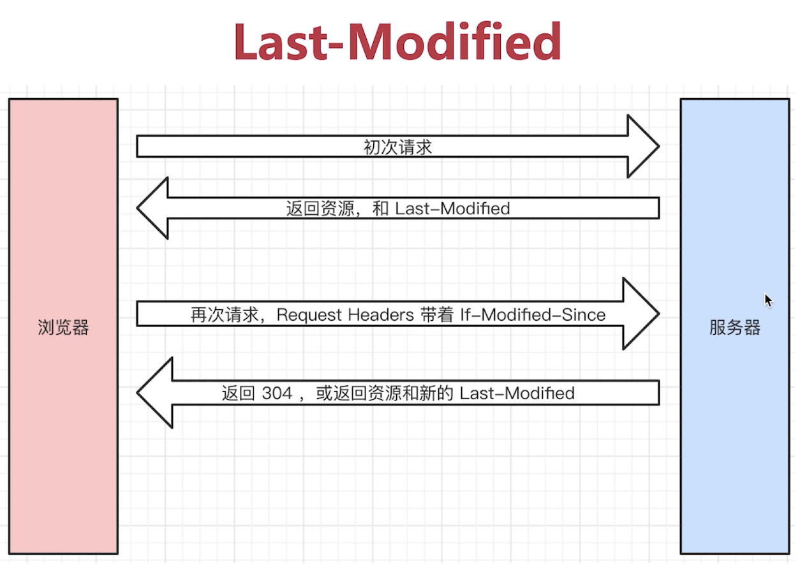

但是 `Last-Modified` 存在一些弊端：

-   如果本地打开缓存文件，即使没有对文件进行修改，但还是会造成 `Last-Modified` 被修改，服务端不能命中缓存导致发送相同的资源
-   因为 `Last-Modified` 只能以秒计时，如果在不可感知的时间内修改完成文件，那么服务端会认为资源还是命中了，不会返回正确的资源

因为以上这些弊端，所以在 HTTP / 1.1 出现了 `ETag` 。

#### ETag 和 If-None-Match

`ETag` 类似于文件指纹，`If-None-Match` 会将当前 `ETag` 发送给服务器，询问该资源 `ETag` 是否变动，有变动的话就将新的资源发送回来。并且 `ETag` 优先级比 `Last-Modified` 高。

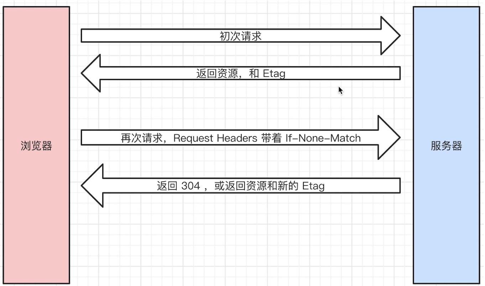

Headers 示例

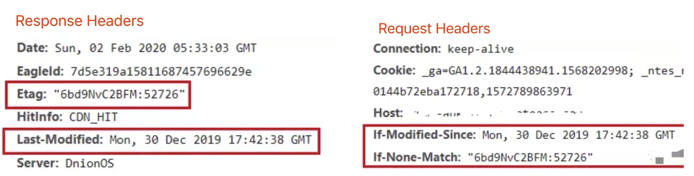

以上就是缓存策略的所有内容了，看到这里，不知道你是否存在这样一个疑问。**如果什么缓存策略都没设置，那么浏览器会怎么处理？**

对于这种情况，浏览器会采用一个启发式的算法，通常会取响应头中的 `Date` 减去 `Last-Modified` 值的 10% 作为缓存时间。

#### 代码文件

这里特指除了 HTML 外的代码文件，因为 HTML 文件一般不缓存或者缓存时间很短。

一般来说，现在都会使用工具来打包代码，那么我们就可以对文件名进行哈希处理，只有当代码修改后才会生成新的文件名。基于此，我们就可以给代码文件设置缓存有效期一年 `Cache-Control: max-age=31536000`，这样只有当 HTML 文件中引入的文件名发生了改变才会去下载最新的代码文件，否则就一直使用缓存。

同样想问一下缓存都是需要后端做头文件配置的吧？ 那作为前端怎么根据这些配置来做判断缓存及后续操作呢？ 作者有时间的话可以做一个配套例子讲解一下不~

其实可以针对返回的资源添加 header 的某些字段就能实现资源缓存，比如请求了 x.js 这个资源，那么在返回这个资源的时候，添加以下代码: res.setHeader('Cache-control', 'max-age=60') 这样浏览器接受到这个数据的返回，检测到有这个资源，就能知道该资源需要缓存 60s 了。

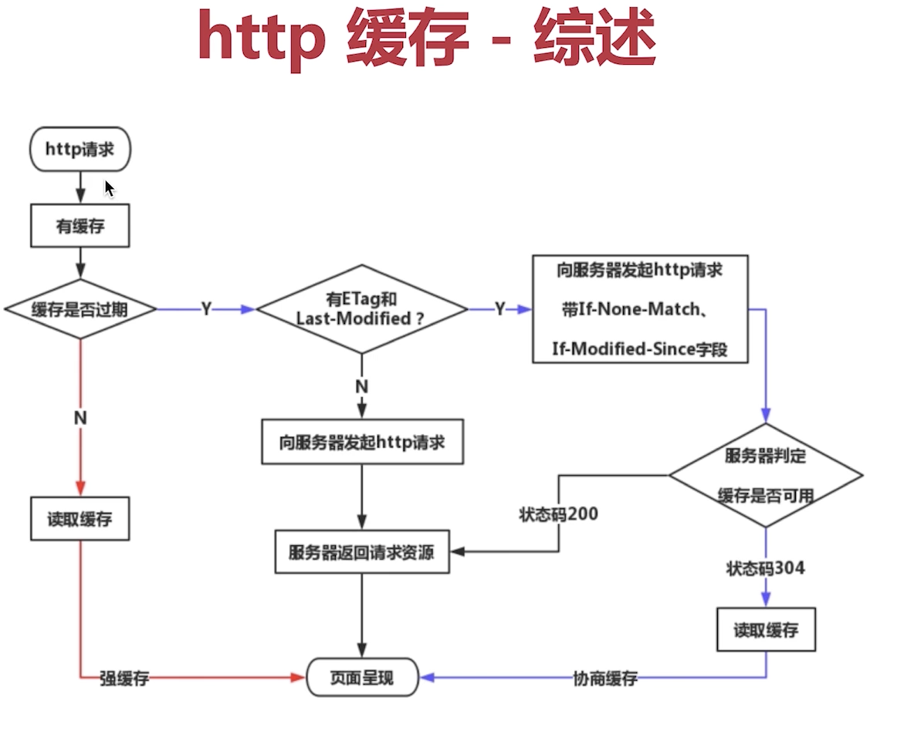

### 刷新操作

手动刷新： 强制缓存(cache-control)失效，协商缓存(last-modified etag)生效

强制刷新： 都失效 ctrl + comman + R

## get 请求和 post 区别 m1 复习

get 一般用于查询，post 一般用于提交操作。

get 参数拼接在 url 上，post 放在请求体内(数据体更大)

post 易于防范 CSRF

## 自测

# 性能优化

原则：多使用内存、缓存；减少 cpu 计算量，减少网络加载耗时(空间换时间)。

**减少页面体积，提升网络加载。**

静态资源压缩合并（JS 代码、CSS 代码、雪碧图)

todo 静态资源缓存（资源名称加 MD5），gzip 压缩(服务端)

CDN

**优化页面渲染**

-   CSS 放前面 head 位置，JS 放 body 后面

-   懒加载

-   减少 DOM 查询（例如把 length 存起来)

-   减少 DOM 操作 （频繁操作 DOM，合并到一起）

事件节流

使用 SSR 后端渲染，数据直接输出到 HTML，减少浏览器使用 JS 渲染页面的时间

尽早进行 js 执行，onContentLoaded

预解析 prefetch

逻辑层面：减少重复渲染，

usecallback memo SCU

cdn

静态资源要尽量放在 CDN 上,如插件 swiper、

缓存（静态资源加 hash 后缀，根据文件内容计算 hash；文件内容不变，则 hash 不变，则 url 不变；url 和文件不变，则自动触发 http 缓存机制，返回 304。

## **减少页面体积，提升网络加载。**

## **优化页面渲染**

### 懒加载

一开始先给为 `src` 赋值成一个通用的预览图，下拉时候再动态赋值成正式的图片。如下，`preview.png`是预览图片，比较小，加载很快，而且很多图片都共用这个`preview.png`，加载一次即可。待页面下拉，图片显示出来时，再去替换`src`为`data-realsrc`的值。

```

```

另外，这里为何要用`data-`开头的属性值？—— 所有 HTML 中自定义的属性，都应该用`data-`开头，因为`data-`开头的属性浏览器渲染的时候会忽略掉，提高渲染性能。

### 合并 DOM 插入

DOM 操作是非常耗费性能的，因此插入多个标签时，先插入 Fragment 然后再统一插入 DOM。

```js
var listNode = document.getElementById("list");
// 要插入 10 个 li 标签
var frag = document.createDocumentFragment();
var x, li;
for (x = 0; x < 10; x++) {
	li = document.createElement("li");
	li.innerHTML = "List item " + x;
	frag.appendChild(li); // 先放在 frag 中，最后一次性插入到 DOM 结构中。
}
listNode.appendChild(frag);
```

### 尽早执行操作

```js
window.addEventListener("load", function () {
	// 页面的全部资源加载完才会执行，包括图片、视频等
});
document.addEventListener("DOMContentLoaded", function () {
	// DOM 渲染完即可执行，此时图片、视频还可能没有加载完
});
```

### 性能优化怎么做

上面提到的都是性能优化的单个点，性能优化项目具体实施起来，应该按照下面步骤推进：

1. 建立性能数据收集平台，摸底当前性能数据，通过性能打点，将上述整个页面打开过程消耗时间记录下来
2. 分析耗时较长时间段原因，寻找优化点，确定优化目标
3. 开始优化
4. 通过数据收集平台记录优化效果
5. 不断调整优化点和预期目标，循环 2~4 步骤

性能优化是个长期的事情，不是一蹴而就的，应该本着先摸底、再分析、后优化的原则逐步来做。

**举个例子**：看过性能优化相关文章的同学应该知道有这么一条规则，要减少页面上的 HTTP 请求。

#### 这是什么？

先了解一下 HTTP 请求是啥，查资料发现原来是向服务器请求资源用的。

#### 为什么要减少 HTTP 请求？

查资料发现：HTTP 请求需要经历 DNS 查找，TCP 握手，SSL 握手（如果有的话）等一系列过程，才能真正发出这个请求。并且现代浏览器对于 TCP 并发数也是有限制的，超过 TCP 并发数的 HTTP 请求只能等前面的请求完成了才能继续发送。

我们可以打开 chrome 开发者工具看一下一个 HTTP 请求所花费的具体时间。

[](https://camo.githubusercontent.com/30caca30415e62596111580fb4fc19653c9b9691a0b48c51da2cc8303296a0d5/68747470733a2f2f696d672d626c6f672e6373646e696d672e636e2f696d675f636f6e766572742f34653030666261656262656561353164653335623833383230353433323938642e706e67)

这是一个 HTTP 请求，请求的文件大小为 28.4KB。

名词解释：

1. Queueing: 在请求队列中的时间。
2. Stalled: 从 TCP 连接建立完成，到真正可以传输数据之间的时间差，此时间包括代理协商时间。
3. Proxy negotiation: 与代理服务器连接进行协商所花费的时间。
4. DNS Lookup: 执行 DNS 查找所花费的时间，页面上的每个不同的域都需要进行 DNS 查找。
5. Initial Connection / Connecting: 建立连接所花费的时间，包括 TCP 握手/重试和协商 SSL。
6. SSL: 完成 SSL 握手所花费的时间。
7. Request sent: 发出网络请求所花费的时间，通常为一毫秒的时间。
8. Waiting(TFFB): TFFB 是发出页面请求到接收到应答数据第一个字节的时间总和，它包含了 DNS 解析时间、 TCP 连接时间、发送 HTTP 请求时间和获得响应消息第一个字节的时间。
9. Content Download: 接收响应数据所花费的时间。
   从这个例子可以看出，真正下载数据的时间占比为 `13.05 / 204.16 = 6.39%`。文件越小，这个比例越小，文件越大，比例就越高。这就是为什么要建议将多个小文件合并为一个大文件，从而减少 HTTP 请求次数的原因。

#### 有没有更好的方式？

使用 HTTP2，所有的请求都可以放在一个 TCP 连接上发送。HTTP2 还有好多东西要学，这里不深入讲解了。

经过灵魂三问后，是不是这条优化规则的来龙去脉全都理清了，并且在你查资料动手的过程中，知识会理解得更加深刻。

**掌握了这种学习方法，并且时刻运用在学习中、工作中，突破瓶颈只是时间的问题**。

## 其它

RAF requestAnimationFrame

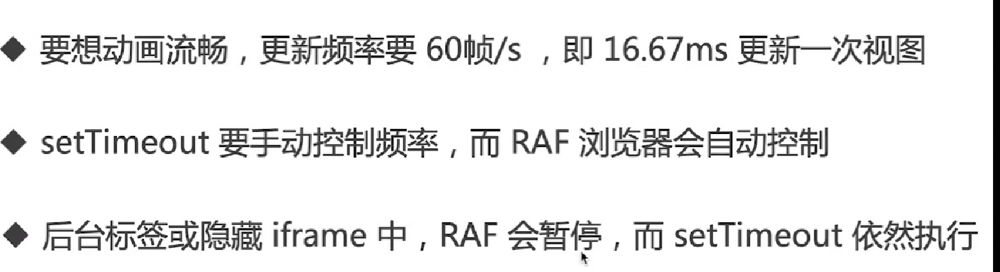

```js
// 3s 把宽度从 100px 变为 640px ，即增加 540px
// 60帧/s ，3s 180 帧 ，每次变化 3px

const $div1 = $("#div1");
let curWidth = 100;
const maxWidth = 640;

// // setTimeout
// function animate() {
//     curWidth = curWidth + 3
//     $div1.css('width', curWidth)
//     if (curWidth < maxWidth) {
//         setTimeout(animate, 16.7) // 自己控制时间
//     }
// }
// animate()

// RAF
function animate() {
	curWidth = curWidth + 3;
	$div1.css("width", curWidth);
	if (curWidth < maxWidth) {
		window.requestAnimationFrame(animate); // 时间不用自己控制
	}
}
animate();
```

## 自测

# 设计模式

单例模式

## 观察者模式 P0

## 发布订阅模式 P0

装饰器模式

适配器模式

代理模式

模板方法模式

# Git

> 题目：常用的 Git 命令有哪些？如何使用 Git 多人协作开发？

### 常用的 Git 命令 差不多

首先，通过`git clone <项目远程地址>`下载下来最新的代码，例如`git clone git@git.coding.net:username/project-name.git`，默认会下载`master`分支。

然后修改代码，修改过程中可以通过`git status`看到自己的修改情况，通过`git diff <文件名>`可查阅单个文件的差异。

最后，将修改的内容提交到远程服务器，做如下操作

```
git add .
git commit -m "xxx"
git push origin master
```

如果别人也提交了代码，你想同步别人提交的内容，执行`git pull origin master`即可。

git commit --amend --no--edit

git status

git diff

git log git reflog

git reset --soft HEAD^

git show 提交的 commit-id

git checkout 文件 / . 撤销文件修改

git checkout -b 分支名

git stash

### 如何多人协作开发 p0 掌握

多人协作开发，就不能使用`master`分支了，而是要每个开发者单独拉一个分支，使用`git checkout -b <branchname>`，运行`git branch`可以看到本地所有的分支名称。

自己的分支，如果想同步`master`分支的内容，可运行`git merge master`。切换分支可使用`git checkout <branchname>`。

在自己的分支上修改了内容，可以将自己的分支提交到远程服务器

```
git add .
git commit -m "xxx"
git push origin <branchname>
```

最后，待代码测试没问题，再将自己分支的内容合并到`master`分支，然后提交到远程服务器。

```js
git checkout master
git merge <branchname>
git push origin master
```

## Linux 基础命令

目前互联网公司的线上服务器都使用 Linux 系统，测试环境为了保证和线上一致，肯定也是使用 Linux 系统，而且都是命令行的，没有桌面，不能用鼠标操作。因此，掌握基础的 Linux 命令是非常必要的。下面总结一些最常用的 Linux 命令，建议大家在真实的 Linux 系统下亲自试一下。

关于如何得到 Linux 系统，有两种选择：第一，在自己电脑的虚拟机中安装一个 Linux 系统，例如 Ubuntu/CentOS 等，下载这些都不用花钱；第二，花钱去阿里云等云服务商租一个最便宜的 Linux 虚拟机。推荐第二种。一般正式入职之后，公司都会给你分配开发机或者测试机，给你账号和密码，你自己可以远程登录。

> 题目：常见 linux 命令有哪些？

### 登录

入职之后，一般会有现有的用户名和密码给你，你拿来之后直接登录就行。运行 `ssh name@server` 然后输入密码即可登录。

### 目录操作

-   创建目录 `mkdir <目录名称>`
-   删除目录 `rm <目录名称>`
-   定位目录 `cd <目录名称>`
-   查看目录文件 `ls` `ll`
-   修改目录名 `mv <目录名称> <新目录名称>`
-   拷贝目录 `cp <目录名称> <新目录名称>`

### 文件操作

-   创建文件 `touch <文件名称>` `vi <文件名称>`
-   删除文件 `rm <文件名称>`
-   修改文件名 `mv <文件名称> <新文件名称>`
-   拷贝文件 `cp <文件名称> <新文件名称>`

### 文件内容操作

-   查看文件 `cat <文件名称>` `head <文件名称>` `tail <文件名称>`
-   编辑文件内容 `vi <文件名称>`
-   查找文件内容 `grep '关键字' <文件名称>`

# Web 安全 p1

> 题目：前端常见的安全问题有哪些？

Web 前端的安全问题，能回答出下文的两个问题，这个题目就能基本过关了。开始之前，先说一个最简单的攻击方式 —— SQL 注入。

上学的时候就知道有一个「SQL 注入」的攻击方式。例如做一个系统的登录界面，输入用户名和密码，提交之后，后端直接拿到数据就拼接 SQL 语句去查询数据库。如果在输入时进行了恶意的 SQL 拼装，那么最后生成的 SQL 就会有问题。但是现在稍微大型一点的系统，都不会这么做，从提交登录信息到最后拿到授权，要经过层层的验证。因此，SQL 注入都只出现在比较低端小型的系统上。

输入框不要输入 script

## XSS（Cross Site Scripting，跨站脚本攻击）

这是前端最常见的攻击方式，很多大型网站（如 Facebook）都被 XSS 攻击过。

举一个例子，我在一个博客网站正常发表一篇文章，输入汉字、英文和图片，完全没有问题。但是如果我写的是恶意的 JS 脚本，例如获取到`document.cookie`然后传输到自己的服务器上，那我这篇博客的每一次浏览都会执行这个脚本，都会把访客 cookie 中的信息偷偷传递到我的服务器上来。

其实原理上就是黑客通过某种方式（发布文章、发布评论等）将一段特定的 JS 代码隐蔽地输入进去。然后别人再看这篇文章或者评论时，之前注入的这段 JS 代码就执行了。**JS 代码一旦执行，那可就不受控制了，因为它跟网页原有的 JS 有同样的权限**，例如可以获取 server 端数据、可以获取 cookie 等。于是，攻击就这样发生了。

### XSS 的危害

XSS 的危害相当大，如果页面可以随意执行别人不安全的 JS 代码，轻则会让页面错乱、功能缺失，重则会造成用户的信息泄露。

比如早些年社交网站经常爆出 XSS 蠕虫，通过发布的文章内插入 JS，用户访问了感染不安全 JS 注入的文章，会自动重新发布新的文章，这样的文章会通过推荐系统进入到每个用户的文章列表面前，很快就会造成大规模的感染。

还有利用获取 cookie 的方式，将 cookie 传入入侵者的服务器上，入侵者就可以模拟 cookie 登录网站，对用户的信息进行篡改。

### XSS 的预防

那么如何预防 XSS 攻击呢？—— 最根本的方式，就是对用户输入的内容进行验证和替换，需要替换的字符有：

```
& 替换为：&amp;
< 替换为：&lt;
> 替换为：&gt;
” 替换为：&quot;
‘ 替换为：&#x27;
/ 替换为：&#x2f;
```

替换了这些字符之后，黑客输入的攻击代码就会失效，XSS 攻击将不会轻易发生。

除此之外，还可以通过对 cookie 进行较强的控制，比如对敏感的 cookie 增加`http-only`限制，让 JS 获取不到 cookie 的内容。

npm xss

## CSRF（Cross-site request forgery，跨站请求伪造）

CSRF 是借用了当前操作者的权限来偷偷地完成某个操作，而不是拿到用户的信息。

例如，一个支付类网站，给他人转账的接口是`http://buy.com/pay?touid=999&money=100`，而这个接口在使用时没有任何密码或者 token 的验证，只要打开访问就直接给他人转账。一个用户已经登录了`http://buy.com`，在选择商品时，突然收到一封邮件，而这封邮件正文有这么一行代码``，他访问了邮件之后，其实就已经完成了购买。

CSRF 的发生其实是借助了一个 cookie 的特性。我们知道，登录了`http://buy.com`之后，cookie 就会有登录过的标记了，此时请求`http://buy.com/pay?touid=999&money=100`是会带着 cookie 的，因此 server 端就知道已经登录了。而如果在`http://buy.com`去请求其他域名的 API 例如`http://abc.com/api`时，是不会带 cookie 的，这是浏览器的同源策略的限制。但是 —— **此时在其他域名的页面中，请求`http://buy.com/pay?touid=999&money=100`，会带着`buy.com`的 cookie ，这是发生 CSRF 攻击的理论基础。**

预防 CSRF 就是加入各个层级的权限验证，例如现在的购物网站，只要涉及现金交易，肯定要输入密码或者指纹才行。除此之外，敏感的接口使用`POST`请求而不是`GET`也是很重要的。增加验证。

## 自测

xss ：跨站脚本攻击，攻击者往 web 页面注入恶意脚本代码，当用户浏览该页面时，代码执行，从而达到攻击者盗取用户信息的目的。

react 本身会自动对 script 标签进行转义

csrf 跨站请求伪造。

攻击者诱导受害者进入第三方网站，在第三方网站中，向被攻击网站发送跨站请求。

利用受害者在被攻击网站已经获取的注册凭证，绕过后台身份验证，达到冒充用户执行某些操作的目的。

一个典型的 CSRF 攻击有着如下的流程：

-   [受害者登录 a.com](https://link.juejin.cn?target=http%3A%2F%2Fxn--a-f38al5vkzdt61bv7l.com)，并保留了登录凭证（Cookie）。
-   [攻击者引诱受害者访问了 b.com](https://link.juejin.cn?target=http%3A%2F%2Fxn--b-nv6ao4io8bp6po6e00mu47cda4311avpa330h.com)。
-   [b.com](https://link.juejin.cn?target=http%3A%2F%2Fb.com) 向 [a.com](https://link.juejin.cn?target=http%3A%2F%2Fa.com) 发送了一个请求：[a.com/act=xx。浏览器会…](https://link.juejin.cn?target=http%3A%2F%2Fa.com%2Fact%3Dxx%E3%80%82%E6%B5%8F%E8%A7%88%E5%99%A8%E4%BC%9A%E9%BB%98%E8%AE%A4%E6%90%BA%E5%B8%A6a.com%E7%9A%84Cookie%E3%80%82)
-   a.com 接收到请求后，对请求进行验证，并确认是受害者的凭证，误以为是受害者自己发送的请求。
-   a.com 以受害者的名义执行了 act=xx。
-   攻击完成，攻击者在受害者不知情的情况下，冒充受害者，让 a.com 执行了自己定义的操作。

针对这两点，我们可以专门制定防护策略，如下：

-   阻止不明外域的访问
    -   同源检测
    -   Samesite Cookie
-   提交时要求附加本域才能获取的信息
    -   CSRF Token
    -   双重 Cookie 验证

作者：美团技术团队
链接：https://juejin.cn/post/6844903689702866952

打开页面，服务端生成一个 token，随机字符串+时间戳，不放在 cookie 中，放到服务器的 session 中，

Xss

# Nginx

https://github.com/qappleh/Interview/tree/master/Nginx
